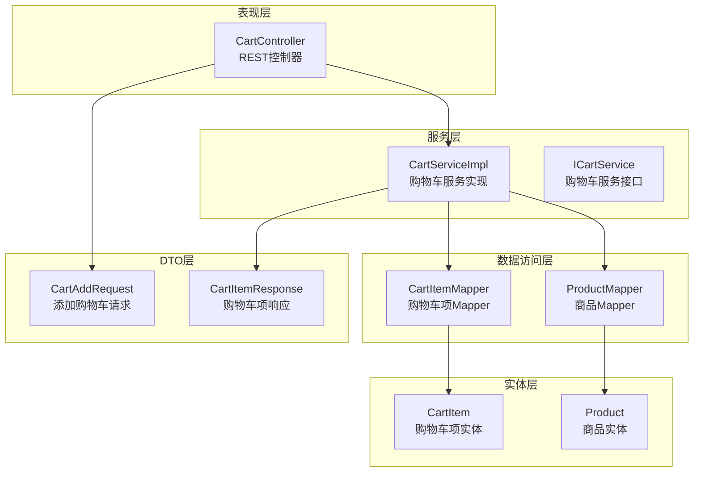
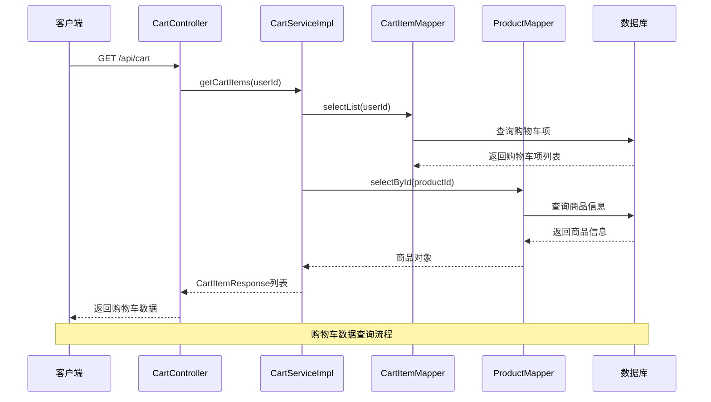
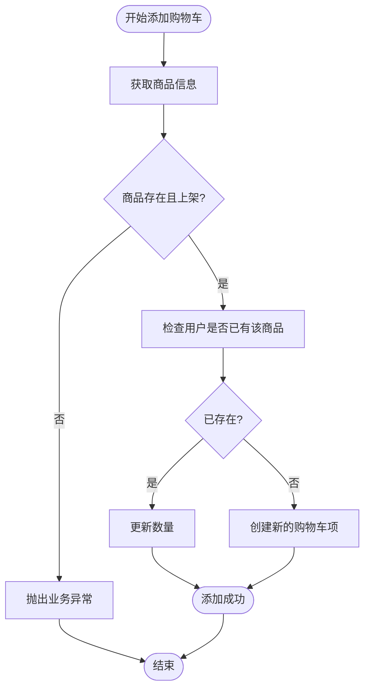
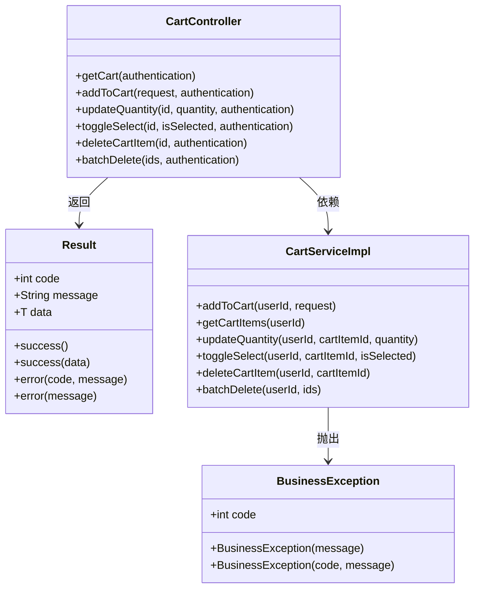
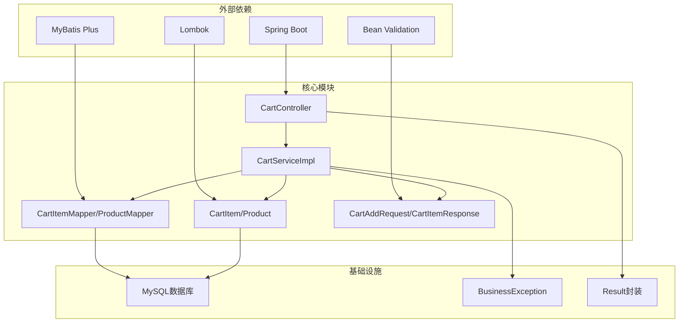
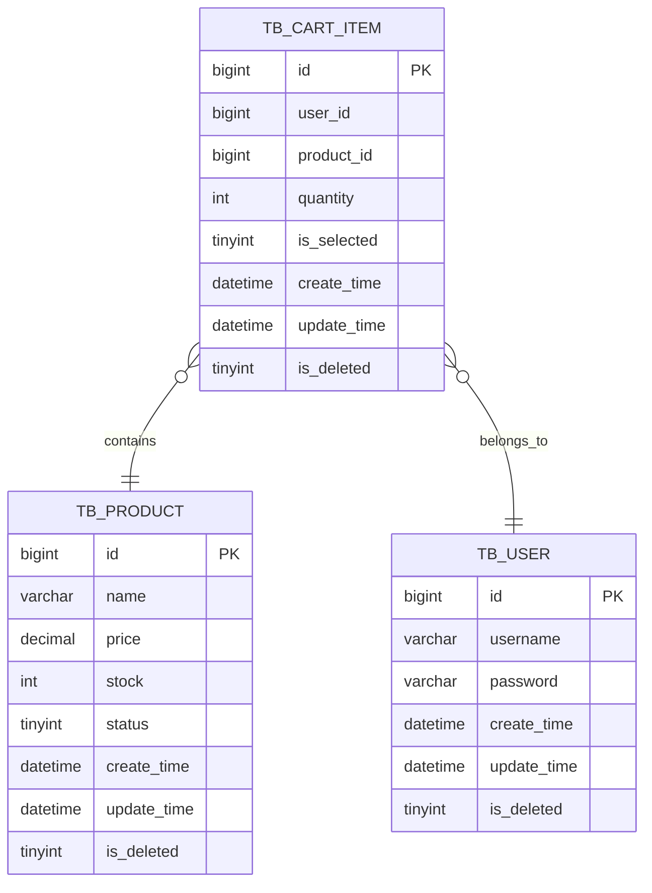

# 购物车系统

<cite>
**本文档引用的文件**
- [CartController.java](file://src/main/java/com/qoder/mall/controller/CartController.java)
- [CartServiceImpl.java](file://src/main/java/com/qoder/mall/service/impl/CartServiceImpl.java)
- [ICartService.java](file://src/main/java/com/qoder/mall/service/ICartService.java)
- [CartItem.java](file://src/main/java/com/qoder/mall/entity/CartItem.java)
- [Product.java](file://src/main/java/com/qoder/mall/entity/Product.java)
- [CartAddRequest.java](file://src/main/java/com/qoder/mall/dto/request/CartAddRequest.java)
- [CartItemResponse.java](file://src/main/java/com/qoder/mall/dto/response/CartItemResponse.java)
- [CartItemMapper.java](file://src/main/java/com/qoder/mall/mapper/CartItemMapper.java)
- [ProductMapper.java](file://src/main/java/com/qoder/mall/mapper/ProductMapper.java)
- [schema.sql](file://src/main/resources/db/schema.sql)
- [BusinessException.java](file://src/main/java/com/qoder/mall/common/exception/BusinessException.java)
- [Result.java](file://src/main/java/com/qoder/mall/common/result/Result.java)
</cite>

## 目录
1. [简介](#简介)
2. [项目结构](#项目结构)
3. [核心组件](#核心组件)
4. [架构概览](#架构概览)
5. [详细组件分析](#详细组件分析)
6. [依赖关系分析](#依赖关系分析)
7. [性能考虑](#性能考虑)
8. [故障排除指南](#故障排除指南)
9. [结论](#结论)
10. [附录](#附录)

## 简介

购物车系统是电商应用中的核心功能模块，负责管理用户的商品选择、数量调整、选中状态控制以及批量操作。本系统采用Spring Boot + MyBatis Plus技术栈构建，实现了完整的购物车CRUD操作，包括添加商品、修改数量、删除商品、清空购物车等功能。

系统通过严格的业务逻辑验证，确保商品数量管理的安全性，包括库存检查、数量限制、商品状态验证等机制。同时支持选中状态控制，包括单选多选、全选反选、状态同步等操作，并提供批量删除、批量更新等高级功能。

## 项目结构

购物车系统遵循标准的分层架构设计，主要分为以下层次：

**图表来源**
- [CartController.java:16-78](file://src/main/java/com/qoder/mall/controller/CartController.java#L16-L78)
- [CartServiceImpl.java:19-117](file://src/main/java/com/qoder/mall/service/impl/CartServiceImpl.java#L19-L117)
- [ICartService.java:8-22](file://src/main/java/com/qoder/mall/service/ICartService.java#L8-L22)

**章节来源**
- [CartController.java:16-78](file://src/main/java/com/qoder/mall/controller/CartController.java#L16-L78)
- [CartServiceImpl.java:19-117](file://src/main/java/com/qoder/mall/service/impl/CartServiceImpl.java#L19-L117)

## 核心组件

### 数据模型

购物车系统的核心数据模型由两个主要实体组成：

#### 购物车项实体 (CartItem)
- 主键：自增ID
- 用户ID：关联用户表
- 商品ID：关联商品表
- 数量：默认1，整数类型
- 选中状态：0/1，0表示未选中，1表示选中
- 创建时间：自动记录
- 更新时间：自动更新
- 逻辑删除：0/1标识

#### 商品实体 (Product)
- 主键：自增ID
- 商品编号：唯一标识
- 名称：商品名称
- 价格：Decimal类型，精确到分
- 库存：整数类型
- 销量：整数类型
- 状态：0/1，0表示下架，1表示上架
- 封面图片ID：关联文件存储表

**章节来源**
- [CartItem.java:10-32](file://src/main/java/com/qoder/mall/entity/CartItem.java#L10-L32)
- [Product.java:11-53](file://src/main/java/com/qoder/mall/entity/Product.java#L11-L53)
- [schema.sql:136-147](file://src/main/resources/db/schema.sql#L136-L147)

### 请求和响应DTO

#### 添加购物车请求 (CartAddRequest)
- productId：商品ID，非空验证
- quantity：数量，最小值为1

#### 购物车项响应 (CartItemResponse)
- id：购物车项ID
- productId：商品ID
- productName：商品名称
- productPrice：商品价格
- productStock：商品库存
- productCoverUrl：商品封面URL
- quantity：数量
- isSelected：选中状态
- subtotal：小计金额

**章节来源**
- [CartAddRequest.java:10-21](file://src/main/java/com/qoder/mall/dto/request/CartAddRequest.java#L10-L21)
- [CartItemResponse.java:16-45](file://src/main/java/com/qoder/mall/dto/response/CartItemResponse.java#L16-L45)

## 架构概览

购物车系统采用经典的三层架构模式，通过清晰的职责分离实现松耦合的设计：

**图表来源**
- [CartController.java:24-29](file://src/main/java/com/qoder/mall/controller/CartController.java#L24-L29)
- [CartServiceImpl.java:53-77](file://src/main/java/com/qoder/mall/service/impl/CartServiceImpl.java#L53-L77)

**章节来源**
- [CartController.java:24-76](file://src/main/java/com/qoder/mall/controller/CartController.java#L24-L76)
- [CartServiceImpl.java:53-77](file://src/main/java/com/qoder/mall/service/impl/CartServiceImpl.java#L53-L77)

## 详细组件分析

### 控制器层 (CartController)

控制器层提供了完整的购物车API接口，所有接口都基于Spring Security进行身份认证，确保操作的安全性。

#### 核心接口

| 接口 | 方法 | 路径 | 功能描述 |
|------|------|------|----------|
| 查看购物车 | GET | `/api/cart` | 获取当前用户的所有购物车项 |
| 添加到购物车 | POST | `/api/cart` | 添加商品到购物车 |
| 更新数量 | PUT | `/api/cart/{id}` | 修改指定购物车项的数量 |
| 切换选中状态 | PUT | `/api/cart/{id}/select` | 切换购物车项的选中状态 |
| 删除购物车项 | DELETE | `/api/cart/{id}` | 删除指定的购物车项 |
| 批量删除 | DELETE | `/api/cart/batch` | 批量删除多个购物车项 |

**章节来源**
- [CartController.java:24-76](file://src/main/java/com/qoder/mall/controller/CartController.java#L24-L76)

### 服务层 (CartServiceImpl)

服务层实现了购物车的核心业务逻辑，包括商品数量管理、状态验证、权限控制等。

#### 添加商品到购物车 (addToCart)

**图表来源**
- [CartServiceImpl.java:27-50](file://src/main/java/com/qoder/mall/service/impl/CartServiceImpl.java#L27-L50)

#### 数量管理机制

服务层实现了灵活的数量管理机制：

1. **商品状态验证**：添加前检查商品是否存在且状态为上架
2. **数量累加**：如果商品已在购物车中，数量会累加而不是替换
3. **默认选中**：新添加的商品默认设置为选中状态
4. **权限验证**：所有操作都会验证用户身份和数据所有权

**章节来源**
- [CartServiceImpl.java:27-50](file://src/main/java/com/qoder/mall/service/impl/CartServiceImpl.java#L27-L50)

### 数据访问层

#### 购物车项Mapper (CartItemMapper)
继承MyBatis Plus的BaseMapper，提供标准的CRUD操作方法。

#### 商品Mapper (ProductMapper)
提供专门的商品操作方法，包括库存扣减和恢复。

**章节来源**
- [CartItemMapper.java:6](file://src/main/java/com/qoder/mall/mapper/CartItemMapper.java#L6)
- [ProductMapper.java:8-16](file://src/main/java/com/qoder/mall/mapper/ProductMapper.java#L8-L16)

### 异常处理机制

系统使用统一的业务异常处理机制：

**图表来源**
- [BusinessException.java:6-19](file://src/main/java/com/qoder/mall/common/exception/BusinessException.java#L6-L19)
- [Result.java:8-39](file://src/main/java/com/qoder/mall/common/result/Result.java#L8-L39)
- [CartController.java:22](file://src/main/java/com/qoder/mall/controller/CartController.java#L22)

**章节来源**
- [BusinessException.java:6-19](file://src/main/java/com/qoder/mall/common/exception/BusinessException.java#L6-L19)
- [Result.java:8-39](file://src/main/java/com/qoder/mall/common/result/Result.java#L8-L39)

## 依赖关系分析

购物车系统的依赖关系体现了清晰的分层架构：

**图表来源**
- [CartController.java:1-15](file://src/main/java/com/qoder/mall/controller/CartController.java#L1-L15)
- [CartServiceImpl.java:1-18](file://src/main/java/com/qoder/mall/service/impl/CartServiceImpl.java#L1-L18)

**章节来源**
- [CartController.java:1-15](file://src/main/java/com/qoder/mall/controller/CartController.java#L1-L15)
- [CartServiceImpl.java:1-18](file://src/main/java/com/qoder/mall/service/impl/CartServiceImpl.java#L1-L18)

## 性能考虑

### 数据库优化

1. **索引设计**：
   - 购物车表在user_id上建立索引，支持快速查询用户购物车
   - 商品表在category_id和status上建立复合索引，优化商品查询

2. **查询优化**：
   - 使用LambdaQueryWrapper进行类型安全的查询构建
   - 采用流式处理优化大数据量的转换操作

### 缓存策略

虽然当前实现未集成缓存，但建议在生产环境中考虑：

1. **Redis缓存**：缓存热门商品信息和用户购物车数据
2. **本地缓存**：使用Caffeine缓存最近访问的商品信息
3. **读写分离**：对于高并发场景，考虑读写分离架构

### 并发控制

系统通过数据库层面的约束保证数据一致性：

1. **事务管理**：Spring声明式事务确保操作的原子性
2. **乐观锁**：使用版本号或时间戳防止并发更新冲突
3. **死锁预防**：统一的更新顺序避免死锁发生

## 故障排除指南

### 常见问题及解决方案

#### 1. 商品不存在或已下架
**问题现象**：添加商品时抛出"商品不存在或已下架"异常
**解决方法**：
- 检查商品ID的有效性
- 验证商品状态是否为上架状态
- 确认商品未被逻辑删除

#### 2. 权限验证失败
**问题现象**：操作购物车项时抛出"购物车项不存在"异常
**解决方法**：
- 确认用户身份认证有效
- 检查购物车项是否属于当前用户
- 验证URL参数的正确性

#### 3. 数据库连接问题
**问题现象**：所有购物车操作失败，返回数据库连接异常
**解决方法**：
- 检查数据库连接配置
- 验证数据库服务状态
- 确认数据库权限设置

**章节来源**
- [CartServiceImpl.java:109-115](file://src/main/java/com/qoder/mall/service/impl/CartServiceImpl.java#L109-L115)
- [BusinessException.java:6-19](file://src/main/java/com/qoder/mall/common/exception/BusinessException.java#L6-L19)

### 日志监控

建议在生产环境中启用详细的日志监控：

1. **SQL执行日志**：监控数据库查询性能
2. **业务操作日志**：记录关键业务操作
3. **异常日志**：收集系统异常信息
4. **性能指标**：监控系统响应时间和吞吐量

## 结论

购物车系统通过清晰的分层架构、严格的数据验证和完善的异常处理机制，实现了稳定可靠的购物车功能。系统支持完整的CRUD操作，具备良好的扩展性和维护性。

主要优势包括：
- **安全性**：基于Spring Security的身份认证和授权
- **数据完整性**：通过数据库约束和业务逻辑保证数据一致性
- **可扩展性**：模块化设计便于功能扩展和性能优化
- **易维护性**：清晰的代码结构和完善的注释说明

未来可以考虑的改进方向：
- 集成Redis缓存提升性能
- 实现购物车数据的持久化存储
- 增加购物车数据的备份和恢复机制
- 优化批量操作的性能表现

## 附录

### API接口文档

#### 获取购物车列表
- **请求**：GET /api/cart
- **认证**：需要登录
- **响应**：购物车项列表

#### 添加到购物车
- **请求**：POST /api/cart
- **请求体**：CartAddRequest
- **认证**：需要登录
- **响应**：成功状态码

#### 更新购物车数量
- **请求**：PUT /api/cart/{id}?quantity={数量}
- **路径参数**：id（购物车项ID）
- **查询参数**：quantity（数量）
- **认证**：需要登录
- **响应**：成功状态码

#### 切换选中状态
- **请求**：PUT /api/cart/{id}/select?isSelected={状态}
- **路径参数**：id（购物车项ID）
- **查询参数**：isSelected（0/1）
- **认证**：需要登录
- **响应**：成功状态码

#### 删除购物车项
- **请求**：DELETE /api/cart/{id}
- **路径参数**：id（购物车项ID）
- **认证**：需要登录
- **响应**：成功状态码

#### 批量删除
- **请求**：DELETE /api/cart/batch
- **请求体**：购物车项ID数组
- **认证**：需要登录
- **响应**：成功状态码

### 数据模型关系图

**图表来源**
- [schema.sql:136-147](file://src/main/resources/db/schema.sql#L136-L147)
- [schema.sql:94-117](file://src/main/resources/db/schema.sql#L94-L117)
- [schema.sql:18-34](file://src/main/resources/db/schema.sql#L18-L34)