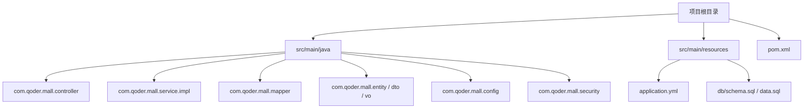
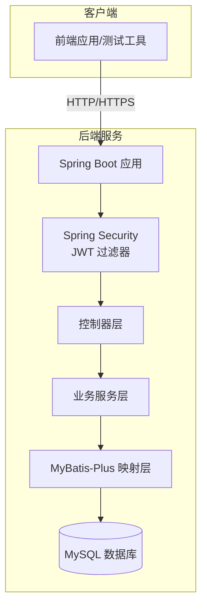
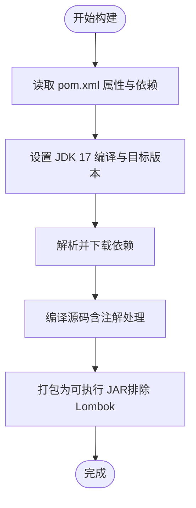
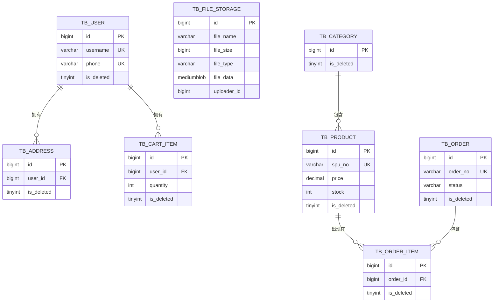
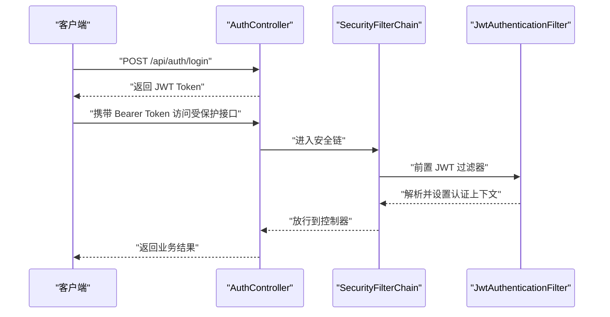
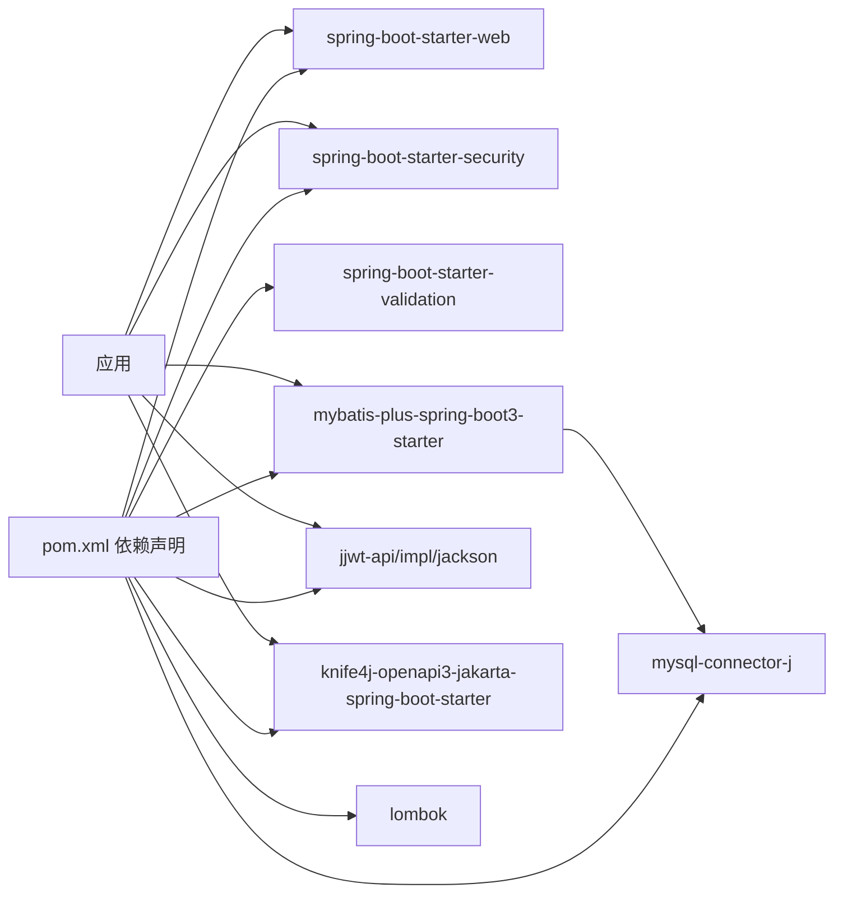

# 部署运维

<cite>
**本文引用的文件**
- [pom.xml](file://pom.xml)
- [application.yml](file://src/main/resources/application.yml)
- [ShoppingBackendApplication.java](file://src/main/java/com/qoder/mall/ShoppingBackendApplication.java)
- [schema.sql](file://src/main/resources/db/schema.sql)
- [data.sql](file://src/main/resources/db/data.sql)
- [CorsConfig.java](file://src/main/java/com/qoder/mall/config/CorsConfig.java)
- [SecurityConfig.java](file://src/main/java/com/qoder/mall/config/SecurityConfig.java)
- [MyBatisPlusConfig.java](file://src/main/java/com/qoder/mall/config/MyBatisPlusConfig.java)
- [SwaggerConfig.java](file://src/main/java/com/qoder/mall/config/SwaggerConfig.java)
</cite>

## 目录
1. [简介](#简介)
2. [项目结构](#项目结构)
3. [核心组件](#核心组件)
4. [架构总览](#架构总览)
5. [详细组件分析](#详细组件分析)
6. [依赖分析](#依赖分析)
7. [性能考虑](#性能考虑)
8. [故障排查指南](#故障排查指南)
9. [结论](#结论)
10. [附录](#附录)

## 简介
本部署运维文档面向购物商城后端项目，围绕构建与打包、部署环境要求、生产配置策略、容器化与编排、性能优化以及故障排查等方面进行系统化说明。文档以仓库中的实际配置与代码为依据，确保可操作性与可追溯性。

## 项目结构
项目采用标准 Spring Boot Maven 工程结构，核心目录与职责如下：
- src/main/java：Java 源码，按包划分领域层（controller、service、mapper、entity、dto、vo、security、config）
- src/main/resources：资源文件，包含数据库初始化脚本与 Spring 配置
- pom.xml：Maven 构建与依赖管理配置

图表来源
- [ShoppingBackendApplication.java:1-17](file://src/main/java/com/qoder/mall/ShoppingBackendApplication.java#L1-L17)
- [pom.xml:1-134](file://pom.xml#L1-L134)

章节来源
- [ShoppingBackendApplication.java:1-17](file://src/main/java/com/qoder/mall/ShoppingBackendApplication.java#L1-L17)
- [pom.xml:1-134](file://pom.xml#L1-L134)

## 核心组件
- 应用入口与扫描：应用启动类负责扫描 Mapper 与开启异步支持，确保 MyBatis-Plus 与 Spring 安全框架正确装配。
- 数据源与持久层：通过 application.yml 配置 MySQL 连接参数；MyBatis-Plus 提供分页插件与自动填充能力。
- 安全与认证：基于 Spring Security 的无状态 JWT 授权模型，开放部分公开接口，限制管理端接口访问。
- 文档与调试：Knife4j/Swagger 提供在线接口文档与认证入口。

章节来源
- [ShoppingBackendApplication.java:8-11](file://src/main/java/com/qoder/mall/ShoppingBackendApplication.java#L8-L11)
- [application.yml:4-36](file://src/main/resources/application.yml#L4-L36)
- [MyBatisPlusConfig.java:14-33](file://src/main/java/com/qoder/mall/config/MyBatisPlusConfig.java#L14-L33)
- [SecurityConfig.java:24-62](file://src/main/java/com/qoder/mall/config/SecurityConfig.java#L24-L62)
- [SwaggerConfig.java:12-29](file://src/main/java/com/qoder/mall/config/SwaggerConfig.java#L12-L29)

## 架构总览
应用整体运行于 Spring Boot 容器，对外提供 REST API，内部通过 MyBatis-Plus 访问 MySQL，使用 JWT 实现无状态鉴权，并通过 Knife4j 提供接口文档。

图表来源
- [ShoppingBackendApplication.java:13-15](file://src/main/java/com/qoder/mall/ShoppingBackendApplication.java#L13-L15)
- [SecurityConfig.java:36-61](file://src/main/java/com/qoder/mall/config/SecurityConfig.java#L36-L61)
- [MyBatisPlusConfig.java:16-21](file://src/main/java/com/qoder/mall/config/MyBatisPlusConfig.java#L16-L21)
- [application.yml:6-9](file://src/main/resources/application.yml#L6-L9)

## 详细组件分析

### 构建与打包（Maven）
- JDK 版本：属性中指定 Java 17，编译插件与目标版本均设置为 17。
- 依赖管理：核心依赖包括 Spring Boot Web、Security、Validation、MyBatis-Plus、MySQL 驱动、JWT、Knife4j、Lombok 等。
- 插件配置：maven-compiler-plugin 指定注解处理器路径；spring-boot-maven-plugin 排除 Lombok 以避免打包冗余。

图表来源
- [pom.xml:20-25](file://pom.xml#L20-L25)
- [pom.xml:101-131](file://pom.xml#L101-L131)

章节来源
- [pom.xml:20-25](file://pom.xml#L20-L25)
- [pom.xml:101-131](file://pom.xml#L101-L131)

### 部署环境要求
- JDK：Java 17（见属性与编译配置）
- 数据库：MySQL（驱动与连接参数在配置文件中定义）
- 文件上传：配置了最大文件大小与请求大小
- 其他：Spring Boot 默认端口 8080

章节来源
- [pom.xml:21](file://pom.xml#L21)
- [application.yml:1-36](file://src/main/resources/application.yml#L1-L36)

### 生产环境配置策略
- 环境变量与外部化配置：建议通过 Spring Profiles 与环境变量覆盖敏感信息（如数据库凭据、JWT 密钥），避免硬编码在仓库中。
- 日志配置：可通过 application.yml 或独立日志配置文件控制日志级别与输出位置。
- 监控指标：建议集成 Actuator 与 Micrometer，暴露 JVM、业务指标，结合 Prometheus/Grafana 监控。
- CORS 与安全：生产环境建议收紧允许来源与方法，仅放行必要路径。
- Swagger：生产环境建议关闭或限制访问，防止敏感接口泄露。

章节来源
- [application.yml:1-36](file://src/main/resources/application.yml#L1-L36)
- [CorsConfig.java:12-24](file://src/main/java/com/qoder/mall/config/CorsConfig.java#L12-L24)
- [SecurityConfig.java:36-61](file://src/main/java/com/qoder/mall/config/SecurityConfig.java#L36-L61)
- [SwaggerConfig.java:14-28](file://src/main/java/com/qoder/mall/config/SwaggerConfig.java#L14-L28)

### 容器化部署方案（概念性）
- Docker 镜像构建：基于官方 JDK 17 基础镜像，复制构建产物，暴露 8080 端口，设置健康检查。
- Kubernetes 部署：定义 Deployment（副本数、滚动更新策略）、Service（ClusterIP/LoadBalancer）、ConfigMap（非敏感配置）、Secret（数据库凭据、JWT 密钥）。
- 存储：持久卷挂载用于文件上传目录（若采用本地文件存储）；推荐使用对象存储（如 MinIO）替代内嵌文件表。
- Ingress/网关：暴露 API 与 Swagger 文档，配置 TLS 与限流。

（本节为通用运维建议，不直接对应具体源文件）

### 数据库初始化与表结构
- 初始化脚本：提供完整的建表与索引定义，包含用户、文件、地址、分类、商品、购物车、订单、订单明细等表。
- 测试数据：提供示例用户、地址、分类与商品数据，便于快速验证。

图表来源
- [schema.sql:18-194](file://src/main/resources/db/schema.sql#L18-L194)

章节来源
- [schema.sql:1-195](file://src/main/resources/db/schema.sql#L1-195)
- [data.sql:10-54](file://src/main/resources/db/data.sql#L10-L54)

### 安全与认证流程
- 登录与注册：开放的公共接口，返回 JWT Token。
- Swagger/Knife4j：文档页面与接口调试入口。
- 管理端接口：需要 ADMIN 角色。
- 未认证/未授权：统一异常处理与响应。

图表来源
- [SecurityConfig.java:36-61](file://src/main/java/com/qoder/mall/config/SecurityConfig.java#L36-L61)
- [SwaggerConfig.java:22-26](file://src/main/java/com/qoder/mall/config/SwaggerConfig.java#L22-L26)

章节来源
- [SecurityConfig.java:24-62](file://src/main/java/com/qoder/mall/config/SecurityConfig.java#L24-L62)
- [SwaggerConfig.java:12-29](file://src/main/java/com/qoder/mall/config/SwaggerConfig.java#L12-L29)

### MyBatis-Plus 配置与分页
- 分页插件：针对 MySQL 的分页拦截器。
- 自动填充：插入与更新时自动填充时间字段。

章节来源
- [MyBatisPlusConfig.java:14-33](file://src/main/java/com/qoder/mall/config/MyBatisPlusConfig.java#L14-L33)

## 依赖分析
- Spring Boot 3.x + Java 17：保证与现代容器与云平台兼容性。
- MyBatis-Plus：简化 CRUD 与分页，配合逻辑删除与自动填充。
- Spring Security + JWT：实现无状态鉴权，适合微服务与无状态应用。
- Knife4j/SpringDoc：提供交互式 API 文档，便于联调与测试。

图表来源
- [pom.xml:27-98](file://pom.xml#L27-L98)

章节来源
- [pom.xml:27-98](file://pom.xml#L27-L98)

## 性能考虑
- 数据库层面
  - 索引优化：参考 schema 中的索引设计，确保高频查询列命中索引（如用户、商品、订单状态等）。
  - 读写分离与分库分表：高并发场景下建议拆分热点表与引入缓存。
  - 连接池与慢查询：合理设置连接池大小与超时，开启慢查询日志定位瓶颈。
- 缓存策略
  - 接口级缓存：对静态或低频变更的数据（如分类、商品详情）增加缓存。
  - 分布式缓存：Redis 缓存热点数据与会话信息，降低数据库压力。
- 负载均衡
  - 多实例部署，结合 Nginx/Ingress 做流量分发，启用健康检查与熔断降级。
- 应用层面
  - 异步任务：对非关键路径（如发送短信、日志上报）异步化。
  - 并发与线程池：合理配置线程池大小，避免阻塞 IO 导致线程耗尽。
- 文件存储
  - 建议迁移至对象存储（如 MinIO/S3），减少数据库文件表膨胀与备份复杂度。

（本节为通用性能建议，不直接对应具体源文件）

## 故障排查指南
- 启动失败
  - 检查 JDK 版本与 Maven 编译配置是否一致。
  - 确认数据库连通性与凭据正确性。
- 认证失败
  - 核对 JWT 密钥与过期时间配置，确认客户端携带正确的 Bearer Token。
  - 检查 Security 配置中的放行路径与角色权限。
- 接口报错
  - 查看全局异常处理与日志级别，定位具体异常栈。
  - 对比 Knife4j/Swagger 文档与实际接口签名。
- 数据问题
  - 使用 schema 与 data 脚本核对表结构与初始数据，确认逻辑删除字段与分页配置生效。

章节来源
- [application.yml:6-9](file://src/main/resources/application.yml#L6-L9)
- [SecurityConfig.java:44-58](file://src/main/java/com/qoder/mall/config/SecurityConfig.java#L44-L58)
- [SwaggerConfig.java:14-28](file://src/main/java/com/qoder/mall/config/SwaggerConfig.java#L14-L28)

## 结论
本项目具备清晰的模块化结构与完善的基础设施配置，能够满足中小型电商后端的部署与运维需求。建议在生产环境中进一步完善配置外化、监控告警、缓存与对象存储策略，并结合容器化与 Kubernetes 实现弹性扩缩容与高可用。

## 附录
- 快速检查清单
  - JDK 17 环境准备
  - MySQL 可用且初始化完成
  - application.yml 中数据库与文件上传配置正确
  - JWT 密钥与过期时间已替换为强密钥
  - Swagger 在生产关闭或限制访问
  - 部署前执行一次全量单元测试与集成测试