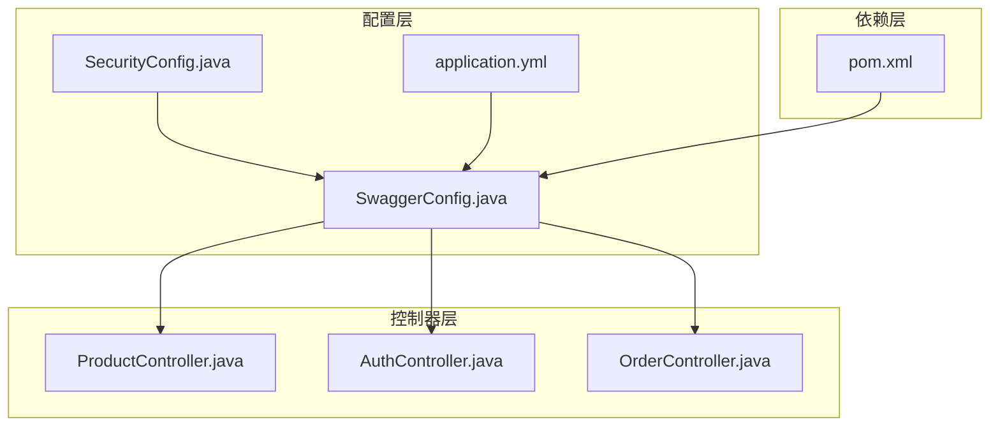
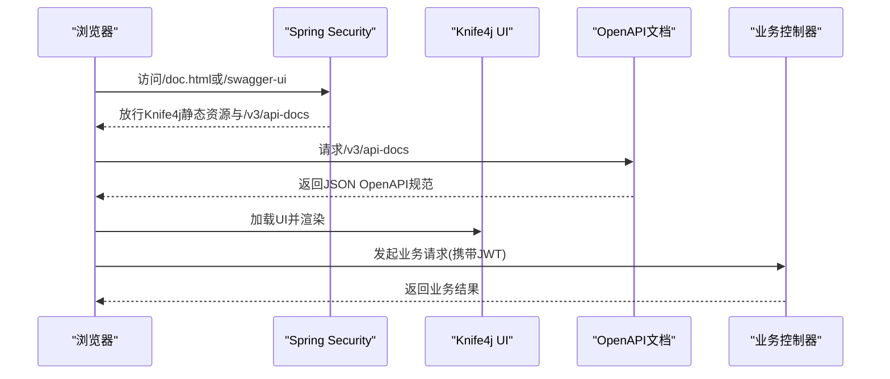
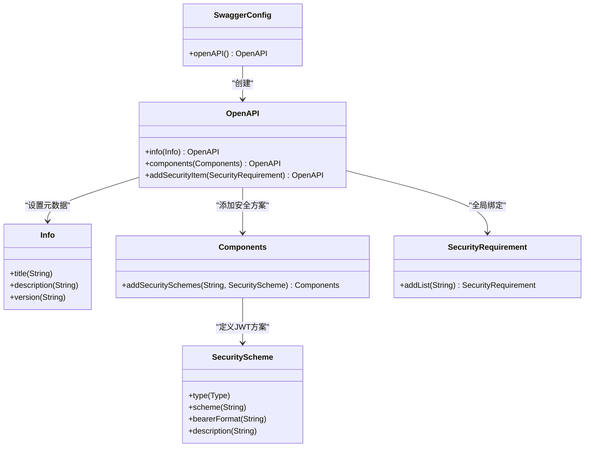
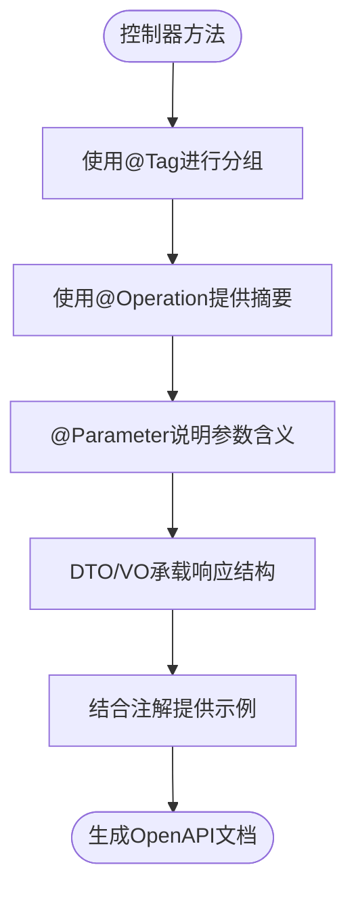
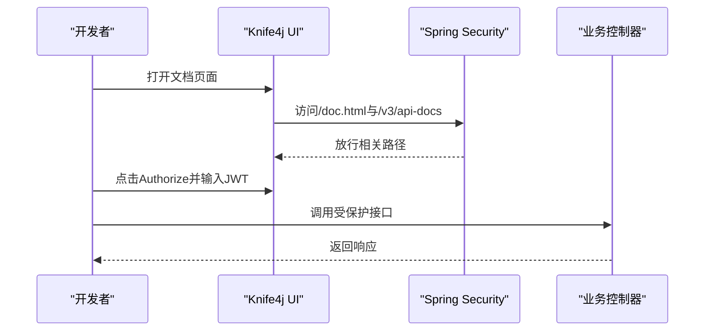
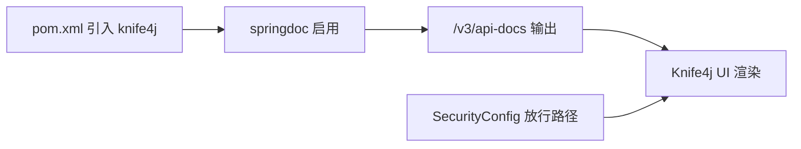

# API文档配置

<cite>
**本文引用的文件**
- [SwaggerConfig.java](file://src/main/java/com/qoder/mall/config/SwaggerConfig.java)
- [pom.xml](file://pom.xml)
- [application.yml](file://src/main/resources/application.yml)
- [SecurityConfig.java](file://src/main/java/com/qoder/mall/config/SecurityConfig.java)
- [ProductController.java](file://src/main/java/com/qoder/mall/controller/ProductController.java)
- [AuthController.java](file://src/main/java/com/qoder/mall/controller/AuthController.java)
- [OrderController.java](file://src/main/java/com/qoder/mall/controller/OrderController.java)
</cite>

## 目录
1. [简介](#简介)
2. [项目结构](#项目结构)
3. [核心组件](#核心组件)
4. [架构总览](#架构总览)
5. [详细组件分析](#详细组件分析)
6. [依赖分析](#依赖分析)
7. [性能考虑](#性能考虑)
8. [故障排查指南](#故障排查指南)
9. [结论](#结论)
10. [附录](#附录)

## 简介
本文件面向购物商城项目的API文档配置，聚焦于基于SpringDoc OpenAPI与Knife4j的集成方案。内容涵盖：
- Swagger配置类SwaggerConfig的实现要点：OpenAPI元数据、安全方案（Bearer JWT）、全局安全需求。
- API分组、接口描述、参数说明、响应示例的配置方式与最佳实践。
- Knife4j相较Swagger的优势与特殊配置项（如增强UI、聚合分组、国际化等）。
- 文档个性化定制：主题样式、语言设置、版本管理策略。
- 调试技巧、在线测试方法与文档维护最佳实践。

## 项目结构
项目采用Spring Boot标准目录结构，API文档相关的关键位置如下：
- 配置层：SwaggerConfig负责OpenAPI定义；SecurityConfig放行Knife4j相关路径；application.yml启用springdoc与swagger-ui。
- 控制器层：各业务控制器通过OpenAPI注解标注接口分组、摘要、参数说明等。
- 依赖层：pom.xml引入knife4j-openapi3-jakarta-spring-boot-starter。

**图表来源**
- [SwaggerConfig.java:11-29](file://src/main/java/com/qoder/mall/config/SwaggerConfig.java#L11-L29)
- [SecurityConfig.java:35-62](file://src/main/java/com/qoder/mall/config/SecurityConfig.java#L35-L62)
- [application.yml:30-36](file://src/main/resources/application.yml#L30-L36)
- [pom.xml:79-84](file://pom.xml#L79-L84)

**章节来源**
- [SwaggerConfig.java:11-29](file://src/main/java/com/qoder/mall/config/SwaggerConfig.java#L11-L29)
- [SecurityConfig.java:35-62](file://src/main/java/com/qoder/mall/config/SecurityConfig.java#L35-L62)
- [application.yml:30-36](file://src/main/resources/application.yml#L30-L36)
- [pom.xml:79-84](file://pom.xml#L79-L84)

## 核心组件
- SwaggerConfig：定义OpenAPI元数据（标题、描述、版本），配置全局安全方案（Bearer JWT）与安全需求。
- SecurityConfig：在Spring Security中放行Knife4j相关静态资源与API文档路径，确保文档可访问。
- application.yml：开启springdoc.api-docs与swagger-ui，并指定OpenAPI文档输出路径。
- 控制器层：使用OpenAPI注解进行接口分组、摘要、参数说明与示例标注。

关键点：
- 全局安全方案统一使用Bearer JWT，便于在Knife4j UI中一键注入Token进行在线测试。
- 控制器通过@Tag、@Operation、@Parameter等注解完成文档元数据的声明式配置。

**章节来源**
- [SwaggerConfig.java:14-28](file://src/main/java/com/qoder/mall/config/SwaggerConfig.java#L14-L28)
- [SecurityConfig.java:50-52](file://src/main/java/com/qoder/mall/config/SecurityConfig.java#L50-L52)
- [application.yml:31-35](file://src/main/resources/application.yml#L31-L35)
- [ProductController.java:19-52](file://src/main/java/com/qoder/mall/controller/ProductController.java#L19-L52)
- [AuthController.java:19-42](file://src/main/java/com/qoder/mall/controller/AuthController.java#L19-L42)
- [OrderController.java:19-68](file://src/main/java/com/qoder/mall/controller/OrderController.java#L19-L68)

## 架构总览
下图展示从浏览器访问到API文档生成与控制器处理的整体流程，以及Knife4j在其中的角色。

**图表来源**
- [SecurityConfig.java:50-52](file://src/main/java/com/qoder/mall/config/SecurityConfig.java#L50-L52)
- [application.yml:31-35](file://src/main/resources/application.yml#L31-L35)
- [SwaggerConfig.java:14-28](file://src/main/java/com/qoder/mall/config/SwaggerConfig.java#L14-L28)

## 详细组件分析

### SwaggerConfig配置详解
- OpenAPI元数据：标题、描述、版本用于统一标识API文档。
- 安全方案：定义名为“Bearer”的HTTP安全方案，类型为HTTP，scheme为bearer，格式为JWT，并提供简要说明。
- 全局安全需求：将“Bearer”方案应用到所有接口，确保Knife4j UI能统一注入与测试。

**图表来源**
- [SwaggerConfig.java:14-28](file://src/main/java/com/qoder/mall/config/SwaggerConfig.java#L14-L28)

**章节来源**
- [SwaggerConfig.java:14-28](file://src/main/java/com/qoder/mall/config/SwaggerConfig.java#L14-L28)

### API分组与接口描述
- 分组：控制器类上使用@Tag(name, description)进行分组，如“商品浏览”、“认证管理”、“用户订单”。
- 接口摘要：每个接口使用@Operation(summary)提供简短描述。
- 参数说明：使用@Parameter(description=...)对请求参数进行说明，便于生成清晰的文档。
- 响应示例：可通过@Operation(responses=...)或在DTO中配合注解提供示例，提升可读性。

**图表来源**
- [ProductController.java:19-52](file://src/main/java/com/qoder/mall/controller/ProductController.java#L19-L52)
- [AuthController.java:19-42](file://src/main/java/com/qoder/mall/controller/AuthController.java#L19-L42)
- [OrderController.java:19-68](file://src/main/java/com/qoder/mall/controller/OrderController.java#L19-L68)

**章节来源**
- [ProductController.java:19-52](file://src/main/java/com/qoder/mall/controller/ProductController.java#L19-L52)
- [AuthController.java:19-42](file://src/main/java/com/qoder/mall/controller/AuthController.java#L19-L42)
- [OrderController.java:19-68](file://src/main/java/com/qoder/mall/controller/OrderController.java#L19-L68)

### 安全方案与在线测试
- 全局安全方案：SwaggerConfig中定义的“Bearer”方案，使Knife4j UI支持在文档页面直接输入JWT进行在线测试。
- 安全放行：SecurityConfig对Knife4j相关路径放行，避免被Spring Security拦截。
- 在线测试步骤：
  1) 打开Knife4j UI（例如/doc.html或/swagger-ui）。
  2) 点击“Authorize”按钮，输入令牌值（格式：Bearer xxx）。
  3) 对需要鉴权的接口进行测试调用。

**图表来源**
- [SecurityConfig.java:50-52](file://src/main/java/com/qoder/mall/config/SecurityConfig.java#L50-L52)
- [SwaggerConfig.java:22-27](file://src/main/java/com/qoder/mall/config/SwaggerConfig.java#L22-L27)

**章节来源**
- [SecurityConfig.java:50-52](file://src/main/java/com/qoder/mall/config/SecurityConfig.java#L50-L52)
- [SwaggerConfig.java:22-27](file://src/main/java/com/qoder/mall/config/SwaggerConfig.java#L22-L27)

### Knife4j对比与优势
- 增强UI：提供更友好、功能更丰富的交互界面，支持分组折叠、请求/响应高亮、在线调试等。
- 国际化：内置多语言支持，便于国际化团队协作。
- 聚合分组：可按模块或版本聚合接口，提升大型项目的可维护性。
- 自定义能力：支持自定义主题、Logo、版本号、分组排序等，满足企业级定制需求。
- 与SpringDoc集成：通过knife4j-openapi3-jakarta-spring-boot-starter无缝对接OpenAPI规范。

**章节来源**
- [pom.xml:79-84](file://pom.xml#L79-L84)

### 个性化定制方法
- 主题样式：通过Knife4j提供的配置项调整UI主题、Logo、侧边栏样式等。
- 语言设置：配置国际化语言，适配不同地区团队。
- 版本管理：在OpenAPI元数据中设置版本号，结合Knife4j的版本切换功能，实现多版本文档管理。
- 分组策略：按业务域（如用户、商品、订单）划分@Tag分组，配合Knife4j的分组排序与聚合展示。

**章节来源**
- [SwaggerConfig.java:17-20](file://src/main/java/com/qoder/mall/config/SwaggerConfig.java#L17-L20)
- [ProductController.java:19](file://src/main/java/com/qoder/mall/controller/ProductController.java#L19)
- [AuthController.java:19](file://src/main/java/com/qoder/mall/controller/AuthController.java#L19)
- [OrderController.java:19](file://src/main/java/com/qoder/mall/controller/OrderController.java#L19)

## 依赖分析
- 依赖引入：pom.xml中引入knife4j-openapi3-jakarta-spring-boot-starter，实现SpringDoc与Knife4j的集成。
- 运行时路径：application.yml启用springdoc.api-docs与swagger-ui，并指定OpenAPI输出路径为/v3/api-docs。
- 安全放行：SecurityConfig对/doc.html、/webjars/**、/swagger-resources/**、/v3/api-docs/**、/swagger-ui/**、/favicon.ico放行，确保Knife4j可用。

**图表来源**
- [pom.xml:79-84](file://pom.xml#L79-L84)
- [application.yml:31-35](file://src/main/resources/application.yml#L31-L35)
- [SecurityConfig.java:50-52](file://src/main/java/com/qoder/mall/config/SecurityConfig.java#L50-L52)

**章节来源**
- [pom.xml:79-84](file://pom.xml#L79-L84)
- [application.yml:31-35](file://src/main/resources/application.yml#L31-L35)
- [SecurityConfig.java:50-52](file://src/main/java/com/qoder/mall/config/SecurityConfig.java#L50-L52)

## 性能考虑
- 文档生成：OpenAPI规范由运行时扫描控制器注解生成，建议在生产环境保持合理分组与注释，避免过度复杂导致加载缓慢。
- UI渲染：Knife4j UI在浏览器端渲染，接口数量较多时建议启用分组与搜索功能，减少一次性渲染压力。
- 安全放行：仅放行必要路径，避免暴露敏感资源；同时确保只在开发/测试环境开放文档访问。

## 故障排查指南
- 文档无法访问：
  - 检查application.yml中的springdoc.api-docs.enabled与swagger-ui.enabled是否为true。
  - 确认SecurityConfig对/v3/api-docs/**与/swagger-ui/**已放行。
- 在线测试失败：
  - 确认已在Knife4j UI中正确输入JWT（格式：Bearer xxx）。
  - 检查后端是否正确解析Authorization头并进行鉴权。
- 接口未出现在文档中：
  - 确认控制器类与方法已使用OpenAPI注解（@Tag、@Operation、@Parameter等）。
  - 检查包扫描范围与Spring组件注册是否生效。

**章节来源**
- [application.yml:31-35](file://src/main/resources/application.yml#L31-L35)
- [SecurityConfig.java:50-52](file://src/main/java/com/qoder/mall/config/SecurityConfig.java#L50-L52)
- [SwaggerConfig.java:22-27](file://src/main/java/com/qoder/mall/config/SwaggerConfig.java#L22-L27)

## 结论
本项目通过SpringDoc OpenAPI与Knife4j实现了简洁而强大的API文档体系。SwaggerConfig集中定义了OpenAPI元数据与全局安全方案，SecurityConfig确保文档路径可访问，控制器层通过OpenAPI注解完成分组与描述声明。配合Knife4j的增强UI与个性化定制能力，能够高效支撑团队协作与外部联调。建议在后续迭代中持续完善注释与示例，建立文档变更与版本管理流程，保障文档质量与一致性。

## 附录
- 在线测试操作清单：
  - 打开Knife4j UI（/doc.html或/swagger-ui）。
  - 点击“Authorize”，输入格式为“Bearer xxx”的JWT。
  - 选择受保护接口，点击“Try it out”，填写必要参数后执行。
- 维护最佳实践：
  - 为每个控制器类添加@Tag分组与描述。
  - 为每个接口补充@Operation(summary)与@Parameter(description)。
  - 在DTO中提供字段说明与示例，提升响应可读性。
  - 定期更新OpenAPI版本号，配合Knife4j版本切换功能进行演进。