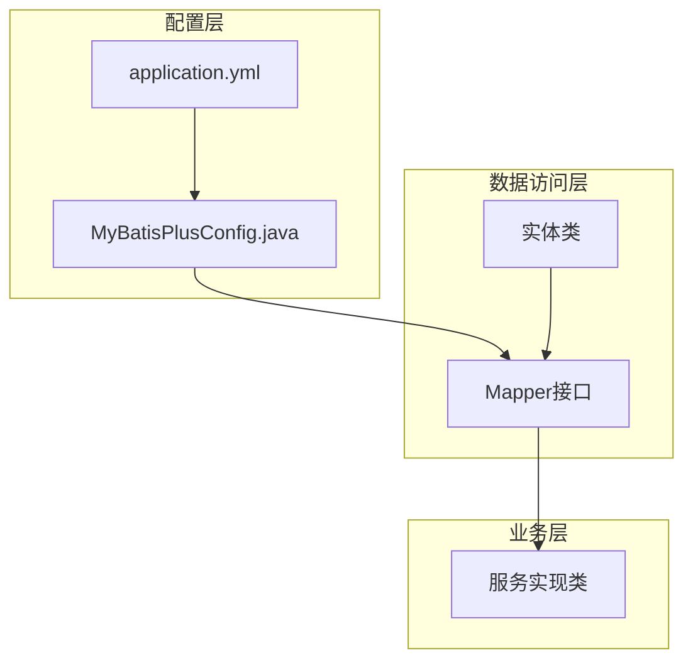
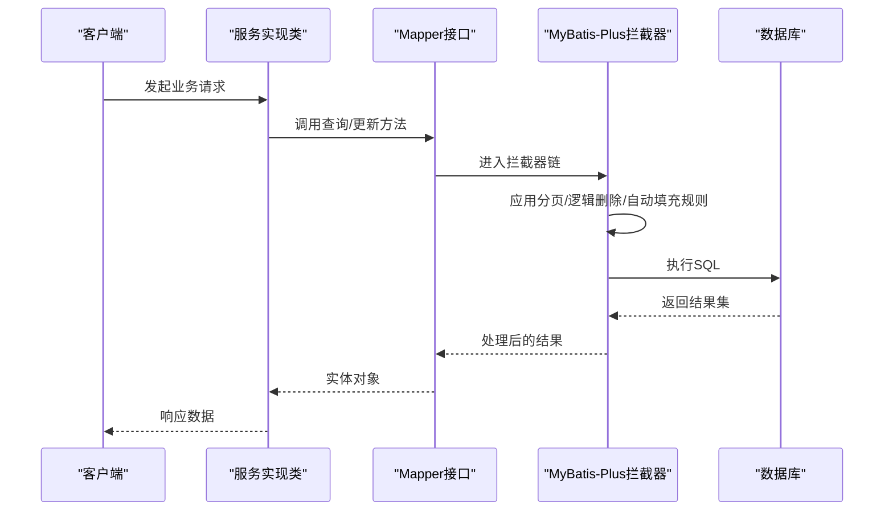
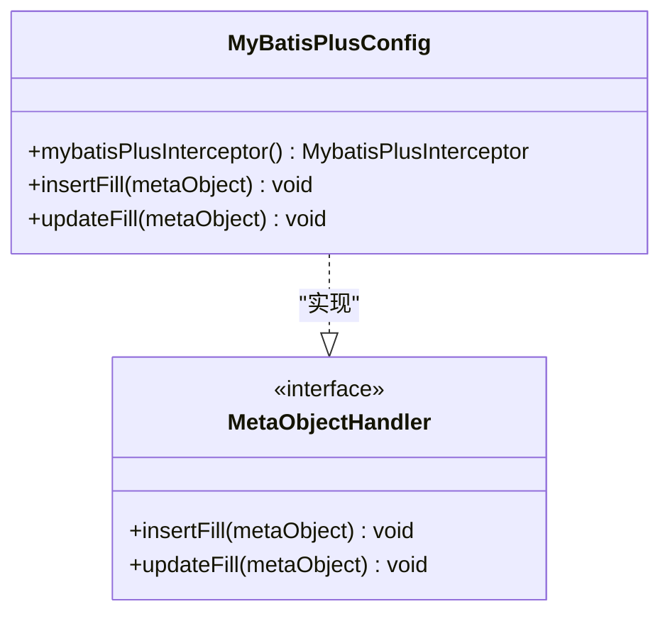
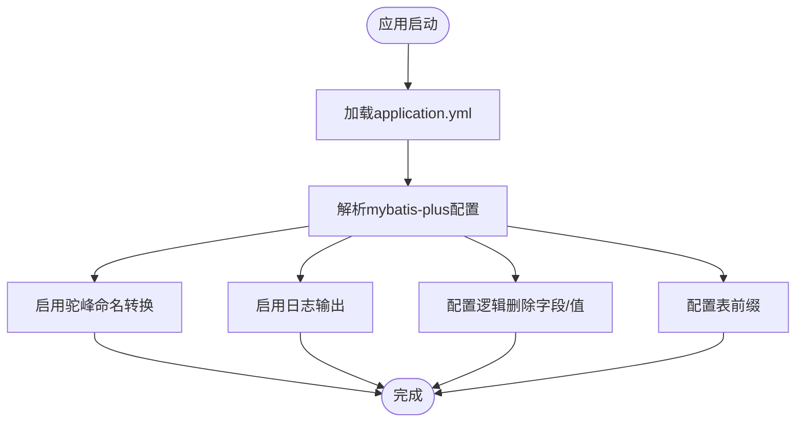
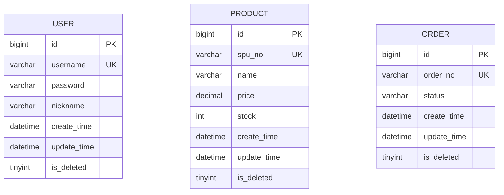
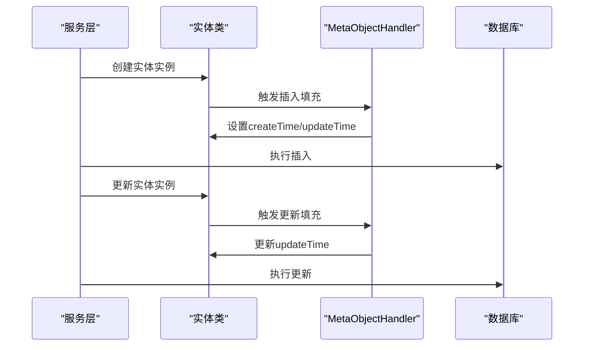
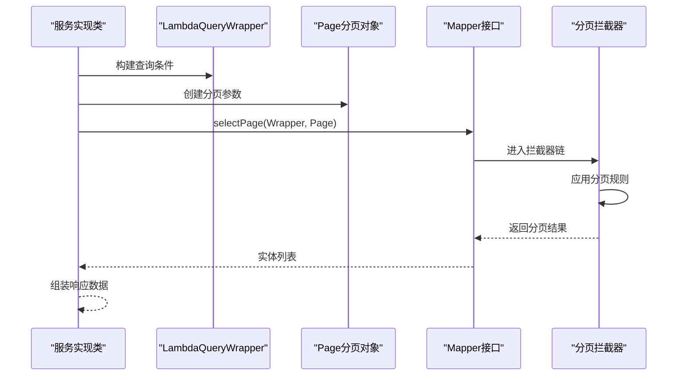
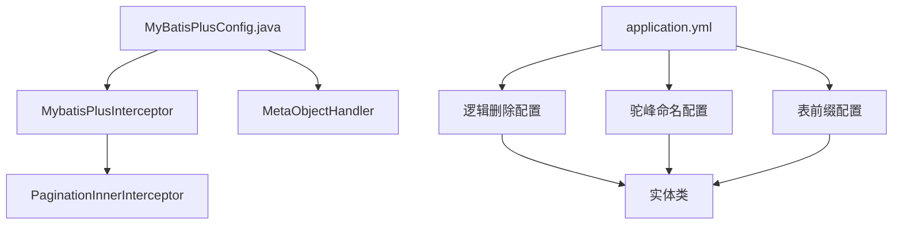

# ORM配置

<cite>
**本文引用的文件**
- [MyBatisPlusConfig.java](file://src/main/java/com/qoder/mall/config/MyBatisPlusConfig.java)
- [application.yml](file://src/main/resources/application.yml)
- [schema.sql](file://src/main/resources/db/schema.sql)
- [User.java](file://src/main/java/com/qoder/mall/entity/User.java)
- [Product.java](file://src/main/java/com/qoder/mall/entity/Product.java)
- [Order.java](file://src/main/java/com/qoder/mall/entity/Order.java)
- [ProductMapper.java](file://src/main/java/com/qoder/mall/mapper/ProductMapper.java)
- [ProductServiceImpl.java](file://src/main/java/com/qoder/mall/service/impl/ProductServiceImpl.java)
- [CategoryServiceImpl.java](file://src/main/java/com/qoder/mall/service/impl/CategoryServiceImpl.java)
- [AddressServiceImpl.java](file://src/main/java/com/qoder/mall/service/impl/AddressServiceImpl.java)
</cite>

## 目录
1. [简介](#简介)
2. [项目结构](#项目结构)
3. [核心组件](#核心组件)
4. [架构概览](#架构概览)
5. [详细组件分析](#详细组件分析)
6. [依赖分析](#依赖分析)
7. [性能考虑](#性能考虑)
8. [故障排查指南](#故障排查指南)
9. [结论](#结论)
10. [附录](#附录)

## 简介
本文件针对购物商城项目的ORM配置进行深入解析，重点围绕MyBatis-Plus配置类MyBatisPlusConfig展开，系统阐述其在分页插件、逻辑删除、自动填充、驼峰命名转换等方面的配置与实现，并结合项目实际业务场景，提供配置优化建议、自定义插件开发指南以及常见ORM问题的排查方法。

## 项目结构
项目采用Spring Boot标准目录结构，ORM相关配置集中在以下位置：
- 配置类：src/main/java/com/qoder/mall/config/MyBatisPlusConfig.java
- 全局配置：src/main/resources/application.yml
- 数据库Schema：src/main/resources/db/schema.sql
- 实体类：src/main/java/com/qoder/mall/entity/*.java
- Mapper接口：src/main/java/com/qoder/mall/mapper/*.java
- 服务层示例：src/main/java/com/qoder/mall/service/impl/*.java

**图表来源**
- [MyBatisPlusConfig.java:1-34](file://src/main/java/com/qoder/mall/config/MyBatisPlusConfig.java#L1-L34)
- [application.yml:15-25](file://src/main/resources/application.yml#L15-L25)

**章节来源**
- [MyBatisPlusConfig.java:1-34](file://src/main/java/com/qoder/mall/config/MyBatisPlusConfig.java#L1-L34)
- [application.yml:15-25](file://src/main/resources/application.yml#L15-L25)

## 核心组件
本项目ORM配置的核心由两部分组成：
- 基于注解的全局配置：通过application.yml集中管理MyBatis-Plus的全局行为，包括驼峰命名转换、日志输出、逻辑删除策略、表前缀等。
- 基于Java配置的拦截器注册：通过MyBatisPlusConfig.java注册MyBatis-Plus拦截器，实现分页功能。

关键配置项说明：
- 分页插件：使用PaginationInnerInterceptor并指定数据库类型为MySQL，确保分页SQL适配MySQL方言。
- 逻辑删除：通过global-config.db-config配置逻辑删除字段、删除值与未删除值，配合实体类上的@TableLogic注解实现软删除。
- 自动填充：通过MetaObjectHandler实现插入与更新时的时间字段自动填充。
- 驼峰命名转换：开启map-underscore-to-camel-case，自动将数据库下划线命名映射到实体类驼峰命名。
- 表前缀：配置table-prefix为"tb_"，简化实体类与表名的映射关系。

**章节来源**
- [MyBatisPlusConfig.java:16-21](file://src/main/java/com/qoder/mall/config/MyBatisPlusConfig.java#L16-L21)
- [MyBatisPlusConfig.java:23-32](file://src/main/java/com/qoder/mall/config/MyBatisPlusConfig.java#L23-L32)
- [application.yml:15-25](file://src/main/resources/application.yml#L15-L25)

## 架构概览
MyBatis-Plus在本项目中的工作流程如下：
- 应用启动时，Spring加载application.yml中的MyBatis-Plus配置。
- MyBatisPlusConfig.java注册MybatisPlusInterceptor，其中包含PaginationInnerInterceptor。
- 业务层调用Mapper接口执行CRUD操作，MyBatis-Plus根据实体类注解和全局配置自动处理逻辑删除、自动填充、分页等逻辑。
- 查询结果自动进行驼峰命名转换，提升代码可读性。

**图表来源**
- [MyBatisPlusConfig.java:16-21](file://src/main/java/com/qoder/mall/config/MyBatisPlusConfig.java#L16-L21)
- [application.yml:15-25](file://src/main/resources/application.yml#L15-L25)

## 详细组件分析

### MyBatis-Plus配置类MyBatisPlusConfig
MyBatisPlusConfig.java实现了MetaObjectHandler接口，承担以下职责：
- 注册分页拦截器：通过@Bean声明mybatisPlusInterceptor，向MyBatis-Plus注入PaginationInnerInterceptor，支持MySQL方言的分页。
- 自动填充策略：在insertFill中统一设置createTime和updateTime；在updateFill中更新updateTime，确保所有实体的时间字段保持一致的业务语义。

**图表来源**
- [MyBatisPlusConfig.java:14-32](file://src/main/java/com/qoder/mall/config/MyBatisPlusConfig.java#L14-L32)

**章节来源**
- [MyBatisPlusConfig.java:16-21](file://src/main/java/com/qoder/mall/config/MyBatisPlusConfig.java#L16-L21)
- [MyBatisPlusConfig.java:23-32](file://src/main/java/com/qoder/mall/config/MyBatisPlusConfig.java#L23-L32)

### 全局配置application.yml
application.yml中的mybatis-plus配置项：
- configuration.map-underscore-to-camel-case：开启驼峰命名转换，避免手动映射。
- configuration.log-impl：启用STDOUT日志输出，便于开发调试。
- global-config.db-config.logic-delete-field：指定逻辑删除字段为isDeleted。
- global-config.db-config.logic-delete-value：设置删除值为1。
- global-config.db-config.logic-not-delete-value：设置未删除值为0。
- global-config.db-config.table-prefix：设置表前缀为"tb_"，简化实体类注解。

**图表来源**
- [application.yml:15-25](file://src/main/resources/application.yml#L15-L25)

**章节来源**
- [application.yml:15-25](file://src/main/resources/application.yml#L15-L25)

### 实体类与逻辑删除
项目中的多个实体类（User、Product、Order等）均使用@TableLogic注解标注逻辑删除字段isDeleted，配合application.yml中的全局配置实现软删除：
- 查询时自动过滤isDeleted=1的记录。
- 删除操作不会物理删除，而是更新isDeleted字段为1。
- 新增实体时isDeleted默认为0，符合未删除状态。

**图表来源**
- [User.java:37-38](file://src/main/java/com/qoder/mall/entity/User.java#L37-L38)
- [Product.java:50-51](file://src/main/java/com/qoder/mall/entity/Product.java#L50-L51)
- [Order.java:52-53](file://src/main/java/com/qoder/mall/entity/Order.java#L52-L53)

**章节来源**
- [User.java:37-38](file://src/main/java/com/qoder/mall/entity/User.java#L37-L38)
- [Product.java:50-51](file://src/main/java/com/qoder/mall/entity/Product.java#L50-L51)
- [Order.java:52-53](file://src/main/java/com/qoder/mall/entity/Order.java#L52-L53)

### 自动填充与驼峰命名
- 自动填充：通过MetaObjectHandler在插入和更新时自动填充时间字段，确保数据一致性。
- 驼峰命名：application.yml开启map-underscore-to-camel-case，数据库字段如create_time会自动映射到实体类的createTime属性。

**图表来源**
- [MyBatisPlusConfig.java:23-32](file://src/main/java/com/qoder/mall/config/MyBatisPlusConfig.java#L23-L32)
- [application.yml:17](file://src/main/resources/application.yml#L17)

**章节来源**
- [MyBatisPlusConfig.java:23-32](file://src/main/java/com/qoder/mall/config/MyBatisPlusConfig.java#L23-L32)
- [application.yml:17](file://src/main/resources/application.yml#L17)

### 条件构造器与分页实践
项目中广泛使用LambdaQueryWrapper构建查询条件，结合分页插件实现高效查询：
- 条件构造器：通过LambdaQueryWrapper.eq、orderByDesc等方法构建复杂查询条件。
- 分页插件：MyBatis-PlusConfig注册的PaginationInnerInterceptor自动拦截分页SQL，确保查询结果按分页返回。

**图表来源**
- [ProductServiceImpl.java:28-38](file://src/main/java/com/qoder/mall/service/impl/ProductServiceImpl.java#L28-L38)
- [CategoryServiceImpl.java:22-40](file://src/main/java/com/qoder/mall/service/impl/CategoryServiceImpl.java#L22-L40)
- [AddressServiceImpl.java:23-31](file://src/main/java/com/qoder/mall/service/impl/AddressServiceImpl.java#L23-L31)
- [MyBatisPlusConfig.java:16-21](file://src/main/java/com/qoder/mall/config/MyBatisPlusConfig.java#L16-L21)

**章节来源**
- [ProductServiceImpl.java:28-38](file://src/main/java/com/qoder/mall/service/impl/ProductServiceImpl.java#L28-L38)
- [CategoryServiceImpl.java:22-40](file://src/main/java/com/qoder/mall/service/impl/CategoryServiceImpl.java#L22-L40)
- [AddressServiceImpl.java:23-31](file://src/main/java/com/qoder/mall/service/impl/AddressServiceImpl.java#L23-L31)
- [MyBatisPlusConfig.java:16-21](file://src/main/java/com/qoder/mall/config/MyBatisPlusConfig.java#L16-L21)

## 依赖分析
MyBatis-Plus配置在项目中的依赖关系如下：
- MyBatisPlusConfig依赖MyBatis-Plus的拦截器机制，通过@Bean注册MybatisPlusInterceptor。
- application.yml中的mybatis-plus配置影响实体类注解的行为，如@TableLogic、@TableField等。
- 实体类与数据库表结构通过表前缀和字段映射建立联系，逻辑删除字段isDeleted贯穿所有实体。

**图表来源**
- [MyBatisPlusConfig.java:16-21](file://src/main/java/com/qoder/mall/config/MyBatisPlusConfig.java#L16-L21)
- [application.yml:15-25](file://src/main/resources/application.yml#L15-L25)

**章节来源**
- [MyBatisPlusConfig.java:16-21](file://src/main/java/com/qoder/mall/config/MyBatisPlusConfig.java#L16-L21)
- [application.yml:15-25](file://src/main/resources/application.yml#L15-L25)

## 性能考虑
- 分页优化：合理设置分页大小，避免一次性加载过多数据；对高频查询建立合适的索引（如status、is_deleted组合索引）。
- 逻辑删除：定期清理长期未使用的软删除数据，避免索引膨胀；在查询时尽量利用索引字段进行过滤。
- 自动填充：仅在必要字段启用自动填充，减少不必要的写入开销。
- SQL日志：生产环境建议关闭STDOUT日志或调整为INFO级别，降低日志I/O开销。

## 故障排查指南
- 分页不生效：检查MyBatis-Plus配置是否正确注册了PaginationInnerInterceptor，确认数据库类型与实际数据库一致。
- 逻辑删除异常：核对实体类的@TableLogic注解与application.yml中的逻辑删除配置是否匹配；检查数据库中isDeleted字段的数据类型与取值范围。
- 自动填充失败：确认实体类的@TableField(fill=...)注解是否正确配置；检查MetaObjectHandler的insertFill和updateFill方法是否被调用。
- 驼峰命名映射错误：检查application.yml中map-underscore-to-camel-case是否开启；核对实体类字段命名与数据库字段是否一致。
- 查询性能差：分析慢查询日志，检查WHERE条件、ORDER BY字段是否命中索引；考虑添加复合索引或重构查询条件。

## 结论
本项目的MyBatis-Plus配置通过全局配置与Java配置相结合的方式，实现了分页、逻辑删除、自动填充、驼峰命名转换等核心功能。配置简洁而实用，能够满足购物商城的日常业务需求。建议在生产环境中进一步完善索引策略、监控SQL执行效率，并根据业务发展持续优化ORM配置。

## 附录
- 数据库表结构参考：schema.sql中定义了完整的表结构，包括逻辑删除字段isDeleted的定义与索引设计。
- Mapper接口示例：ProductMapper展示了自定义SQL的使用方式，结合逻辑删除字段确保查询结果不包含已删除记录。
- 服务层实践：ProductServiceImpl、CategoryServiceImpl、AddressServiceImpl等展示了条件构造器与分页插件的实际应用场景。

**章节来源**
- [schema.sql:18-195](file://src/main/resources/db/schema.sql#L18-L195)
- [ProductMapper.java:10-14](file://src/main/java/com/qoder/mall/mapper/ProductMapper.java#L10-L14)