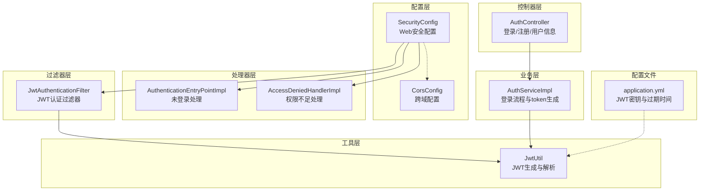
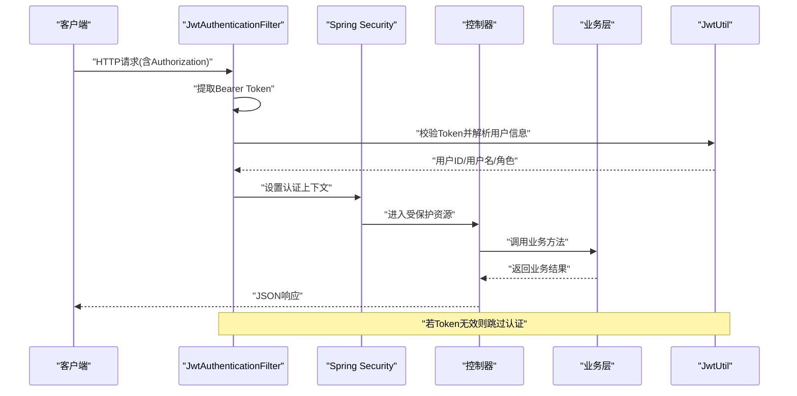
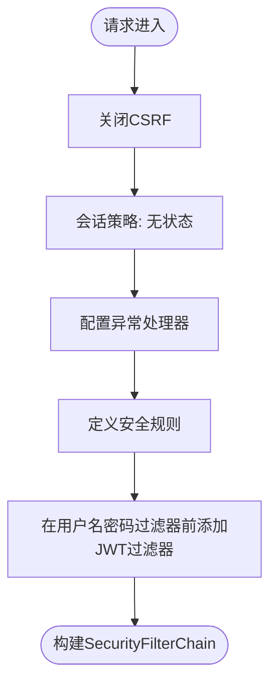
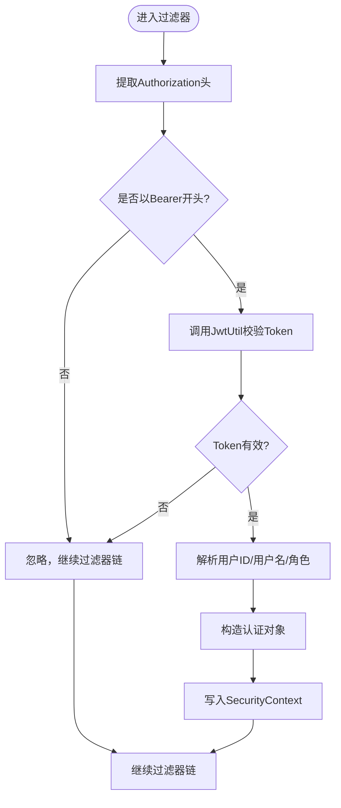
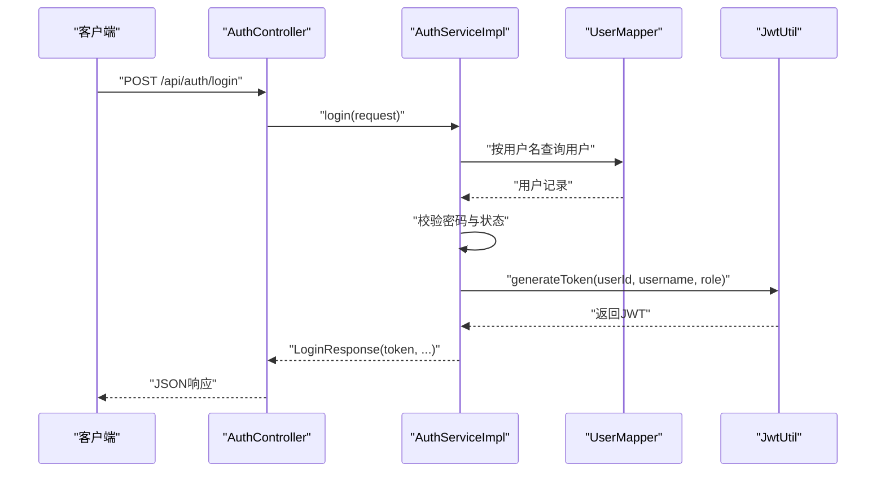
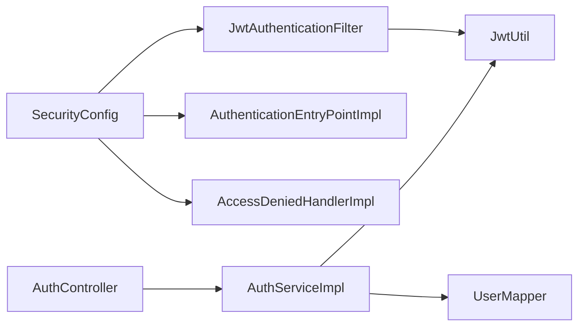

# 安全配置

<cite>
**本文引用的文件**
- [SecurityConfig.java](file://src/main/java/com/qoder/mall/config/SecurityConfig.java)
- [JwtAuthenticationFilter.java](file://src/main/java/com/qoder/mall/security/filter/JwtAuthenticationFilter.java)
- [AuthenticationEntryPointImpl.java](file://src/main/java/com/qoder/mall/security/handler/AuthenticationEntryPointImpl.java)
- [AccessDeniedHandlerImpl.java](file://src/main/java/com/qoder/mall/security/handler/AccessDeniedHandlerImpl.java)
- [JwtUtil.java](file://src/main/java/com/qoder/mall/common/util/JwtUtil.java)
- [CorsConfig.java](file://src/main/java/com/qoder/mall/config/CorsConfig.java)
- [AuthController.java](file://src/main/java/com/qoder/mall/controller/AuthController.java)
- [AuthServiceImpl.java](file://src/main/java/com/qoder/mall/service/impl/AuthServiceImpl.java)
- [application.yml](file://src/main/resources/application.yml)
- [User.java](file://src/main/java/com/qoder/mall/entity/User.java)
- [LoginResponse.java](file://src/main/java/com/qoder/mall/dto/response/LoginResponse.java)
</cite>

## 目录
1. [简介](#简介)
2. [项目结构](#项目结构)
3. [核心组件](#核心组件)
4. [架构总览](#架构总览)
5. [详细组件分析](#详细组件分析)
6. [依赖分析](#依赖分析)
7. [性能考虑](#性能考虑)
8. [故障排查指南](#故障排查指南)
9. [结论](#结论)
10. [附录](#附录)

## 简介
本文件面向购物商城项目的后端安全配置，重点围绕Spring Security配置类SecurityConfig展开，系统性阐述HTTP安全配置、JWT认证过滤器集成、CORS配置、异常处理机制；深入解析JWT认证过滤器的工作原理（token提取、验证、用户信息解析）；文档化认证入口点与访问拒绝处理器；解释安全规则配置（公共访问路径、受保护路径、权限要求）。同时提供安全配置的自定义方法、调试技巧以及常见安全问题的解决方案，帮助开发者在不直接阅读代码的情况下也能快速理解并维护安全体系。

## 项目结构
安全相关代码主要分布在以下模块：
- 配置层：SecurityConfig（Web安全）、CorsConfig（跨域）
- 过滤器层：JwtAuthenticationFilter（JWT认证过滤器）
- 处理器层：AuthenticationEntryPointImpl（未登录处理）、AccessDeniedHandlerImpl（权限不足处理）
- 工具层：JwtUtil（JWT生成与解析）
- 控制器层：AuthController（登录/注册/用户信息）
- 业务层：AuthServiceImpl（登录流程与token生成）
- 配置文件：application.yml（JWT密钥与过期时间）

图表来源
- [SecurityConfig.java:30-61](file://src/main/java/com/qoder/mall/config/SecurityConfig.java#L30-L61)
- [JwtAuthenticationFilter.java:21-46](file://src/main/java/com/qoder/mall/security/filter/JwtAuthenticationFilter.java#L21-L46)
- [AuthenticationEntryPointImpl.java:14-29](file://src/main/java/com/qoder/mall/security/handler/AuthenticationEntryPointImpl.java#L14-L29)
- [AccessDeniedHandlerImpl.java:14-29](file://src/main/java/com/qoder/mall/security/handler/AccessDeniedHandlerImpl.java#L14-L29)
- [JwtUtil.java:16-78](file://src/main/java/com/qoder/mall/common/util/JwtUtil.java#L16-L78)
- [CorsConfig.java:9-23](file://src/main/java/com/qoder/mall/config/CorsConfig.java#L9-L23)
- [AuthController.java:16-42](file://src/main/java/com/qoder/mall/controller/AuthController.java#L16-L42)
- [AuthServiceImpl.java:17-74](file://src/main/java/com/qoder/mall/service/impl/AuthServiceImpl.java#L17-L74)
- [application.yml:26-28](file://src/main/resources/application.yml#L26-L28)

章节来源
- [SecurityConfig.java:20-61](file://src/main/java/com/qoder/mall/config/SecurityConfig.java#L20-L61)
- [CorsConfig.java:9-23](file://src/main/java/com/qoder/mall/config/CorsConfig.java#L9-L23)

## 核心组件
- Web安全配置（SecurityConfig）
  - 关闭CSRF，启用方法级安全注解，设置会话策略为无状态
  - 注入认证入口点与访问拒绝处理器
  - 定义安全规则：公共端点、Swagger文档端点、管理员端点、其余请求需认证
  - 在用户名密码过滤器之前添加JWT认证过滤器
- JWT认证过滤器（JwtAuthenticationFilter）
  - 从请求头提取Bearer token
  - 使用JwtUtil校验token有效性并解析用户信息
  - 构造认证对象并写入SecurityContext
- 异常处理
  - 认证入口点：未登录或Token过期返回统一JSON响应
  - 访问拒绝处理器：无权限访问返回统一JSON响应
- 跨域配置（CorsConfig）
  - 允许任意源、凭证、头与方法，全局注册
- JWT工具（JwtUtil）
  - 读取配置中的密钥与过期时间
  - 生成token并包含用户ID、用户名、角色
  - 解析token并提供用户ID、用户名、角色与有效期校验
- 登录流程（AuthController/ServiceImpl）
  - 用户名密码匹配成功后生成JWT并返回给客户端

章节来源
- [SecurityConfig.java:30-61](file://src/main/java/com/qoder/mall/config/SecurityConfig.java#L30-L61)
- [JwtAuthenticationFilter.java:21-46](file://src/main/java/com/qoder/mall/security/filter/JwtAuthenticationFilter.java#L21-L46)
- [AuthenticationEntryPointImpl.java:14-29](file://src/main/java/com/qoder/mall/security/handler/AuthenticationEntryPointImpl.java#L14-L29)
- [AccessDeniedHandlerImpl.java:14-29](file://src/main/java/com/qoder/mall/security/handler/AccessDeniedHandlerImpl.java#L14-L29)
- [JwtUtil.java:16-78](file://src/main/java/com/qoder/mall/common/util/JwtUtil.java#L16-L78)
- [CorsConfig.java:9-23](file://src/main/java/com/qoder/mall/config/CorsConfig.java#L9-L23)
- [AuthController.java:16-42](file://src/main/java/com/qoder/mall/controller/AuthController.java#L16-L42)
- [AuthServiceImpl.java:17-74](file://src/main/java/com/qoder/mall/service/impl/AuthServiceImpl.java#L17-L74)

## 架构总览
下图展示了从客户端到服务端的完整安全流程：客户端携带Authorization头发起请求，JWT过滤器解析并验证token，随后进入Spring Security的授权链路，最终由控制器处理业务逻辑。

图表来源
- [JwtAuthenticationFilter.java:25-46](file://src/main/java/com/qoder/mall/security/filter/JwtAuthenticationFilter.java#L25-L46)
- [JwtUtil.java:48-78](file://src/main/java/com/qoder/mall/common/util/JwtUtil.java#L48-L78)
- [SecurityConfig.java:36-61](file://src/main/java/com/qoder/mall/config/SecurityConfig.java#L36-L61)
- [AuthController.java:31-42](file://src/main/java/com/qoder/mall/controller/AuthController.java#L31-L42)

## 详细组件分析

### Spring Security配置类 SecurityConfig
- HTTP安全配置要点
  - 禁用CSRF，适合无状态API
  - 会话策略设为STATELESS，避免会话开销
  - 注入自定义认证入口点与访问拒绝处理器
- 授权规则
  - 公共端点：登录、注册、文件下载、商品/分类查询
  - 文档端点：Swagger/Knife4j相关路径
  - 管理端点：/api/admin/** 仅ADMIN角色可访问
  - 其他所有请求均需认证
- 过滤器链
  - 在UsernamePasswordAuthenticationFilter之前插入JWT过滤器，确保先完成基于token的认证

图表来源
- [SecurityConfig.java:36-61](file://src/main/java/com/qoder/mall/config/SecurityConfig.java#L36-L61)

章节来源
- [SecurityConfig.java:30-61](file://src/main/java/com/qoder/mall/config/SecurityConfig.java#L30-L61)

### JWT认证过滤器 JwtAuthenticationFilter
- Token提取
  - 从Authorization头中提取Bearer token
  - 若头部不存在或不以Bearer开头则忽略
- Token验证与用户信息解析
  - 使用JwtUtil校验token有效性（解析并检查过期）
  - 解析用户ID、用户名、角色
  - 构造SimpleGrantedAuthority并创建UsernamePasswordAuthenticationToken
  - 将认证信息写入SecurityContextHolder
- 过滤器特性
  - 继承OncePerRequestFilter，保证每个请求只执行一次

图表来源
- [JwtAuthenticationFilter.java:25-46](file://src/main/java/com/qoder/mall/security/filter/JwtAuthenticationFilter.java#L25-L46)
- [JwtUtil.java:48-78](file://src/main/java/com/qoder/mall/common/util/JwtUtil.java#L48-L78)

章节来源
- [JwtAuthenticationFilter.java:19-56](file://src/main/java/com/qoder/mall/security/filter/JwtAuthenticationFilter.java#L19-L56)

### 认证入口点 AuthenticationEntryPointImpl
- 触发场景：未认证访问受保护资源
- 行为：返回401状态码与统一JSON响应，消息提示“未登录或Token已过期”

章节来源
- [AuthenticationEntryPointImpl.java:14-29](file://src/main/java/com/qoder/mall/security/handler/AuthenticationEntryPointImpl.java#L14-L29)

### 访问拒绝处理器 AccessDeniedHandlerImpl
- 触发场景：认证通过但权限不足（如非ADMIN访问/admin）
- 行为：返回403状态码与统一JSON响应，消息提示“无权限访问”

章节来源
- [AccessDeniedHandlerImpl.java:14-29](file://src/main/java/com/qoder/mall/security/handler/AccessDeniedHandlerImpl.java#L14-L29)

### JWT工具 JwtUtil
- 密钥与过期时间
  - 从配置文件读取jwt.secret与jwt.expiration
  - 基于HS256算法生成签名密钥
- Token生成
  - 包含用户ID、用户名、角色等声明
  - 设置签发时间与过期时间
- Token解析
  - 解析Claims并提供用户ID、用户名、角色
  - 提供isTokenValid用于过期判断

章节来源
- [JwtUtil.java:16-78](file://src/main/java/com/qoder/mall/common/util/JwtUtil.java#L16-L78)
- [application.yml:26-28](file://src/main/resources/application.yml#L26-L28)

### 跨域配置 CorsConfig
- 允许任意源、凭证、头与方法
- 对所有路径注册CORS配置
- 作为独立的CorsFilter Bean提供

章节来源
- [CorsConfig.java:9-23](file://src/main/java/com/qoder/mall/config/CorsConfig.java#L9-L23)

### 登录流程与用户信息获取
- 登录接口
  - AuthController接收用户名/密码
  - AuthServiceImpl校验用户并生成JWT
  - 返回包含token与用户信息的响应对象
- 获取用户信息
  - AuthController通过Authentication参数获取当前用户ID
  - AuthServiceImpl根据ID查询用户信息

图表来源
- [AuthController.java:31-35](file://src/main/java/com/qoder/mall/controller/AuthController.java#L31-L35)
- [AuthServiceImpl.java:53-74](file://src/main/java/com/qoder/mall/service/impl/AuthServiceImpl.java#L53-L74)
- [JwtUtil.java:33-46](file://src/main/java/com/qoder/mall/common/util/JwtUtil.java#L33-L46)

章节来源
- [AuthController.java:16-42](file://src/main/java/com/qoder/mall/controller/AuthController.java#L16-L42)
- [AuthServiceImpl.java:17-92](file://src/main/java/com/qoder/mall/service/impl/AuthServiceImpl.java#L17-L92)
- [User.java:8-39](file://src/main/java/com/qoder/mall/entity/User.java#L8-L39)
- [LoginResponse.java:9-30](file://src/main/java/com/qoder/mall/dto/response/LoginResponse.java#L9-L30)

## 依赖分析
- 组件耦合
  - SecurityConfig依赖JwtAuthenticationFilter、AuthenticationEntryPointImpl、AccessDeniedHandlerImpl
  - JwtAuthenticationFilter依赖JwtUtil
  - AuthController依赖AuthServiceImpl
  - AuthServiceImpl依赖JwtUtil与UserMapper
- 外部依赖
  - Spring Security（Web安全、方法级安全）
  - Spring MVC（控制器与响应封装）
  - Jackson（JSON序列化）
  - JWT库（io.jsonwebtoken）

图表来源
- [SecurityConfig.java:24-28](file://src/main/java/com/qoder/mall/config/SecurityConfig.java#L24-L28)
- [JwtAuthenticationFilter.java:21-23](file://src/main/java/com/qoder/mall/security/filter/JwtAuthenticationFilter.java#L21-L23)
- [AuthController.java:20-22](file://src/main/java/com/qoder/mall/controller/AuthController.java#L20-L22)
- [AuthServiceImpl.java:21-23](file://src/main/java/com/qoder/mall/service/impl/AuthServiceImpl.java#L21-L23)

章节来源
- [SecurityConfig.java:20-61](file://src/main/java/com/qoder/mall/config/SecurityConfig.java#L20-L61)
- [JwtAuthenticationFilter.java:19-56](file://src/main/java/com/qoder/mall/security/filter/JwtAuthenticationFilter.java#L19-L56)
- [AuthController.java:16-42](file://src/main/java/com/qoder/mall/controller/AuthController.java#L16-L42)
- [AuthServiceImpl.java:17-92](file://src/main/java/com/qoder/mall/service/impl/AuthServiceImpl.java#L17-L92)

## 性能考虑
- 无状态设计
  - 会话策略为STATELESS，减少服务器端会话存储开销
- 过滤器链优化
  - JWT过滤器仅在需要时进行token解析，避免对公共端点的额外负担
- 缓存建议
  - 可引入Redis缓存热点用户信息，降低频繁解析token带来的CPU压力
- 日志与监控
  - 建议对认证失败与权限拒绝事件进行埋点，便于定位性能瓶颈

## 故障排查指南
- 401 未登录或Token已过期
  - 检查客户端是否正确携带Authorization头（格式为Bearer xxx）
  - 确认jwt.secret与jwt.expiration配置一致且未被修改
  - 核对客户端是否使用了正确的密钥与过期时间
- 403 无权限访问
  - 确认用户角色是否为ADMIN（管理员端点）
  - 检查用户状态是否正常（启用状态）
- Token解析失败
  - 校验JWT签名算法与密钥长度（HS256至少256位）
  - 检查token是否过期或被篡改
- CORS问题
  - 确认CORS配置允许的源、头与方法满足前端需求
  - 浏览器控制台查看预检请求是否通过

章节来源
- [AuthenticationEntryPointImpl.java:19-29](file://src/main/java/com/qoder/mall/security/handler/AuthenticationEntryPointImpl.java#L19-L29)
- [AccessDeniedHandlerImpl.java:19-29](file://src/main/java/com/qoder/mall/security/handler/AccessDeniedHandlerImpl.java#L19-L29)
- [JwtUtil.java:25-31](file://src/main/java/com/qoder/mall/common/util/JwtUtil.java#L25-L31)
- [CorsConfig.java:12-23](file://src/main/java/com/qoder/mall/config/CorsConfig.java#L12-L23)

## 结论
本安全配置通过无状态的JWT认证与Spring Security的细粒度授权规则，实现了对公开资源、文档资源、管理员资源与普通业务资源的差异化保护。配合统一的异常处理与跨域支持，整体架构清晰、扩展性强。建议在生产环境中进一步完善令牌刷新、审计日志与限流策略，并持续监控认证与授权指标。

## 附录
- 自定义方法
  - 扩展安全规则：在SecurityConfig中新增requestMatchers以开放更多公共端点或限制特定路径
  - 自定义异常处理：替换AuthenticationEntryPointImpl与AccessDeniedHandlerImpl以适配不同业务场景
  - 增强JWT：引入刷新令牌、黑名单机制、多角色支持
- 调试技巧
  - 启用Spring Security调试日志，观察过滤器链与认证过程
  - 使用Postman或curl验证Authorization头格式与响应状态码
  - 在JwtUtil中增加日志输出，定位token解析异常
- 常见问题
  - Authorization头缺失或格式错误导致401
  - 密钥不一致或过期时间不匹配导致403
  - CORS跨域失败导致前端无法访问后端接口