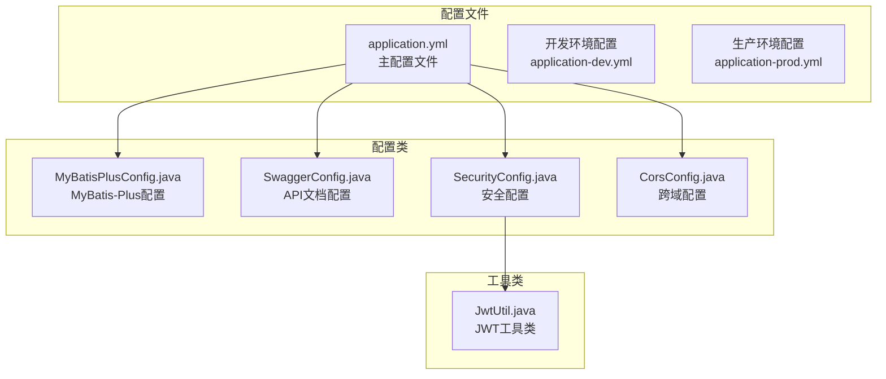
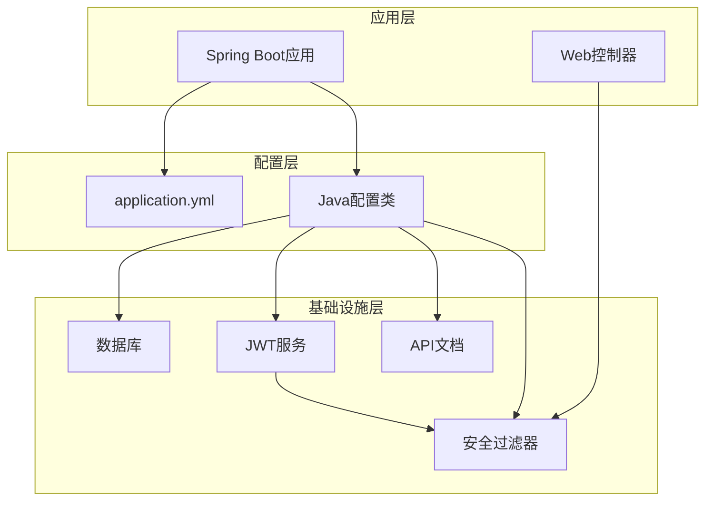

# 应用配置详解

<cite>
**本文档引用的文件**
- [application.yml](file://src/main/resources/application.yml)
- [MyBatisPlusConfig.java](file://src/main/java/com/qoder/mall/config/MyBatisPlusConfig.java)
- [SwaggerConfig.java](file://src/main/java/com/qoder/mall/config/SwaggerConfig.java)
- [JwtUtil.java](file://src/main/java/com/qoder/mall/common/util/JwtUtil.java)
- [SecurityConfig.java](file://src/main/java/com/qoder/mall/config/SecurityConfig.java)
- [CorsConfig.java](file://src/main/java/com/qoder/mall/config/CorsConfig.java)
- [pom.xml](file://pom.xml)
</cite>

## 目录
1. [简介](#简介)
2. [项目结构](#项目结构)
3. [核心配置组件](#核心配置组件)
4. [架构概览](#架构概览)
5. [详细配置分析](#详细配置分析)
6. [依赖关系分析](#依赖关系分析)
7. [性能考虑](#性能考虑)
8. [故障排除指南](#故障排除指南)
9. [结论](#结论)

## 简介

本文档为购物商城项目的应用配置提供全面的技术文档，重点解析application.yml文件中的所有配置项。该系统基于Spring Boot 3.2.5构建，集成了MyBatis-Plus、JWT认证、SpringDoc API文档等核心技术组件。文档将详细说明每个配置项的作用、默认值、可选值范围以及实际应用场景，并提供最佳实践建议和常见问题解决方案。

## 项目结构

购物商城项目采用标准的Spring Boot项目结构，主要配置文件位于resources目录下：



**图表来源**
- [application.yml:1-36](file://src/main/resources/application.yml#L1-L36)
- [MyBatisPlusConfig.java:1-34](file://src/main/java/com/qoder/mall/config/MyBatisPlusConfig.java#L1-L34)
- [SwaggerConfig.java:1-30](file://src/main/java/com/qoder/mall/config/SwaggerConfig.java#L1-L30)

**章节来源**
- [application.yml:1-36](file://src/main/resources/application.yml#L1-L36)
- [pom.xml:1-134](file://pom.xml#L1-L134)

## 核心配置组件

系统配置主要分为以下几个核心组件：

### 服务器配置
- **端口配置**: 默认8080端口，支持HTTP协议
- **服务器类型**: 基于Tomcat嵌入式服务器

### 数据库配置
- **数据源类型**: MySQL 8.0+
- **驱动程序**: MySQL Connector/J
- **连接参数**: 包含时区设置、SSL配置、字符集设置

### 文件上传配置
- **单文件大小限制**: 5MB
- **请求总大小限制**: 10MB

### MyBatis-Plus配置
- **命名策略**: 下划线转驼峰映射
- **日志实现**: 控制台输出
- **逻辑删除**: 支持软删除功能
- **表前缀**: tb_

### 安全配置
- **JWT密钥**: 高强度随机字符串
- **JWT过期时间**: 7天（604800000毫秒）
- **CORS配置**: 允许所有域名访问

**章节来源**
- [application.yml:1-36](file://src/main/resources/application.yml#L1-L36)

## 架构概览

系统配置架构采用分层设计，各配置组件协同工作：



**图表来源**
- [application.yml:1-36](file://src/main/resources/application.yml#L1-L36)
- [SecurityConfig.java:1-63](file://src/main/java/com/qoder/mall/config/SecurityConfig.java#L1-L63)

## 详细配置分析

### 服务器配置详解

#### 端口配置
- **配置位置**: `server.port`
- **默认值**: 8080
- **可选范围**: 1-65535（建议使用非特权端口）
- **应用场景**: 开发环境8080，生产环境可根据需要调整
- **最佳实践**: 
  - 开发环境保持8080便于调试
  - 生产环境使用防火墙限制访问
  - 多实例部署时使用不同端口

#### 服务器类型
- **实现**: Tomcat嵌入式服务器
- **特点**: 自动配置，零部署
- **性能**: 轻量级，启动快速

**章节来源**
- [application.yml:1-2](file://src/main/resources/application.yml#L1-L2)

### 数据库连接配置

#### 数据源配置
- **配置位置**: `spring.datasource`
- **关键参数**:
  - `url`: 数据库连接URL
  - `username`: 数据库用户名
  - `password`: 数据库密码
  - `driver-class-name`: JDBC驱动类名

#### 连接URL参数详解
- **时区设置**: `serverTimezone=Asia/Shanghai`
- **字符集**: `useUnicode=true&characterEncoding=utf8`
- **SSL配置**: `useSSL=false`
- **公钥检索**: `allowPublicKeyRetrieval=true`

#### 驱动程序配置
- **驱动类**: `com.mysql.cj.jdbc.Driver`
- **版本要求**: MySQL Connector/J 8.0+
- **兼容性**: 支持MySQL 8.0+特性

**章节来源**
- [application.yml:4-9](file://src/main/resources/application.yml#L4-L9)

### 文件上传配置

#### 上传限制配置
- **配置位置**: `spring.servlet.multipart`
- **关键参数**:
  - `max-file-size`: 单文件最大大小
  - `max-request-size`: 请求总大小限制

#### 参数详解
- **单文件大小**: 5MB（适合图片上传场景）
- **请求总大小**: 10MB（考虑多文件上传）
- **内存阈值**: 默认1MB（超出则写入磁盘）

#### 实际应用场景
- 商品图片上传
- 用户头像上传
- 文件附件上传

**章节来源**
- [application.yml:10-13](file://src/main/resources/application.yml#L10-L13)

### MyBatis-Plus配置

#### 命名策略配置
- **配置位置**: `mybatis-plus.configuration.map-underscore-to-camel-case`
- **默认值**: true
- **作用**: 自动进行下划线与驼峰命名转换
- **应用场景**: 数据库字段与Java实体属性映射

#### 日志配置
- **配置位置**: `mybatis-plus.configuration.log-impl`
- **实现类**: `org.apache.ibatis.logging.stdout.StdOutImpl`
- **用途**: 开发环境SQL调试输出

#### 逻辑删除配置
- **配置位置**: `mybatis-plus.global-config.db-config`
- **逻辑删除字段**: `isDeleted`
- **删除值**: 1（已删除）
- **未删除值**: 0（未删除）

#### 表前缀配置
- **配置位置**: `mybatis-plus.global-config.db-config.table-prefix`
- **前缀**: `tb_`
- **作用**: 统一表名前缀规范

#### 分页插件配置
- **实现类**: `MybatisPlusInterceptor`
- **分页策略**: `PaginationInnerInterceptor(DbType.MYSQL)`
- **数据库类型**: MySQL专用分页

#### 元对象处理器
- **实现接口**: `MetaObjectHandler`
- **自动填充字段**:
  - `createTime`: 创建时间
  - `updateTime`: 更新时间
- **填充时机**: 插入和更新操作

**章节来源**
- [application.yml:15-24](file://src/main/resources/application.yml#L15-L24)
- [MyBatisPlusConfig.java:14-33](file://src/main/java/com/qoder/mall/config/MyBatisPlusConfig.java#L14-L33)

### JWT配置

#### 密钥配置
- **配置位置**: `jwt.secret`
- **默认值**: `qoder-mall-jwt-secret-key-2024-spring-boot`
- **长度要求**: 至少32字节（256位）
- **安全性**: 建议使用随机生成的强密码

#### 过期时间配置
- **配置位置**: `jwt.expiration`
- **默认值**: 604800000（毫秒）
- **换算**: 7天（7 × 24 × 60 × 60 × 1000）
- **应用场景**: 用户会话有效期

#### JWT工具类实现
- **签名算法**: HS256（HMAC SHA-256）
- **密钥处理**: 自动填充到256位
- **令牌结构**:
  - 头部: 算法和类型信息
  - 载荷: 用户ID、用户名、角色
  - 签名: 基于密钥的哈希值

#### 安全考虑
- **密钥管理**: 生产环境使用环境变量
- **令牌刷新**: 建议实现刷新令牌机制
- **令牌撤销**: 考虑黑名单机制

**章节来源**
- [application.yml:26-28](file://src/main/resources/application.yml#L26-L28)
- [JwtUtil.java:19-23](file://src/main/java/com/qoder/mall/common/util/JwtUtil.java#L19-L23)
- [JwtUtil.java:25-31](file://src/main/java/com/qoder/mall/common/util/JwtUtil.java#L25-L31)

### SpringDoc API文档配置

#### OpenAPI配置
- **配置位置**: `springdoc.api-docs`
- **启用状态**: `enabled: true`
- **文档路径**: `/v3/api-docs`
- **格式**: JSON格式的OpenAPI规范

#### Swagger UI配置
- **配置位置**: `springdoc.swagger-ui`
- **启用状态**: `enabled: true`
- **UI路径**: `/swagger-ui/`
- **集成**: 与Knife4j增强版集成

#### 安全配置
- **安全方案**: Bearer Token
- **认证方式**: JWT Token
- **权限控制**: 通过SecurityRequirement定义

#### API文档注解
- **@Tag**: 接口分类标签
- **@Operation**: 接口描述
- **@Parameter**: 参数说明
- **@Api**: 方法级别的API文档

**章节来源**
- [application.yml:30-36](file://src/main/resources/application.yml#L30-L36)
- [SwaggerConfig.java:14-28](file://src/main/java/com/qoder/mall/config/SwaggerConfig.java#L14-L28)

### 安全配置

#### CORS配置
- **配置位置**: `CorsConfig.java`
- **允许来源**: `*`（所有域名）
- **凭证支持**: 启用凭据传递
- **头部支持**: 允许所有头部
- **方法支持**: 允许所有HTTP方法

#### 安全过滤链
- **配置位置**: `SecurityConfig.java`
- **认证入口**: `AuthenticationEntryPointImpl`
- **权限拒绝**: `AccessDeniedHandlerImpl`
- **过滤器**: `JwtAuthenticationFilter`

#### 访问控制规则
- **公开端点**:
  - 登录接口: `/api/auth/login`
  - 注册接口: `/api/auth/register`
  - 文件下载: `/api/files/{fileId}`
  - 商品浏览: GET `/api/categories/**`, `/api/products/**`
  - API文档: Knife4j相关路径
- **管理员端点**: `/api/admin/**` 需要ADMIN角色
- **其他端点**: 需要认证

**章节来源**
- [CorsConfig.java:12-23](file://src/main/java/com/qoder/mall/config/CorsConfig.java#L12-L23)
- [SecurityConfig.java:36-61](file://src/main/java/com/qoder/mall/config/SecurityConfig.java#L36-L61)

## 依赖关系分析

系统配置依赖关系如下：

```mermaid
graph TB
subgraph "配置文件依赖"
A[application.yml]
B[pom.xml]
end
subgraph "运行时依赖"
C[Spring Boot Starter Web]
D[Spring Boot Starter Security]
E[MyBatis-Plus]
F[JWT (jjwt)]
G[Knife4j]
end
subgraph "配置类依赖"
H[MyBatisPlusConfig]
I[SwaggerConfig]
J[SecurityConfig]
K[CorsConfig]
end
A --> H
A --> I
A --> J
A --> K
B --> C
B --> D
B --> E
B --> F
B --> G
H --> E
I --> G
J --> F
J --> D
```

**图表来源**
- [pom.xml:27-84](file://pom.xml#L27-L84)
- [MyBatisPlusConfig.java:3-7](file://src/main/java/com/qoder/mall/config/MyBatisPlusConfig.java#L3-L7)
- [SwaggerConfig.java:3-7](file://src/main/java/com/qoder/mall/config/SwaggerConfig.java#L3-L7)

**章节来源**
- [pom.xml:20-25](file://pom.xml#L20-L25)
- [pom.xml:46-84](file://pom.xml#L46-L84)

## 性能考虑

### 数据库连接优化
- **连接池**: 使用Spring Boot默认连接池
- **超时设置**: 建议配置连接超时和查询超时
- **连接数**: 根据并发需求调整最大连接数

### 缓存策略
- **查询缓存**: 对热点数据实施缓存
- **Redis集成**: 建议添加Redis作为缓存层
- **缓存失效**: 设置合理的缓存过期时间

### 文件上传优化
- **异步处理**: 大文件上传建议异步处理
- **存储优化**: 使用CDN加速静态资源
- **压缩传输**: 启用Gzip压缩减少带宽

### JWT性能优化
- **密钥缓存**: 缓存解密密钥避免重复计算
- **令牌验证**: 异步验证机制
- **内存管理**: 合理设置令牌过期时间

## 故障排除指南

### 数据库连接问题
**症状**: 应用启动失败，数据库连接异常
**排查步骤**:
1. 检查数据库服务是否启动
2. 验证连接URL格式正确性
3. 确认用户名密码正确
4. 检查网络连通性

**解决方案**:
- 更新正确的数据库连接信息
- 添加数据库驱动依赖
- 配置防火墙规则

### JWT配置问题
**症状**: 用户登录失败，令牌验证错误
**排查步骤**:
1. 检查JWT密钥配置
2. 验证令牌过期时间设置
3. 确认密钥长度符合要求

**解决方案**:
- 生成新的随机密钥
- 调整过期时间设置
- 在生产环境使用环境变量

### API文档访问问题
**症状**: Swagger UI无法访问，返回404错误
**排查步骤**:
1. 检查springdoc配置启用状态
2. 验证Knife4j依赖是否正确
3. 确认安全配置中API文档路径

**解决方案**:
- 启用springdoc.api-docs
- 添加Knife4j依赖
- 在SecurityConfig中放行API文档路径

### 文件上传问题
**症状**: 文件上传失败，返回400错误
**排查步骤**:
1. 检查文件大小限制配置
2. 验证上传路径权限
3. 确认MIME类型支持

**解决方案**:
- 调整max-file-size和max-request-size
- 检查文件存储目录权限
- 添加必要的MIME类型映射

**章节来源**
- [SecurityConfig.java:50-52](file://src/main/java/com/qoder/mall/config/SecurityConfig.java#L50-L52)

## 结论

购物商城项目的应用配置采用了现代化的Spring Boot配置方式，实现了高度的模块化和可维护性。通过合理配置各个组件，系统具备了良好的扩展性和安全性。

### 主要优势
- **配置集中化**: 所有配置集中在application.yml中
- **模块化设计**: 各配置组件职责明确
- **安全性考虑**: 完善的JWT认证和CORS配置
- **开发友好**: 丰富的API文档和调试支持

### 改进建议
- **环境分离**: 建议添加开发、测试、生产环境配置文件
- **安全加固**: 生产环境使用加密的敏感配置
- **监控集成**: 添加健康检查和性能监控
- **容错机制**: 实现配置错误的降级处理

该配置体系为购物商城提供了稳定可靠的基础架构，能够满足当前业务需求并支持未来的功能扩展。