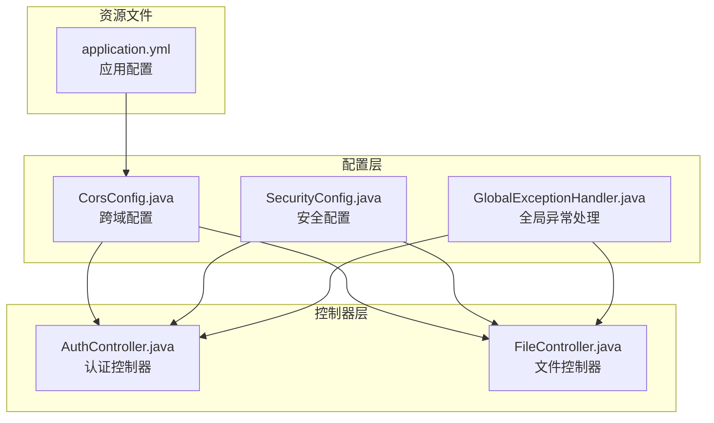
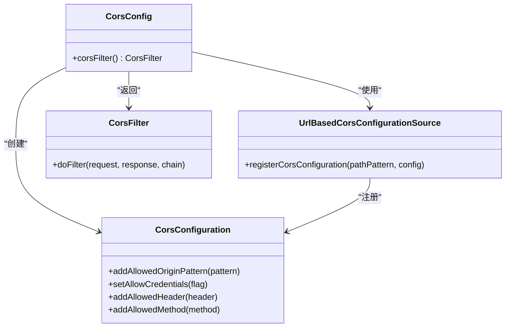
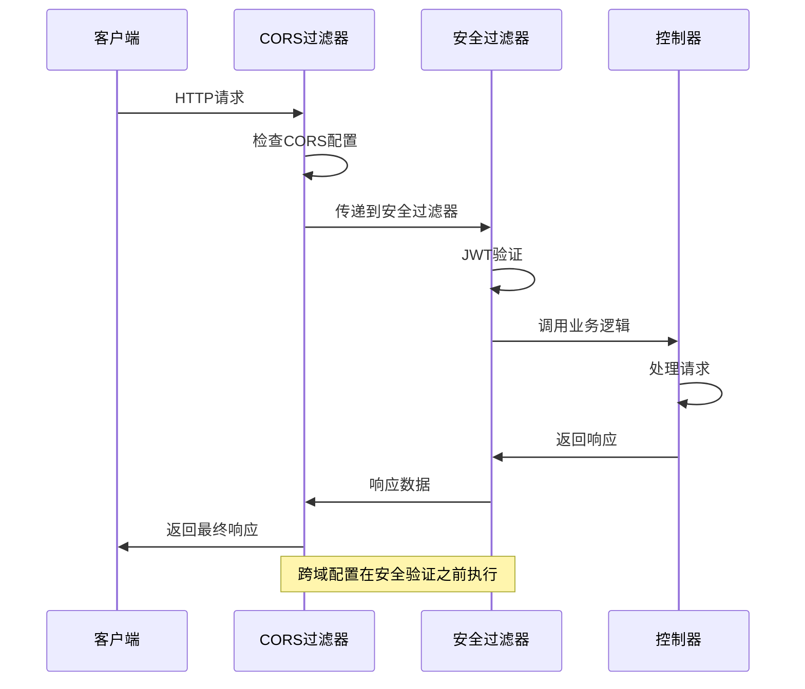
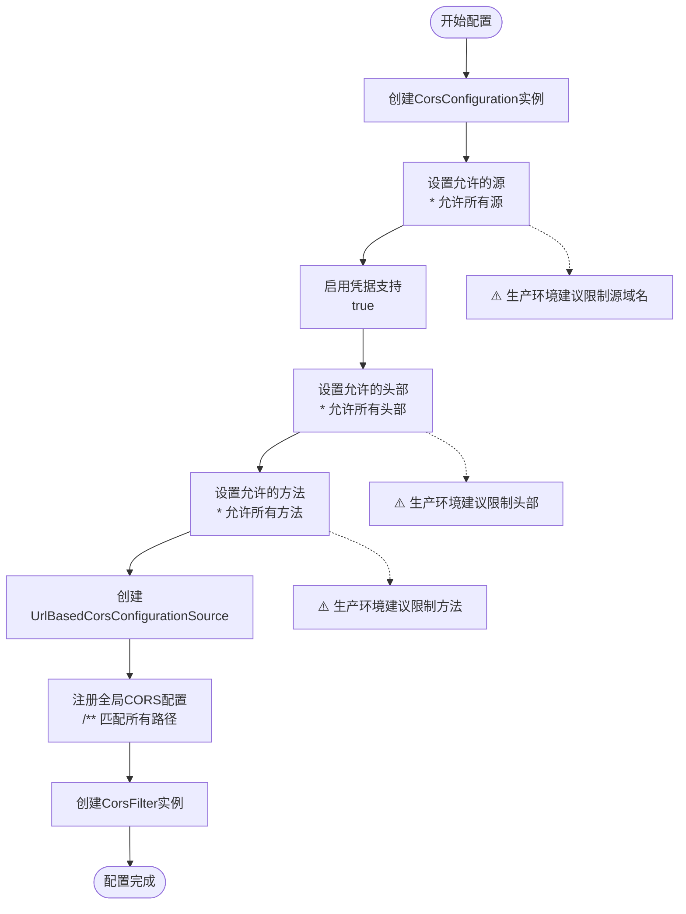
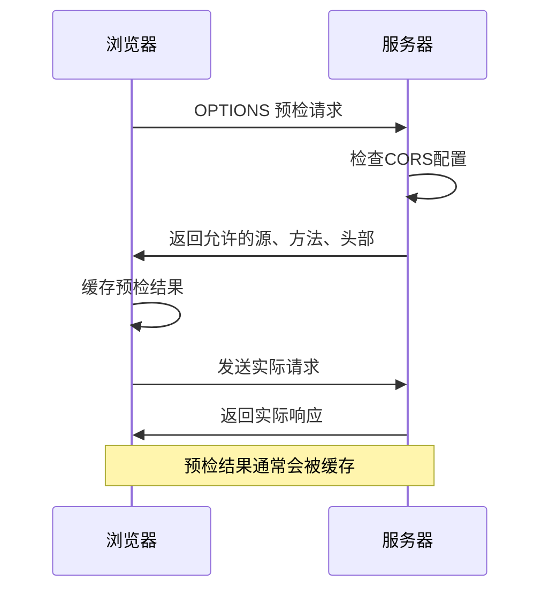
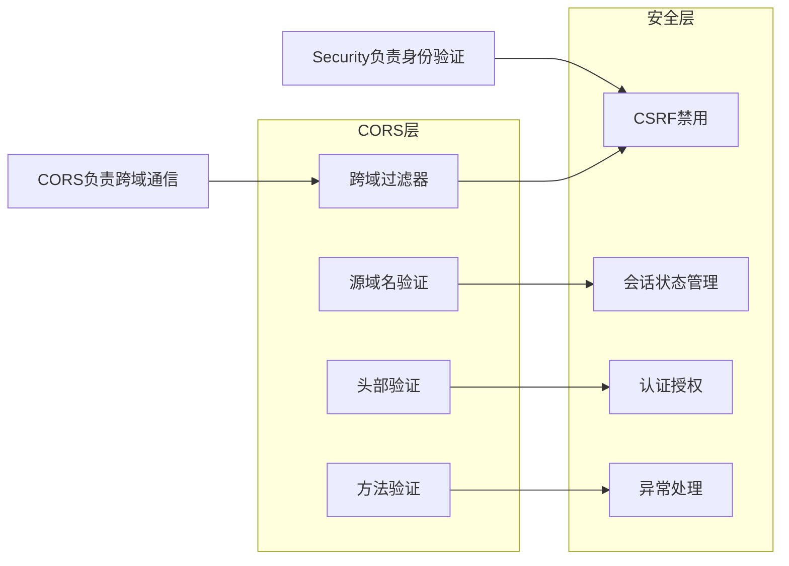
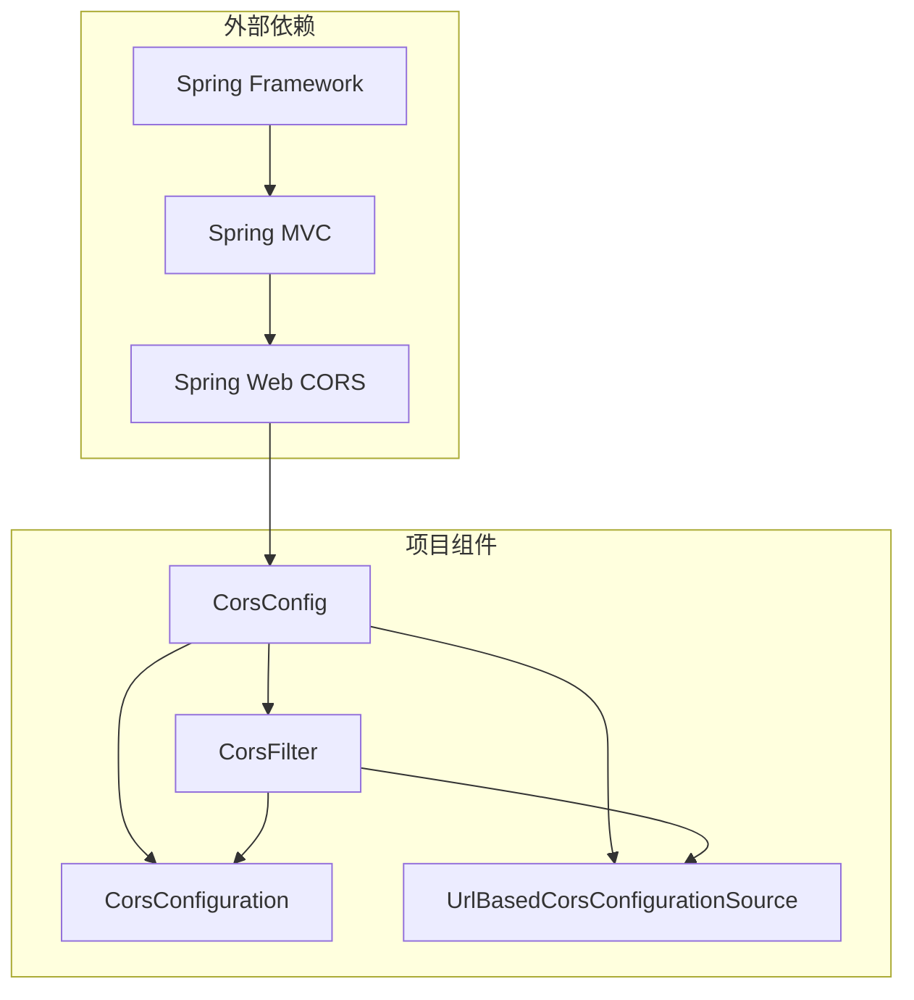
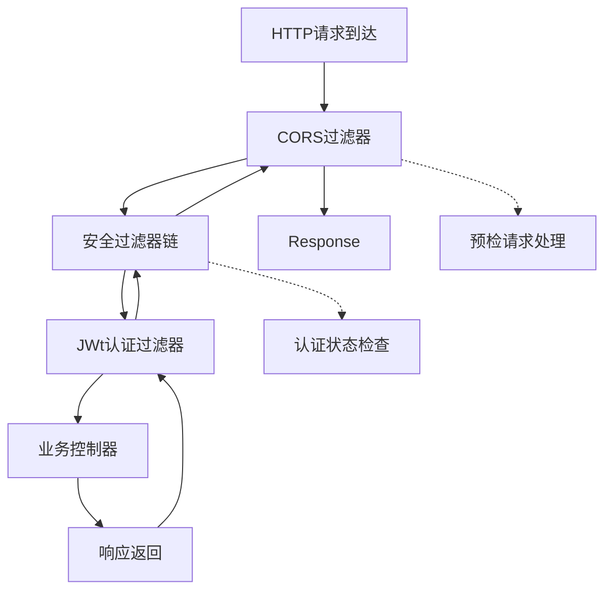
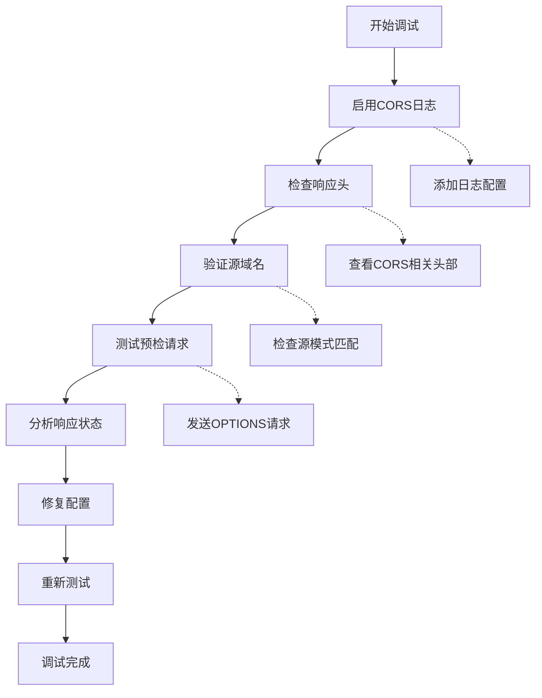

# 跨域配置

<cite>
**本文档引用的文件**
- [CorsConfig.java](file://src/main/java/com/qoder/mall/config/CorsConfig.java)
- [SecurityConfig.java](file://src/main/java/com/qoder/mall/config/SecurityConfig.java)
- [GlobalExceptionHandler.java](file://src/main/java/com/qoder/mall/common/exception/GlobalExceptionHandler.java)
- [application.yml](file://src/main/resources/application.yml)
- [AuthController.java](file://src/main/java/com/qoder/mall/controller/AuthController.java)
- [FileController.java](file://src/main/java/com/qoder/mall/controller/FileController.java)
- [ShoppingBackendApplication.java](file://src/main/java/com/qoder/mall/ShoppingBackendApplication.java)
</cite>

## 目录
1. [简介](#简介)
2. [项目结构](#项目结构)
3. [核心组件](#核心组件)
4. [架构概览](#架构概览)
5. [详细组件分析](#详细组件分析)
6. [依赖关系分析](#依赖关系分析)
7. [性能考虑](#性能考虑)
8. [故障排除指南](#故障排除指南)
9. [结论](#结论)
10. [附录](#附录)

## 简介

本项目采用Spring Boot构建的购物商城后端服务，跨域配置是确保前后端分离架构正常运行的关键组件。本文档深入解析CORS配置类CorsConfig的实现原理，详细说明各种配置选项的作用机制，并提供针对不同前端框架的最佳实践指导。

## 项目结构

项目采用标准的Spring Boot目录结构，跨域配置位于配置层，与安全配置、异常处理等核心组件协同工作：



**图表来源**
- [CorsConfig.java:1-25](file://src/main/java/com/qoder/mall/config/CorsConfig.java#L1-L25)
- [SecurityConfig.java:1-63](file://src/main/java/com/qoder/mall/config/SecurityConfig.java#L1-L63)
- [AuthController.java:1-44](file://src/main/java/com/qoder/mall/controller/AuthController.java#L1-L44)

**章节来源**
- [ShoppingBackendApplication.java:1-16](file://src/main/java/com/qoder/mall/ShoppingBackendApplication.java#L1-L16)
- [application.yml:1-36](file://src/main/resources/application.yml#L1-L36)

## 核心组件

### CORS配置类CorsConfig

CorsConfig是项目的核心跨域配置组件，采用Spring Boot的自动配置模式，通过@Bean注解定义跨域过滤器。

#### 主要特性
- **宽松的跨域策略**：允许所有源、方法和头部
- **凭证支持**：启用凭据传递功能
- **全局生效**：对所有路径进行跨域配置

#### 配置选项详解



**图表来源**
- [CorsConfig.java:12-23](file://src/main/java/com/qoder/mall/config/CorsConfig.java#L12-L23)

**章节来源**
- [CorsConfig.java:1-25](file://src/main/java/com/qoder/mall/config/CorsConfig.java#L1-L25)

## 架构概览

系统采用分层架构设计，跨域配置在过滤器链中处于关键位置：



**图表来源**
- [CorsConfig.java:12-23](file://src/main/java/com/qoder/mall/config/CorsConfig.java#L12-L23)
- [SecurityConfig.java:36-58](file://src/main/java/com/qoder/mall/config/SecurityConfig.java#L36-L58)

## 详细组件分析

### CORS配置实现原理

#### 配置流程分析



**图表来源**
- [CorsConfig.java:14-22](file://src/main/java/com/qoder/mall/config/CorsConfig.java#L14-L22)

#### 预检请求处理机制

预检请求（OPTIONS）是CORS协议的重要组成部分，用于在实际请求前获取服务器的跨域权限信息：



**图表来源**
- [CorsConfig.java:15-18](file://src/main/java/com/qoder/mall/config/CorsConfig.java#L15-L18)

### 安全配置与CORS的关系

虽然项目同时实现了CORS配置和Spring Security，但两者职责明确分工：



**图表来源**
- [SecurityConfig.java:36-61](file://src/main/java/com/qoder/mall/config/SecurityConfig.java#L36-L61)

**章节来源**
- [SecurityConfig.java:1-63](file://src/main/java/com/qoder/mall/config/SecurityConfig.java#L1-L63)

### API端点与跨域配置

项目中的API端点遵循RESTful设计原则，与CORS配置完美结合：

| 控制器 | HTTP方法 | 路径模式 | 认证要求 | CORS影响 |
|--------|----------|----------|----------|----------|
| AuthController | POST | /api/auth/login | 否 | 公共端点，需要跨域支持 |
| AuthController | POST | /api/auth/register | 否 | 公共端点，需要跨域支持 |
| AuthController | GET | /api/auth/info | 是 | 需要凭据传递 |
| FileController | POST | /api/files/upload | 是 | 文件上传需要跨域 |
| FileController | GET | /api/files/{fileId} | 否 | 文件下载需要跨域 |

**章节来源**
- [AuthController.java:24-42](file://src/main/java/com/qoder/mall/controller/AuthController.java#L24-L42)
- [FileController.java:25-41](file://src/main/java/com/qoder/mall/controller/FileController.java#L25-L41)

## 依赖关系分析

### 组件间依赖关系



**图表来源**
- [CorsConfig.java:3-7](file://src/main/java/com/qoder/mall/config/CorsConfig.java#L3-L7)

### 过滤器链执行顺序



**图表来源**
- [SecurityConfig.java:58](file://src/main/java/com/qoder/mall/config/SecurityConfig.java#L58)

**章节来源**
- [CorsConfig.java:12-23](file://src/main/java/com/qoder/mall/config/CorsConfig.java#L12-L23)
- [SecurityConfig.java:36-61](file://src/main/java/com/qoder/mall/config/SecurityConfig.java#L36-L61)

## 性能考虑

### 预检请求缓存策略

浏览器通常会缓存预检请求的结果以提高性能：

- **缓存时间**：由服务器通过`Access-Control-Max-Age`响应头控制
- **缓存范围**：针对特定的源、方法和头部组合
- **性能影响**：减少重复的预检请求，提升整体响应速度

### 凭证传递的性能影响

启用凭据支持会带来额外的安全检查开销：

- **Cookie验证**：每次请求都需要验证会话状态
- **安全检查**：增加服务器的认证处理时间
- **适用场景**：适用于需要保持用户登录状态的应用

## 故障排除指南

### 常见跨域问题及解决方案

#### 1. 预检请求失败

**症状**：浏览器发送OPTIONS预检请求但返回404或405错误

**原因分析**：
- CORS配置未正确加载
- 预检请求路径不匹配
- 过滤器链配置问题

**解决方案**：
- 确认CorsConfig类被Spring容器管理
- 验证URL模式匹配规则
- 检查过滤器链的执行顺序

#### 2. 凭证传递失败

**症状**：启用凭据后请求失败，提示缺少凭据

**原因分析**：
- 源域名配置不正确
- 凭据支持未启用
- Cookie域设置问题

**解决方案**：
- 设置具体的源域名而非通配符
- 确保`setAllowCredentials(true)`已启用
- 验证Cookie的域和路径设置

#### 3. 自定义头部被拒绝

**症状**：包含自定义头部的请求被CORS拦截

**原因分析**：
- 自定义头部未在允许列表中
- 预检请求未正确处理

**解决方案**：
- 在生产环境中明确列出允许的头部
- 确保预检请求能够正确返回允许的头部

### 诊断工具和方法

#### 开发环境调试



**图表来源**
- [CorsConfig.java:14-22](file://src/main/java/com/qoder/mall/config/CorsConfig.java#L14-L22)

#### 生产环境监控

**监控指标**：
- CORS预检请求成功率
- 跨域请求响应时间
- 凭证传递失败率
- 自定义头部拒绝次数

**告警阈值**：
- 预检请求失败率 > 5%
- CORS相关错误 > 100次/小时
- 平均响应时间 > 2秒

**章节来源**
- [GlobalExceptionHandler.java:18-53](file://src/main/java/com/qoder/mall/common/exception/GlobalExceptionHandler.java#L18-L53)

## 结论

本项目的跨域配置采用了简单直接的设计理念，通过全局宽松的CORS策略确保前后端开发的便利性。这种设计在开发阶段非常友好，但在生产环境中需要进行更精细的配置优化。

### 最佳实践建议

1. **生产环境配置优化**
   - 明确指定允许的源域名
   - 限制允许的HTTP方法
   - 明确列出允许的自定义头部
   - 合理设置预检请求缓存时间

2. **安全加固措施**
   - 禁用通配符源域名
   - 实施严格的头部白名单
   - 定期审查CORS配置
   - 监控跨域请求异常

3. **性能优化策略**
   - 合理设置预检缓存时间
   - 优化凭证传递机制
   - 监控跨域请求性能指标
   - 实施适当的限流策略

## 附录

### 不同前端框架的跨域配置最佳实践

#### Vue.js项目配置

**开发环境**：
```javascript
// vue.config.js
module.exports = {
  devServer: {
    proxy: {
      '/api': {
        target: 'http://localhost:8080',
        changeOrigin: true,
        pathRewrite: {
          '^/api': ''
        }
      }
    }
  }
}
```

**生产环境**：
- 使用Nginx反向代理
- 配置CORS响应头
- 实施HTTPS强制跳转

#### React项目配置

**开发环境**：
```javascript
// package.json
{
  "name": "react-app",
  "proxy": "http://localhost:8080"
}

// 或使用setupProxy.js
const { createProxyMiddleware } = require('http-proxy-middleware');

module.exports = function(app) {
  app.use(
    '/api',
    createProxyMiddleware({
      target: 'http://localhost:8080',
      changeOrigin: true,
    })
  );
};
```

**生产环境**：
- Nginx代理配置
- CORS响应头设置
- 安全头配置

#### Angular项目配置

**开发环境**：
```typescript
// angular.json
{
  "serve": {
    "options": {
      "proxyConfig": "src/proxy.conf.json"
    }
  }
}

// src/proxy.conf.json
{
  "/api": {
    "target": "http://localhost:8080",
    "secure": false,
    "changeOrigin": true
  }
}
```

**生产环境**：
- Nginx负载均衡
- CDN加速
- HTTPS配置

### CORS配置参数详解

| 参数名称 | 类型 | 默认值 | 描述 | 生产环境建议 |
|----------|------|--------|------|-------------|
| allowedOrigins | 字符串数组 | `*` | 允许的源域名 | 明确指定具体域名 |
| allowedOriginPatterns | 字符串数组 | `*` | 源域名模式匹配 | 使用精确匹配 |
| allowCredentials | 布尔值 | `true` | 是否允许携带凭据 | 根据需求启用 |
| allowedHeaders | 字符串数组 | `*` | 允许的请求头 | 列出必需的头部 |
| exposedHeaders | 字符串数组 | 空 | 允许暴露的响应头 | 仅列出必要头部 |
| allowedMethods | 字符串数组 | `*` | 允许的HTTP方法 | 限制到实际使用的方法 |
| maxAge | 长整型 | 1800秒 | 预检请求缓存时间 | 根据实际需求设置 |

### 配置迁移指南

从宽松配置迁移到严格配置的步骤：

1. **评估现有使用情况**
   - 分析所有API端点的调用方
   - 统计使用的HTTP方法
   - 识别必需的自定义头部

2. **制定迁移计划**
   - 创建源域名白名单
   - 定义允许的HTTP方法集合
   - 列出必需的自定义头部

3. **逐步实施**
   - 先在测试环境验证
   - 渐进式扩大允许范围
   - 监控迁移过程中的问题

4. **监控和优化**
   - 设置性能监控指标
   - 定期审查配置有效性
   - 根据使用情况进行微调