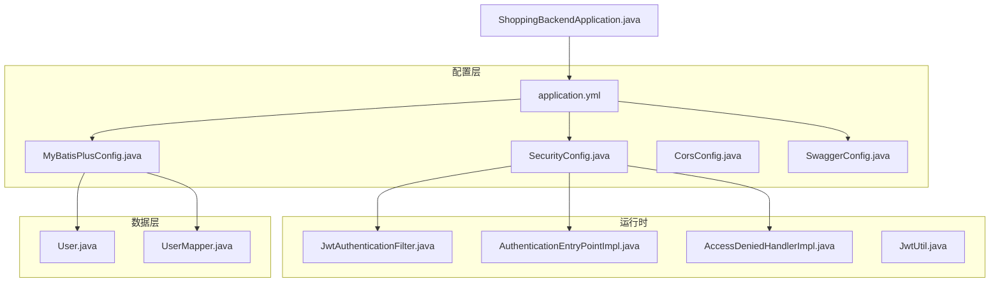
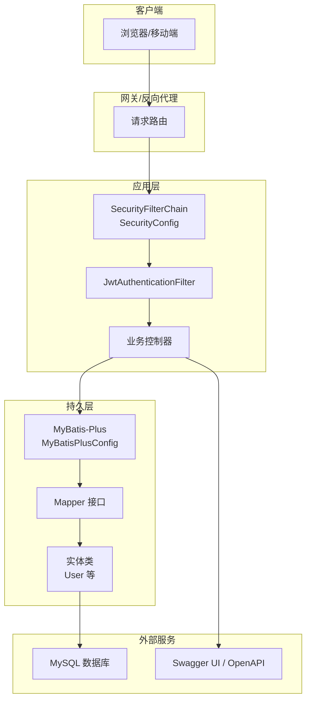
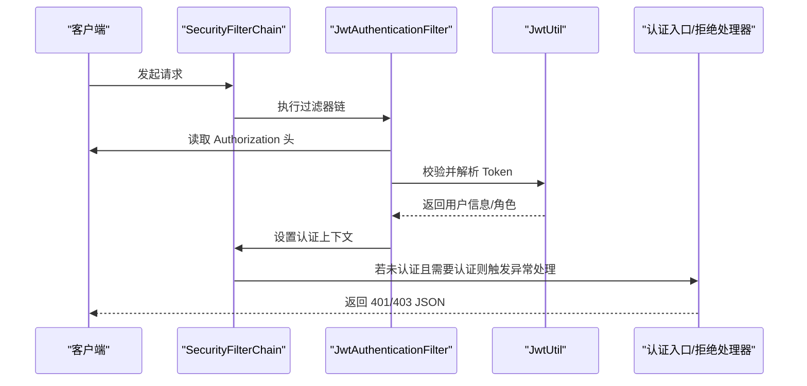
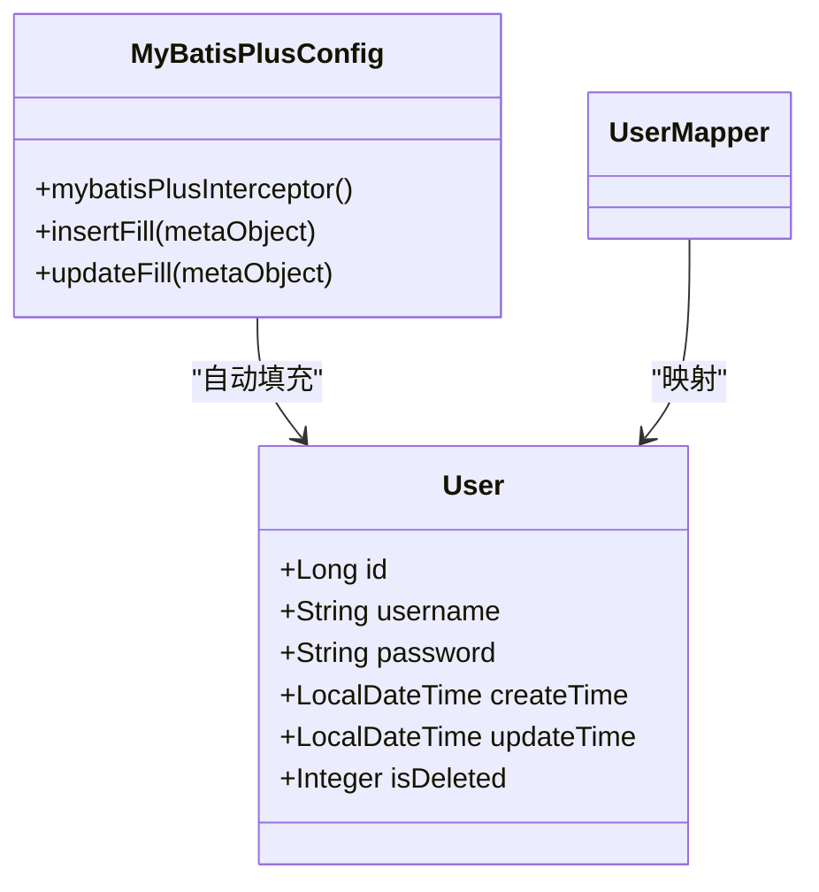
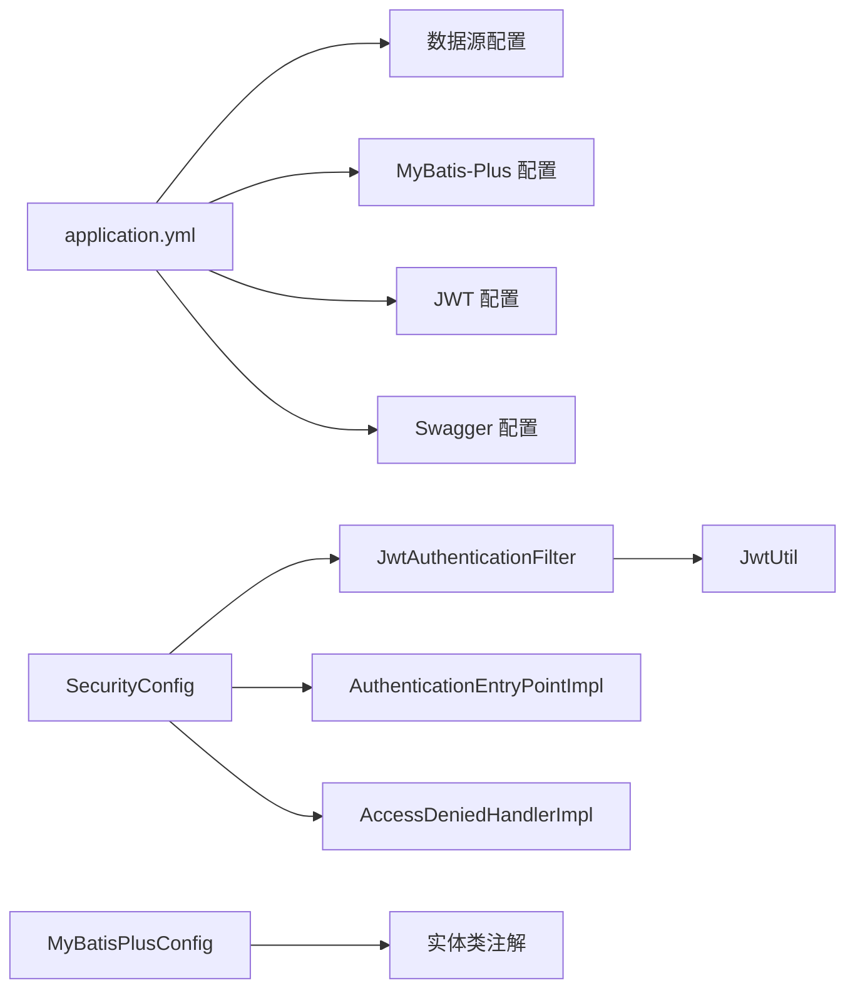

# 配置管理

<cite>
**本文引用的文件**
- [application.yml](file://src/main/resources/application.yml)
- [SecurityConfig.java](file://src/main/java/com/qoder/mall/config/SecurityConfig.java)
- [MyBatisPlusConfig.java](file://src/main/java/com/qoder/mall/config/MyBatisPlusConfig.java)
- [CorsConfig.java](file://src/main/java/com/qoder/mall/config/CorsConfig.java)
- [SwaggerConfig.java](file://src/main/java/com/qoder/mall/config/SwaggerConfig.java)
- [JwtAuthenticationFilter.java](file://src/main/java/com/qoder/mall/security/filter/JwtAuthenticationFilter.java)
- [AuthenticationEntryPointImpl.java](file://src/main/java/com/qoder/mall/security/handler/AuthenticationEntryPointImpl.java)
- [AccessDeniedHandlerImpl.java](file://src/main/java/com/qoder/mall/security/handler/AccessDeniedHandlerImpl.java)
- [JwtUtil.java](file://src/main/java/com/qoder/mall/common/util/JwtUtil.java)
- [User.java](file://src/main/java/com/qoder/mall/entity/User.java)
- [UserMapper.java](file://src/main/java/com/qoder/mall/mapper/UserMapper.java)
- [AuthController.java](file://src/main/java/com/qoder/mall/controller/AuthController.java)
- [AdminProductController.java](file://src/main/java/com/qoder/mall/controller/Admin/AdminProductController.java)
- [ShoppingBackendApplication.java](file://src/main/java/com/qoder/mall/ShoppingBackendApplication.java)
</cite>

## 目录
1. [简介](#简介)
2. [项目结构](#项目结构)
3. [核心组件](#核心组件)
4. [架构总览](#架构总览)
5. [详细组件分析](#详细组件分析)
6. [依赖关系分析](#依赖关系分析)
7. [性能考虑](#性能考虑)
8. [故障排查指南](#故障排查指南)
9. [结论](#结论)
10. [附录](#附录)

## 简介
本文件系统性梳理购物商城项目的配置管理，覆盖以下方面：
- 应用配置文件 application.yml 的各项配置项说明（数据库连接、文件上传、MyBatis-Plus、JWT、Swagger）
- Spring Security 安全配置（过滤器链、权限规则、异常处理）
- MyBatis-Plus 配置（分页插件、逻辑删除、自动填充）
- 跨域配置与 Swagger API 文档配置
- 不同环境下的配置差异与最佳实践
- 配置优化建议与常见问题排查

## 项目结构
项目采用标准 Spring Boot 结构，配置相关的核心位置如下：
- 应用配置：resources/application.yml
- 安全配置：config/SecurityConfig.java 及其过滤器与异常处理器
- ORM 配置：config/MyBatisPlusConfig.java
- 跨域配置：config/CorsConfig.java
- API 文档：config/SwaggerConfig.java
- 实体与映射：entity/*、mapper/*
- 启动类：ShoppingBackendApplication.java

图表来源
- [application.yml:1-36](file://src/main/resources/application.yml#L1-L36)
- [SecurityConfig.java:35-61](file://src/main/java/com/qoder/mall/config/SecurityConfig.java#L35-L61)
- [MyBatisPlusConfig.java:14-33](file://src/main/java/com/qoder/mall/config/MyBatisPlusConfig.java#L14-L33)
- [CorsConfig.java:10-24](file://src/main/java/com/qoder/mall/config/CorsConfig.java#L10-L24)
- [SwaggerConfig.java:12-29](file://src/main/java/com/qoder/mall/config/SwaggerConfig.java#L12-L29)
- [JwtAuthenticationFilter.java:21-46](file://src/main/java/com/qoder/mall/security/filter/JwtAuthenticationFilter.java#L21-L46)
- [AuthenticationEntryPointImpl.java:15-30](file://src/main/java/com/qoder/mall/security/handler/AuthenticationEntryPointImpl.java#L15-L30)
- [AccessDeniedHandlerImpl.java:15-30](file://src/main/java/com/qoder/mall/security/handler/AccessDeniedHandlerImpl.java#L15-L30)
- [JwtUtil.java:17-79](file://src/main/java/com/qoder/mall/common/util/JwtUtil.java#L17-L79)
- [User.java:8-39](file://src/main/java/com/qoder/mall/entity/User.java#L8-L39)
- [UserMapper.java:1-8](file://src/main/java/com/qoder/mall/mapper/UserMapper.java#L1-L8)
- [ShoppingBackendApplication.java:8-16](file://src/main/java/com/qoder/mall/ShoppingBackendApplication.java#L8-L16)

章节来源
- [application.yml:1-36](file://src/main/resources/application.yml#L1-L36)
- [ShoppingBackendApplication.java:8-16](file://src/main/java/com/qoder/mall/ShoppingBackendApplication.java#L8-L16)

## 核心组件
本节对各配置模块进行逐项解析，帮助快速理解配置项的作用与取值范围。

- 应用服务器配置
  - 端口：server.port 指定服务监听端口
  - 参考路径：[application.yml:1-2](file://src/main/resources/application.yml#L1-L2)

- 数据源配置
  - 连接地址：spring.datasource.url
  - 用户名：spring.datasource.username
  - 密码：spring.datasource.password
  - 驱动类：spring.datasource.driver-class-name
  - 参考路径：[application.yml:4-9](file://src/main/resources/application.yml#L4-L9)

- 文件上传配置
  - 单文件最大大小：spring.servlet.multipart.max-file-size
  - 请求整体最大大小：spring.servlet.multipart.max-request-size
  - 参考路径：[application.yml:10-13](file://src/main/resources/application.yml#L10-L13)

- MyBatis-Plus 配置
  - 命名策略：map-underscore-to-camel-case
  - 日志实现：log-impl
  - 全局配置：
    - 逻辑删除字段：logic-delete-field
    - 逻辑删除值：logic-delete-value
    - 未删除值：logic-not-delete-value
    - 表前缀：table-prefix
  - 参考路径：[application.yml:15-24](file://src/main/resources/application.yml#L15-L24)

- JWT 配置
  - 密钥：jwt.secret
  - 过期时间（毫秒）：jwt.expiration
  - 参考路径：[application.yml:26-28](file://src/main/resources/application.yml#L26-L28)

- SpringDoc/OpenAPI 配置
  - API 文档开关：springdoc.api-docs.enabled
  - 文档路径：springdoc.api-docs.path
  - Swagger UI 开关：springdoc.swagger-ui.enabled
  - 参考路径：[application.yml:30-36](file://src/main/resources/application.yml#L30-L36)

章节来源
- [application.yml:1-36](file://src/main/resources/application.yml#L1-L36)

## 架构总览
下图展示配置在系统中的作用与交互关系，包括安全过滤链、ORM 自动填充、跨域与 API 文档等。

图表来源
- [SecurityConfig.java:35-61](file://src/main/java/com/qoder/mall/config/SecurityConfig.java#L35-L61)
- [JwtAuthenticationFilter.java:21-46](file://src/main/java/com/qoder/mall/security/filter/JwtAuthenticationFilter.java#L21-L46)
- [MyBatisPlusConfig.java:14-33](file://src/main/java/com/qoder/mall/config/MyBatisPlusConfig.java#L14-L33)
- [User.java:8-39](file://src/main/java/com/qoder/mall/entity/User.java#L8-L39)
- [UserMapper.java:1-8](file://src/main/java/com/qoder/mall/mapper/UserMapper.java#L1-L8)
- [SwaggerConfig.java:12-29](file://src/main/java/com/qoder/mall/config/SwaggerConfig.java#L12-L29)

## 详细组件分析

### Spring Security 配置
- 安全策略
  - CSRF 关闭：适用于无状态 API
  - Session 策略：STATELESS
  - 异常处理：自定义认证入口与访问拒绝处理器
  - 参考路径：[SecurityConfig.java:37-43](file://src/main/java/com/qoder/mall/config/SecurityConfig.java#L37-L43)

- 权限规则
  - 公开端点：登录、注册、文件下载、商品/分类查询、Swagger 资源
  - 管理端：/api/admin/** 需要 ADMIN 角色
  - 其他端点：均需认证
  - 参考路径：[SecurityConfig.java:44-58](file://src/main/java/com/qoder/mall/config/SecurityConfig.java#L44-L58)

- 安全过滤器链
  - 在用户名密码过滤器之前插入 JWT 过滤器，从 Authorization 头提取 Bearer Token 并注入认证上下文
  - 参考路径：[SecurityConfig.java:58](file://src/main/java/com/qoder/mall/config/SecurityConfig.java#L58)，[JwtAuthenticationFilter.java:25-46](file://src/main/java/com/qoder/mall/security/filter/JwtAuthenticationFilter.java#L25-L46)

- 异常处理
  - 认证失败：返回 401 JSON
  - 权限不足：返回 403 JSON
  - 参考路径：[AuthenticationEntryPointImpl.java:19-29](file://src/main/java/com/qoder/mall/security/handler/AuthenticationEntryPointImpl.java#L19-L29)，[AccessDeniedHandlerImpl.java:19-29](file://src/main/java/com/qoder/mall/security/handler/AccessDeniedHandlerImpl.java#L19-L29)

图表来源
- [SecurityConfig.java:35-61](file://src/main/java/com/qoder/mall/config/SecurityConfig.java#L35-L61)
- [JwtAuthenticationFilter.java:25-46](file://src/main/java/com/qoder/mall/security/filter/JwtAuthenticationFilter.java#L25-L46)
- [JwtUtil.java:33-78](file://src/main/java/com/qoder/mall/common/util/JwtUtil.java#L33-L78)
- [AuthenticationEntryPointImpl.java:19-29](file://src/main/java/com/qoder/mall/security/handler/AuthenticationEntryPointImpl.java#L19-L29)
- [AccessDeniedHandlerImpl.java:19-29](file://src/main/java/com/qoder/mall/security/handler/AccessDeniedHandlerImpl.java#L19-L29)

章节来源
- [SecurityConfig.java:24-61](file://src/main/java/com/qoder/mall/config/SecurityConfig.java#L24-L61)
- [JwtAuthenticationFilter.java:21-46](file://src/main/java/com/qoder/mall/security/filter/JwtAuthenticationFilter.java#L21-L46)
- [JwtUtil.java:17-79](file://src/main/java/com/qoder/mall/common/util/JwtUtil.java#L17-L79)
- [AuthenticationEntryPointImpl.java:15-30](file://src/main/java/com/qoder/mall/security/handler/AuthenticationEntryPointImpl.java#L15-L30)
- [AccessDeniedHandlerImpl.java:15-30](file://src/main/java/com/qoder/mall/security/handler/AccessDeniedHandlerImpl.java#L15-L30)

### MyBatis-Plus 配置
- 分页插件
  - 使用 MySQL 类型的分页内核拦截器
  - 参考路径：[MyBatisPlusConfig.java:17-21](file://src/main/java/com/qoder/mall/config/MyBatisPlusConfig.java#L17-L21)

- 自动填充
  - 插入时填充：createTime、updateTime
  - 更新时填充：updateTime
  - 参考路径：[MyBatisPlusConfig.java:24-32](file://src/main/java/com/qoder/mall/config/MyBatisPlusConfig.java#L24-L32)，[User.java:31-35](file://src/main/java/com/qoder/mall/entity/User.java#L31-L35)

- 逻辑删除
  - 字段：isDeleted
  - 删除值：1
  - 未删值：0
  - 表前缀：tb_
  - 参考路径：[application.yml:20-24](file://src/main/resources/application.yml#L20-L24)，[User.java:37-38](file://src/main/java/com/qoder/mall/entity/User.java#L37-L38)

图表来源
- [MyBatisPlusConfig.java:14-33](file://src/main/java/com/qoder/mall/config/MyBatisPlusConfig.java#L14-L33)
- [User.java:8-39](file://src/main/java/com/qoder/mall/entity/User.java#L8-L39)
- [UserMapper.java:1-8](file://src/main/java/com/qoder/mall/mapper/UserMapper.java#L1-L8)

章节来源
- [MyBatisPlusConfig.java:14-33](file://src/main/java/com/qoder/mall/config/MyBatisPlusConfig.java#L14-L33)
- [application.yml:15-24](file://src/main/resources/application.yml#L15-L24)
- [User.java:8-39](file://src/main/java/com/qoder/mall/entity/User.java#L8-L39)
- [UserMapper.java:1-8](file://src/main/java/com/qoder/mall/mapper/UserMapper.java#L1-L8)

### 跨域配置
- 允许所有来源模式、凭证、头与方法
- 注册到 /** 路径
- 参考路径：[CorsConfig.java:12-23](file://src/main/java/com/qoder/mall/config/CorsConfig.java#L12-L23)

章节来源
- [CorsConfig.java:10-24](file://src/main/java/com/qoder/mall/config/CorsConfig.java#L10-L24)

### Swagger API 文档配置
- OpenAPI 基本信息：标题、描述、版本
- 安全方案：Bearer JWT
- 全局安全需求：启用 Bearer
- 参考路径：[SwaggerConfig.java:14-28](file://src/main/java/com/qoder/mall/config/SwaggerConfig.java#L14-L28)

章节来源
- [SwaggerConfig.java:12-29](file://src/main/java/com/qoder/mall/config/SwaggerConfig.java#L12-L29)

### JWT 配置与工具
- 配置项：jwt.secret、jwt.expiration
- 工具类功能：生成 Token、解析 Token、校验过期、提取用户信息与角色
- 参考路径：[application.yml:26-28](file://src/main/resources/application.yml#L26-L28)，[JwtUtil.java:19-78](file://src/main/java/com/qoder/mall/common/util/JwtUtil.java#L19-L78)

章节来源
- [application.yml:26-28](file://src/main/resources/application.yml#L26-L28)
- [JwtUtil.java:17-79](file://src/main/java/com/qoder/mall/common/util/JwtUtil.java#L17-L79)

### API 端点与权限示例
- 认证端点：/api/auth/login、/api/auth/register、/api/auth/info
- 管理端点：/api/admin/products/**
- 商品/分类查询：GET /api/products/**、GET /api/categories/**
- Swagger 资源：/v3/api-docs/**、/swagger-ui/**
- 参考路径：[AuthController.java:16-43](file://src/main/java/com/qoder/mall/controller/AuthController.java#L16-L43)，[AdminProductController.java:17-81](file://src/main/java/com/qoder/mall/controller/Admin/AdminProductController.java#L17-L81)，[SecurityConfig.java:44-58](file://src/main/java/com/qoder/mall/config/SecurityConfig.java#L44-L58)

章节来源
- [AuthController.java:16-43](file://src/main/java/com/qoder/mall/controller/AuthController.java#L16-L43)
- [AdminProductController.java:17-81](file://src/main/java/com/qoder/mall/controller/Admin/AdminProductController.java#L17-L81)
- [SecurityConfig.java:44-58](file://src/main/java/com/qoder/mall/config/SecurityConfig.java#L44-L58)

## 依赖关系分析
- 配置文件与组件的绑定
  - application.yml 中的 spring.datasource、mybatis-plus、jwt、springdoc 与对应组件绑定
  - SecurityConfig 通过 @Bean 注入过滤器与异常处理器
  - MyBatisPlusConfig 通过拦截器与实体自动填充机制工作
- 组件间耦合
  - SecurityConfig 依赖 JwtAuthenticationFilter、AuthenticationEntryPointImpl、AccessDeniedHandlerImpl
  - JwtAuthenticationFilter 依赖 JwtUtil
  - MyBatisPlusConfig 依赖实体类的注解（如 @TableLogic、@TableField）

图表来源
- [application.yml:4-36](file://src/main/resources/application.yml#L4-L36)
- [SecurityConfig.java:26-28](file://src/main/java/com/qoder/mall/config/SecurityConfig.java#L26-L28)
- [JwtAuthenticationFilter.java:23](file://src/main/java/com/qoder/mall/security/filter/JwtAuthenticationFilter.java#L23)
- [AuthenticationEntryPointImpl.java:17](file://src/main/java/com/qoder/mall/security/handler/AuthenticationEntryPointImpl.java#L17)
- [AccessDeniedHandlerImpl.java:17](file://src/main/java/com/qoder/mall/security/handler/AccessDeniedHandlerImpl.java#L17)
- [MyBatisPlusConfig.java:14-33](file://src/main/java/com/qoder/mall/config/MyBatisPlusConfig.java#L14-L33)
- [JwtUtil.java:19-23](file://src/main/java/com/qoder/mall/common/util/JwtUtil.java#L19-L23)

章节来源
- [application.yml:4-36](file://src/main/resources/application.yml#L4-L36)
- [SecurityConfig.java:24-61](file://src/main/java/com/qoder/mall/config/SecurityConfig.java#L24-L61)
- [JwtAuthenticationFilter.java:21-46](file://src/main/java/com/qoder/mall/security/filter/JwtAuthenticationFilter.java#L21-L46)
- [AuthenticationEntryPointImpl.java:15-30](file://src/main/java/com/qoder/mall/security/handler/AuthenticationEntryPointImpl.java#L15-L30)
- [AccessDeniedHandlerImpl.java:15-30](file://src/main/java/com/qoder/mall/security/handler/AccessDeniedHandlerImpl.java#L15-L30)
- [MyBatisPlusConfig.java:14-33](file://src/main/java/com/qoder/mall/config/MyBatisPlusConfig.java#L14-L33)
- [JwtUtil.java:17-79](file://src/main/java/com/qoder/mall/common/util/JwtUtil.java#L17-L79)

## 性能考虑
- 数据库连接池与驱动
  - 当前使用 MySQL Connector/J 驱动，建议结合连接池参数（如 HikariCP）进一步优化连接复用与超时设置
- 查询性能
  - 合理使用分页参数，避免一次性加载大量数据
  - 对高频查询建立合适的索引（如用户表的 username、email）
- 缓存策略
  - 对热点数据（如商品详情、分类列表）引入缓存（Redis），减少数据库压力
- 日志级别
  - 生产环境建议降低 MyBatis 日志级别，避免过多 SQL 输出影响性能
- 文件上传
  - 控制单文件与请求大小，防止内存溢出；建议限制文件类型与大小

## 故障排查指南
- 登录/鉴权失败
  - 检查 Authorization 头是否以 Bearer 开头
  - 校验 jwt.secret 与 jwt.expiration 是否正确
  - 查看 AuthenticationEntryPointImpl 返回的 401 错误信息
  - 参考路径：[JwtAuthenticationFilter.java:48-54](file://src/main/java/com/qoder/mall/security/filter/JwtAuthenticationFilter.java#L48-L54)，[JwtUtil.java:33-78](file://src/main/java/com/qoder/mall/common/util/JwtUtil.java#L33-L78)，[AuthenticationEntryPointImpl.java:19-29](file://src/main/java/com/qoder/mall/security/handler/AuthenticationEntryPointImpl.java#L19-L29)

- 权限不足
  - 确认用户角色是否包含 ADMIN 或其他所需角色
  - 检查 SecurityConfig 中的权限规则是否匹配
  - 参考路径：[SecurityConfig.java:54](file://src/main/java/com/qoder/mall/config/SecurityConfig.java#L54)，[AccessDeniedHandlerImpl.java:19-29](file://src/main/java/com/qoder/mall/security/handler/AccessDeniedHandlerImpl.java#L19-L29)

- 数据库连接异常
  - 校验 spring.datasource.url、username、password、driver-class-name
  - 确认网络可达性与防火墙设置
  - 参考路径：[application.yml:4-9](file://src/main/resources/application.yml#L4-L9)

- 文件上传失败
  - 检查 spring.servlet.multipart.max-file-size 与 max-request-size
  - 确认磁盘空间与目录权限
  - 参考路径：[application.yml:10-13](file://src/main/resources/application.yml#L10-L13)

- Swagger 文档不可见
  - 检查 springdoc.api-docs.enabled 与 springdoc.swagger-ui.enabled
  - 确认访问路径 /v3/api-docs 与 /swagger-ui/**
  - 参考路径：[application.yml:30-36](file://src/main/resources/application.yml#L30-L36)，[SwaggerConfig.java:14-28](file://src/main/java/com/qoder/mall/config/SwaggerConfig.java#L14-L28)

- 逻辑删除与自动填充问题
  - 确认实体类字段与 application.yml 中的逻辑删除配置一致
  - 检查自动填充字段是否正确标注 @TableField(fill=...)
  - 参考路径：[application.yml:20-24](file://src/main/resources/application.yml#L20-L24)，[User.java:31-38](file://src/main/java/com/qoder/mall/entity/User.java#L31-L38)

## 结论
本项目配置清晰、职责明确，围绕 Spring Security、MyBatis-Plus、JWT、跨域与 API 文档构建了完整的后端基础设施。通过合理的权限控制、自动填充与逻辑删除机制，提升了数据一致性与可维护性。建议在生产环境中进一步完善连接池、缓存与日志策略，并持续优化分页与索引设计以提升性能。

## 附录
- 不同环境配置策略
  - 开发环境
    - 数据库：本地或内网测试库
    - 日志：开启 MyBatis SQL 输出便于调试
    - Swagger：开启 UI 以便联调
    - 参考路径：[application.yml:15-18](file://src/main/resources/application.yml#L15-L18)，[application.yml:30-36](file://src/main/resources/application.yml#L30-L36)
  - 测试环境
    - 数据库：独立测试库，开启必要的慢查询日志
    - 日志：适度降低 SQL 输出
    - Swagger：按需开启
  - 生产环境
    - 数据库：高可用主从或集群，合理设置连接池
    - 日志：仅保留必要错误日志
    - Swagger：关闭或限制访问
    - 跨域：精确白名单来源，避免通配符
    - 参考路径：[CorsConfig.java:14-18](file://src/main/java/com/qoder/mall/config/CorsConfig.java#L14-L18)

- 配置优化建议
  - 将敏感配置（数据库密码、JWT 密钥）放入环境变量或密钥管理服务
  - 使用 Spring Profiles 切换不同环境配置文件
  - 对高频接口增加缓存与限流策略
  - 对数据库连接参数进行压测与调优