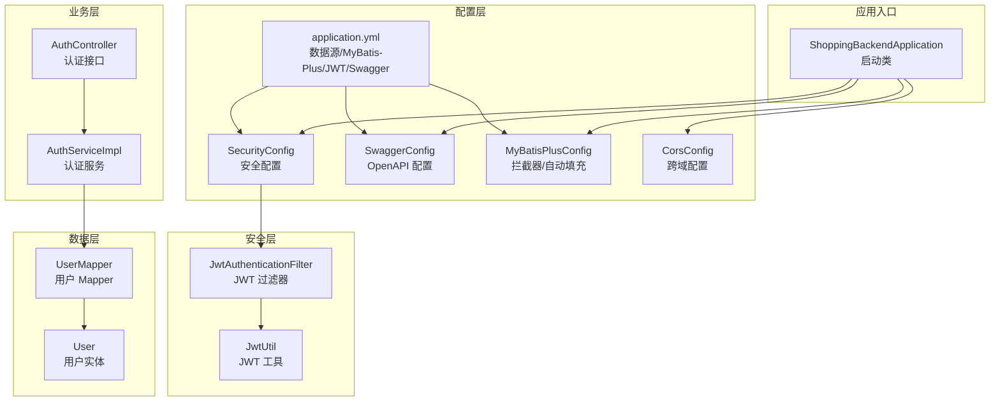
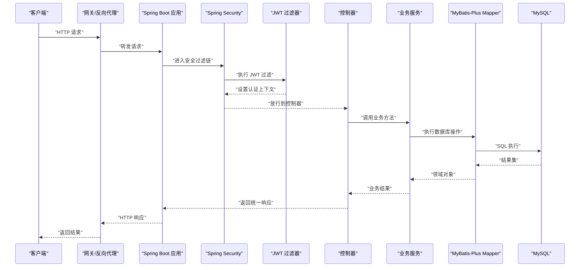
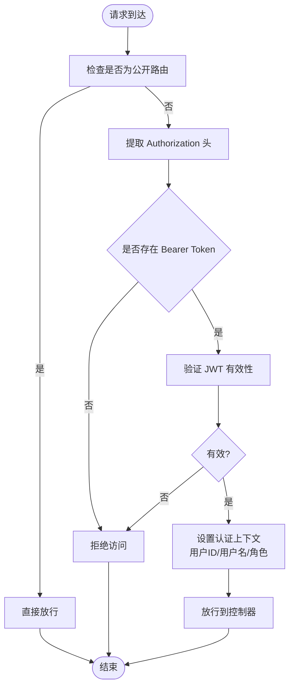
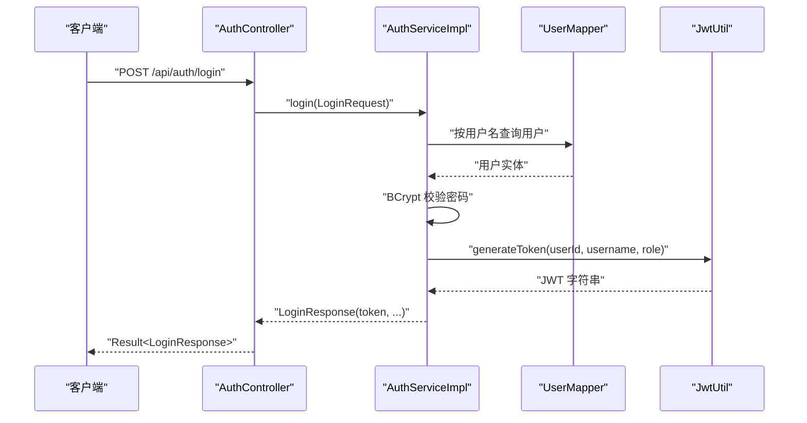
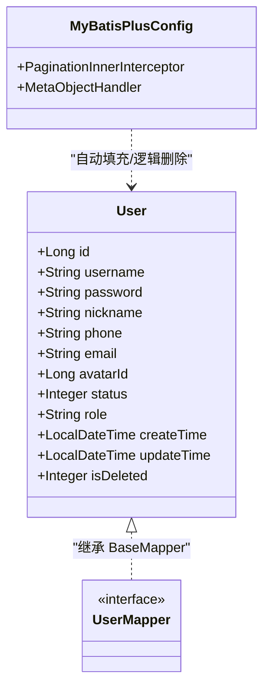
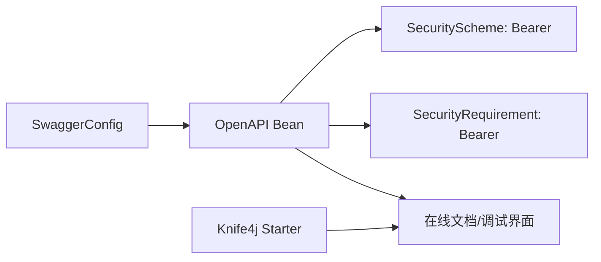
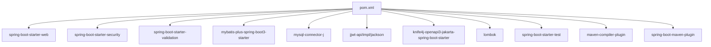

# 技术栈

<cite>
**本文引用的文件**
- [pom.xml](file://pom.xml)
- [application.yml](file://src/main/resources/application.yml)
- [ShoppingBackendApplication.java](file://src/main/java/com/qoder/mall/ShoppingBackendApplication.java)
- [SecurityConfig.java](file://src/main/java/com/qoder/mall/config/SecurityConfig.java)
- [JwtAuthenticationFilter.java](file://src/main/java/com/qoder/mall/security/filter/JwtAuthenticationFilter.java)
- [JwtUtil.java](file://src/main/java/com/qoder/mall/common/util/JwtUtil.java)
- [SwaggerConfig.java](file://src/main/java/com/qoder/mall/config/SwaggerConfig.java)
- [MyBatisPlusConfig.java](file://src/main/java/com/qoder/mall/config/MyBatisPlusConfig.java)
- [CorsConfig.java](file://src/main/java/com/qoder/mall/config/CorsConfig.java)
- [AuthController.java](file://src/main/java/com/qoder/mall/controller/AuthController.java)
- [AuthServiceImpl.java](file://src/main/java/com/qoder/mall/service/impl/AuthServiceImpl.java)
- [UserMapper.java](file://src/main/java/com/qoder/mall/mapper/UserMapper.java)
- [User.java](file://src/main/java/com/qoder/mall/entity/User.java)
- [Result.java](file://src/main/java/com/qoder/mall/common/result/Result.java)
- [OrderStatus.java](file://src/main/java/com/qoder/mall/common/constant/OrderStatus.java)
</cite>

## 目录
1. [引言](#引言)
2. [项目结构](#项目结构)
3. [核心组件](#核心组件)
4. [架构总览](#架构总览)
5. [详细组件分析](#详细组件分析)
6. [依赖分析](#依赖分析)
7. [性能考虑](#性能考虑)
8. [故障排查指南](#故障排查指南)
9. [结论](#结论)
10. [附录](#附录)

## 引言
本技术栈文档面向购物商城后端项目，系统性阐述所采用的核心技术与选型理由，并结合代码实现说明其在项目中的具体应用场景与集成方式。重点覆盖以下方面：
- 应用框架：Spring Boot 3.2.5
- 安全认证：Spring Security + JWT（无状态）
- ORM 框架：MyBatis-Plus
- API 文档与测试：Knife4j（基于 OpenAPI 3）
- 数据库与连接池：MySQL 8.0+ 及 MyBatis-Plus 分页与逻辑删除配置
- 开发工具链：Lombok、Maven、Java 17+

## 项目结构
项目采用标准 Spring Boot 多模块分层结构，按功能域划分包：
- config：全局配置（安全、跨域、MyBatis-Plus、Knife4j/OpenAPI）
- security：安全过滤器与异常处理
- common：通用工具、常量、统一响应封装
- entity/mapper/service/controller：领域模型、数据访问、业务服务、控制层
- resources：配置文件与数据库初始化脚本

图示来源
- [ShoppingBackendApplication.java:1-17](file://src/main/java/com/qoder/mall/ShoppingBackendApplication.java#L1-L17)
- [SecurityConfig.java:1-63](file://src/main/java/com/qoder/mall/config/SecurityConfig.java#L1-L63)
- [SwaggerConfig.java:1-30](file://src/main/java/com/qoder/mall/config/SwaggerConfig.java#L1-L30)
- [MyBatisPlusConfig.java:1-34](file://src/main/java/com/qoder/mall/config/MyBatisPlusConfig.java#L1-L34)
- [CorsConfig.java:1-25](file://src/main/java/com/qoder/mall/config/CorsConfig.java#L1-L25)
- [JwtAuthenticationFilter.java:1-56](file://src/main/java/com/qoder/mall/security/filter/JwtAuthenticationFilter.java#L1-L56)
- [JwtUtil.java:1-80](file://src/main/java/com/qoder/mall/common/util/JwtUtil.java#L1-L80)
- [AuthController.java:1-44](file://src/main/java/com/qoder/mall/controller/AuthController.java#L1-L44)
- [AuthServiceImpl.java:1-92](file://src/main/java/com/qoder/mall/service/impl/AuthServiceImpl.java#L1-L92)
- [UserMapper.java:1-8](file://src/main/java/com/qoder/mall/mapper/UserMapper.java#L1-L8)
- [User.java:1-40](file://src/main/java/com/qoder/mall/entity/User.java#L1-L40)
- [application.yml:1-36](file://src/main/resources/application.yml#L1-L36)

章节来源
- [ShoppingBackendApplication.java:1-17](file://src/main/java/com/qoder/mall/ShoppingBackendApplication.java#L1-L17)
- [application.yml:1-36](file://src/main/resources/application.yml#L1-L36)

## 核心组件
- Spring Boot 3.2.5：提供自动装配、Starter 依赖、内嵌服务器等能力，简化开发与部署。
- Spring Security：提供认证授权、会话策略、异常处理与安全过滤链配置。
- MyBatis-Plus 3.5.5：增强版 ORM，提供代码生成、分页插件、自动字段填充、逻辑删除等。
- JWT（jjwt 0.11.5）：无状态认证令牌，结合 Spring Security 实现鉴权。
- Knife4j（OpenAPI 3）：在线 API 文档与调试界面，提升联调效率。
- MySQL 8.0+：关系型数据库，配合连接池与 MyBatis-Plus 使用。
- Lombok：通过注解减少样板代码，提升开发效率。
- Maven：项目构建与依赖管理。

章节来源
- [pom.xml:1-134](file://pom.xml#L1-L134)
- [application.yml:1-36](file://src/main/resources/application.yml#L1-L36)

## 架构总览
下图展示从客户端到数据库的整体请求链路，包括安全过滤、业务处理与数据持久化：

图示来源
- [SecurityConfig.java:36-61](file://src/main/java/com/qoder/mall/config/SecurityConfig.java#L36-L61)
- [JwtAuthenticationFilter.java:25-46](file://src/main/java/com/qoder/mall/security/filter/JwtAuthenticationFilter.java#L25-L46)
- [AuthController.java:31-42](file://src/main/java/com/qoder/mall/controller/AuthController.java#L31-L42)
- [AuthServiceImpl.java:53-74](file://src/main/java/com/qoder/mall/service/impl/AuthServiceImpl.java#L53-L74)
- [UserMapper.java:1-8](file://src/main/java/com/qoder/mall/mapper/UserMapper.java#L1-L8)
- [application.yml:4-28](file://src/main/resources/application.yml#L4-L28)

## 详细组件分析

### Spring Security 与 JWT 认证
- 无状态会话：禁用 CSRF 与 Session，使用 STATELESS 策略。
- 路由白名单：公开接口与 Knife4j UI 路径无需认证。
- 角色权限：管理员接口需 ADMIN 角色；其余接口需认证。
- JWT 过滤器：从 Authorization 头解析 Bearer Token，填充认证上下文。
- 密码编码：BCryptPasswordEncoder。

图示来源
- [SecurityConfig.java:36-61](file://src/main/java/com/qoder/mall/config/SecurityConfig.java#L36-L61)
- [JwtAuthenticationFilter.java:25-46](file://src/main/java/com/qoder/mall/security/filter/JwtAuthenticationFilter.java#L25-L46)
- [JwtUtil.java:48-78](file://src/main/java/com/qoder/mall/common/util/JwtUtil.java#L48-L78)

章节来源
- [SecurityConfig.java:1-63](file://src/main/java/com/qoder/mall/config/SecurityConfig.java#L1-L63)
- [JwtAuthenticationFilter.java:1-56](file://src/main/java/com/qoder/mall/security/filter/JwtAuthenticationFilter.java#L1-L56)
- [JwtUtil.java:1-80](file://src/main/java/com/qoder/mall/common/util/JwtUtil.java#L1-L80)

### 认证流程（登录与令牌发放）
- 控制器接收登录请求，调用认证服务。
- 服务校验用户凭据，使用 BCrypt 校验密码。
- 通过后使用 JWT 工具生成令牌，包含用户ID、用户名与角色。
- 返回统一封装的响应对象。

图示来源
- [AuthController.java:31-42](file://src/main/java/com/qoder/mall/controller/AuthController.java#L31-L42)
- [AuthServiceImpl.java:53-74](file://src/main/java/com/qoder/mall/service/impl/AuthServiceImpl.java#L53-L74)
- [UserMapper.java:1-8](file://src/main/java/com/qoder/mall/mapper/UserMapper.java#L1-L8)
- [JwtUtil.java:33-46](file://src/main/java/com/qoder/mall/common/util/JwtUtil.java#L33-L46)

章节来源
- [AuthController.java:1-44](file://src/main/java/com/qoder/mall/controller/AuthController.java#L1-L44)
- [AuthServiceImpl.java:1-92](file://src/main/java/com/qoder/mall/service/impl/AuthServiceImpl.java#L1-L92)
- [UserMapper.java:1-8](file://src/main/java/com/qoder/mall/mapper/UserMapper.java#L1-L8)
- [JwtUtil.java:1-80](file://src/main/java/com/qoder/mall/common/util/JwtUtil.java#L1-L80)

### MyBatis-Plus 配置与实体映射
- 分页插件：针对 MySQL 的分页内核拦截器。
- 自动填充：插入/更新时自动填充 createTime、updateTime。
- 逻辑删除：启用逻辑删除字段与值约定，表前缀 tb_。
- 映射规范：实体类使用注解映射表名与字段，逻辑删除字段标注 @TableLogic。

图示来源
- [User.java:1-40](file://src/main/java/com/qoder/mall/entity/User.java#L1-L40)
- [UserMapper.java:1-8](file://src/main/java/com/qoder/mall/mapper/UserMapper.java#L1-L8)
- [MyBatisPlusConfig.java:1-34](file://src/main/java/com/qoder/mall/config/MyBatisPlusConfig.java#L1-L34)

章节来源
- [MyBatisPlusConfig.java:1-34](file://src/main/java/com/qoder/mall/config/MyBatisPlusConfig.java#L1-L34)
- [User.java:1-40](file://src/main/java/com/qoder/mall/entity/User.java#L1-L40)
- [UserMapper.java:1-8](file://src/main/java/com/qoder/mall/mapper/UserMapper.java#L1-L8)

### API 文档与测试（Knife4j/OpenAPI 3）
- OpenAPI Bean：定义标题、描述、版本与 Bearer JWT 安全方案。
- Knife4j Starter：提供在线文档与调试界面。
- Swagger UI：路径与启用开关在配置中声明。

图示来源
- [SwaggerConfig.java:1-30](file://src/main/java/com/qoder/mall/config/SwaggerConfig.java#L1-L30)
- [application.yml:30-36](file://src/main/resources/application.yml#L30-L36)

章节来源
- [SwaggerConfig.java:1-30](file://src/main/java/com/qoder/mall/config/SwaggerConfig.java#L1-L30)
- [application.yml:30-36](file://src/main/resources/application.yml#L30-L36)

### 统一响应与异常处理
- 统一响应：Result 封装 code、message、data，提供 success/error 工厂方法。
- 全局异常：可扩展于全局异常处理器（未在本节展开），结合 Result 输出标准化错误。

章节来源
- [Result.java:1-39](file://src/main/java/com/qoder/mall/common/result/Result.java#L1-L39)

### 数据库与连接池
- 数据源：MySQL JDBC URL、用户名、密码、驱动类名。
- 文件上传限制：单文件与请求总大小配置。
- MyBatis-Plus：下划线转驼峰、日志输出、逻辑删除字段与表前缀、分页配置。

章节来源
- [application.yml:4-28](file://src/main/resources/application.yml#L4-L28)

## 依赖分析
- Spring Boot 父工程：统一版本管理与插件默认行为。
- Web 与安全：spring-boot-starter-web、spring-boot-starter-security、validation。
- ORM：mybatis-plus-spring-boot3-starter。
- 数据库：mysql-connector-j。
- JWT：jjwt-api/impl/jackson。
- 文档：knife4j-openapi3-jakarta-spring-boot-starter。
- 工具：lombok。
- 测试：spring-boot-starter-test。
- 编译与打包：maven-compiler-plugin、spring-boot-maven-plugin。

图示来源
- [pom.xml:27-98](file://pom.xml#L27-L98)

章节来源
- [pom.xml:1-134](file://pom.xml#L1-L134)

## 性能考虑
- 无状态认证：JWT 减少服务端会话存储开销，适合水平扩展。
- 分页与逻辑删除：MyBatis-Plus 分页拦截器与逻辑删除减少全表扫描与误删风险。
- 自动填充：避免重复赋值，降低出错概率。
- 启用跨域与文件上传限制：保证前端交互体验与资源安全。
- 日志输出：开发阶段开启 SQL 日志便于定位问题，生产建议关闭或降级。

## 故障排查指南
- 登录失败
  - 检查用户名是否存在与密码是否匹配。
  - 确认用户状态正常且未被禁用。
  - 查看密码编码是否一致（BCrypt）。
- JWT 无效
  - 核对 Authorization 头格式是否为 Bearer Token。
  - 检查密钥与过期时间配置是否正确。
  - 确认令牌未过期。
- 权限不足
  - 管理员接口需 ADMIN 角色，请确认签发角色与校验逻辑。
- 数据库访问异常
  - 核对数据源连接参数与驱动类名。
  - 检查表前缀与逻辑删除字段配置是否与实体一致。
- API 文档不可用
  - 确认 Knife4j 与 OpenAPI 配置已启用，路径访问正常。

章节来源
- [AuthServiceImpl.java:53-74](file://src/main/java/com/qoder/mall/service/impl/AuthServiceImpl.java#L53-L74)
- [JwtAuthenticationFilter.java:25-46](file://src/main/java/com/qoder/mall/security/filter/JwtAuthenticationFilter.java#L25-L46)
- [JwtUtil.java:48-78](file://src/main/java/com/qoder/mall/common/util/JwtUtil.java#L48-L78)
- [application.yml:4-28](file://src/main/resources/application.yml#L4-L28)
- [SwaggerConfig.java:1-30](file://src/main/java/com/qoder/mall/config/SwaggerConfig.java#L1-L30)

## 结论
本项目以 Spring Boot 为核心，结合 Spring Security 与 JWT 实现无状态认证，利用 MyBatis-Plus 提升数据访问效率与一致性，通过 Knife4j 提供直观的 API 文档与测试能力。整体技术栈选择兼顾易用性、可维护性与扩展性，适用于中小型电商后端场景。

## 附录
- 业务常量示例：订单状态枚举用于统一状态表达与校验。
- 开发建议：遵循分层架构、统一响应、最小暴露面原则；在生产环境谨慎开放 Knife4j UI。

章节来源
- [OrderStatus.java:1-21](file://src/main/java/com/qoder/mall/common/constant/OrderStatus.java#L1-L21)