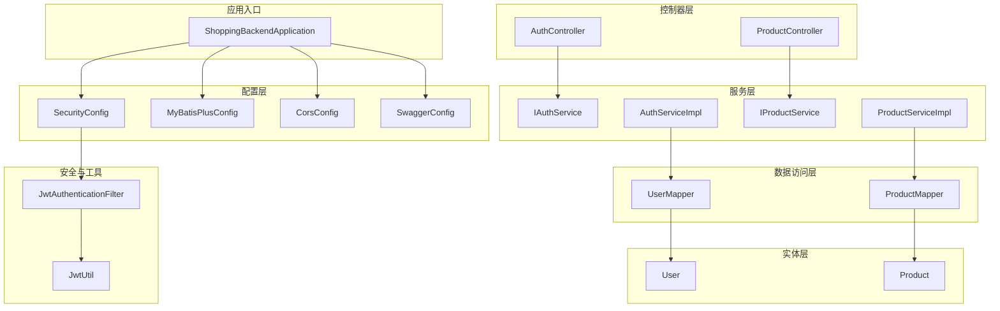
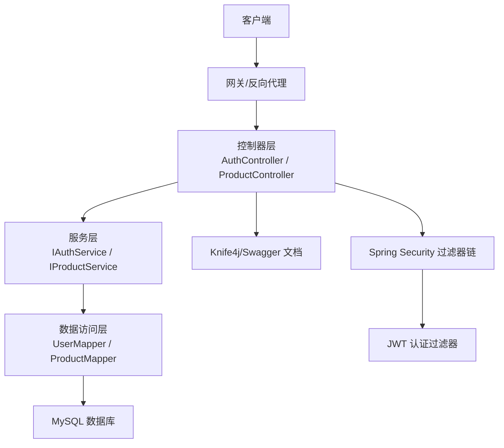
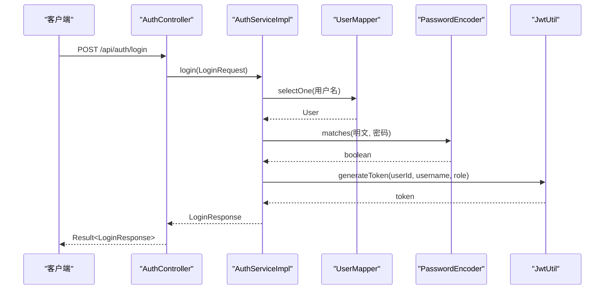
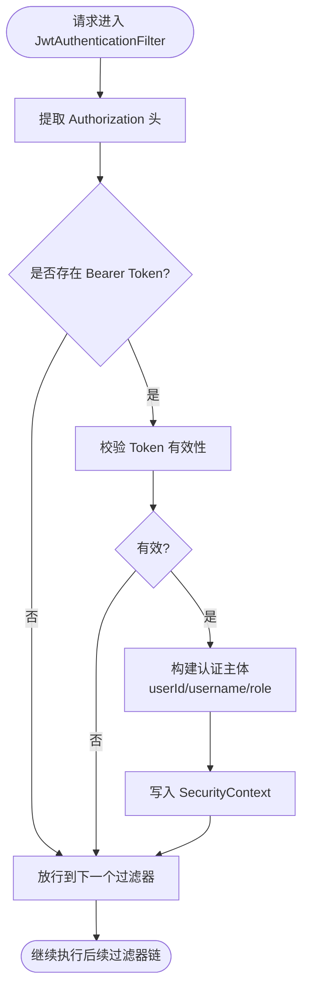
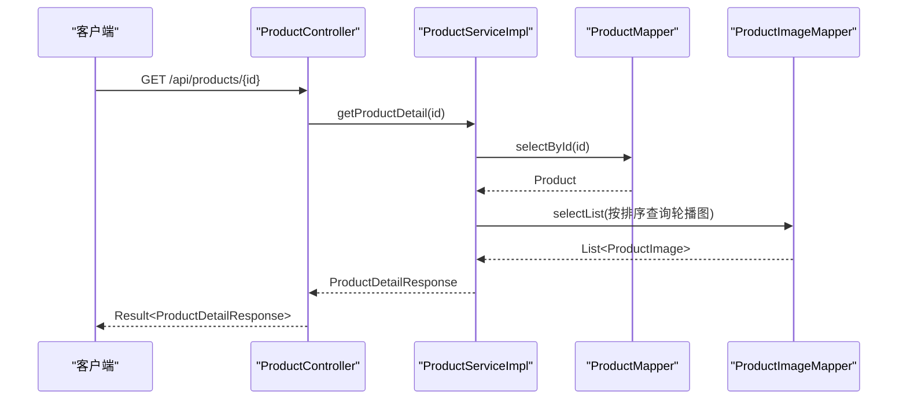
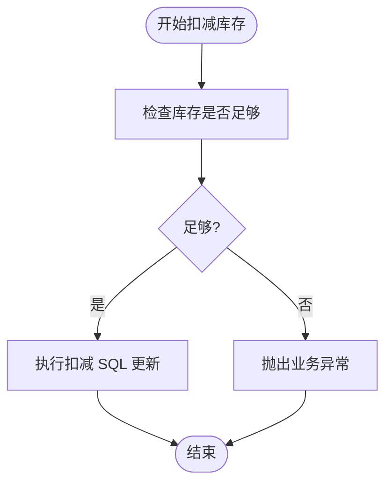
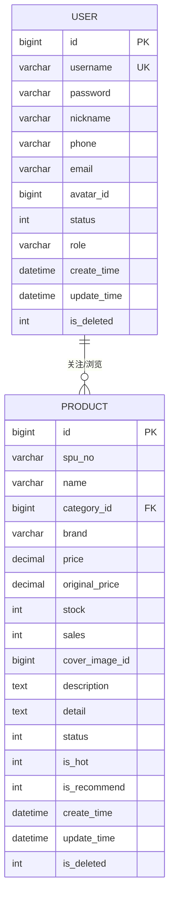
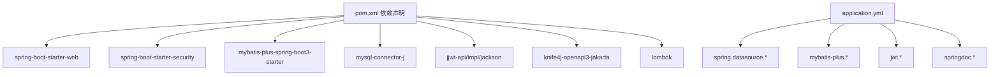

# 架构设计

<cite>
**本文引用的文件**
- [ShoppingBackendApplication.java](file://src/main/java/com/qoder/mall/ShoppingBackendApplication.java)
- [pom.xml](file://pom.xml)
- [application.yml](file://src/main/resources/application.yml)
- [AuthController.java](file://src/main/java/com/qoder/mall/controller/AuthController.java)
- [IAuthService.java](file://src/main/java/com/qoder/mall/service/IAuthService.java)
- [AuthServiceImpl.java](file://src/main/java/com/qoder/mall/service/impl/AuthServiceImpl.java)
- [SecurityConfig.java](file://src/main/java/com/qoder/mall/config/SecurityConfig.java)
- [JwtAuthenticationFilter.java](file://src/main/java/com/qoder/mall/security/filter/JwtAuthenticationFilter.java)
- [JwtUtil.java](file://src/main/java/com/qoder/mall/common/util/JwtUtil.java)
- [User.java](file://src/main/java/com/qoder/mall/entity/User.java)
- [UserMapper.java](file://src/main/java/com/qoder/mall/mapper/UserMapper.java)
- [ProductController.java](file://src/main/java/com/qoder/mall/controller/ProductController.java)
- [IProductService.java](file://src/main/java/com/qoder/mall/service/IProductService.java)
- [ProductServiceImpl.java](file://src/main/java/com/qoder/mall/service/impl/ProductServiceImpl.java)
- [Product.java](file://src/main/java/com/qoder/mall/entity/Product.java)
- [ProductMapper.java](file://src/main/java/com/qoder/mall/mapper/ProductMapper.java)
</cite>

## 目录
1. [引言](#引言)
2. [项目结构](#项目结构)
3. [核心组件](#核心组件)
4. [架构总览](#架构总览)
5. [详细组件分析](#详细组件分析)
6. [依赖分析](#依赖分析)
7. [性能考虑](#性能考虑)
8. [故障排查指南](#故障排查指南)
9. [结论](#结论)
10. [附录](#附录)

## 引言
本项目是一个基于 Spring Boot 的购物商城后端，采用经典的分层架构（Controller/Service/Mapper/Entity），结合 Spring MVC、Spring Security、MyBatis-Plus 等技术栈，提供认证与授权、商品浏览、文件访问等核心能力。本文档从架构视角出发，系统阐述各层职责、模块划分、依赖注入、安全与权限控制、AOP 与事务管理等企业级特性，并总结面向对象设计原则在项目中的应用。

## 项目结构
项目采用按层次与功能混合的组织方式：
- 分层：controller（控制器）、service（服务）、mapper（数据访问）、entity（实体）
- 配置：config（安全、跨域、MyBatis-Plus、Swagger）
- 安全：security/filter（JWT 过滤器）、security/handler（鉴权与拒绝处理器）
- DTO/VO：dto（请求/响应）、vo（视图对象）
- 工具与通用：common/exception（全局异常）、common/result（统一返回）、common/util（工具）
- 资源：resources（数据库脚本、配置）

图表来源
- [ShoppingBackendApplication.java:1-17](file://src/main/java/com/qoder/mall/ShoppingBackendApplication.java#L1-L17)
- [SecurityConfig.java:1-63](file://src/main/java/com/qoder/mall/config/SecurityConfig.java#L1-L63)
- [AuthController.java:1-44](file://src/main/java/com/qoder/mall/controller/AuthController.java#L1-L44)
- [ProductController.java:1-54](file://src/main/java/com/qoder/mall/controller/ProductController.java#L1-L54)
- [IAuthService.java:1-16](file://src/main/java/com/qoder/mall/service/IAuthService.java#L1-L16)
- [AuthServiceImpl.java:1-92](file://src/main/java/com/qoder/mall/service/impl/AuthServiceImpl.java#L1-L92)
- [IProductService.java](file://src/main/java/com/qoder/mall/service/IProductService.java)
- [ProductServiceImpl.java:1-131](file://src/main/java/com/qoder/mall/service/impl/ProductServiceImpl.java#L1-L131)
- [UserMapper.java:1-8](file://src/main/java/com/qoder/mall/mapper/UserMapper.java#L1-L8)
- [ProductMapper.java:1-16](file://src/main/java/com/qoder/mall/mapper/ProductMapper.java#L1-L16)
- [User.java:1-40](file://src/main/java/com/qoder/mall/entity/User.java#L1-L40)
- [Product.java:1-53](file://src/main/java/com/qoder/mall/entity/Product.java#L1-L53)
- [JwtAuthenticationFilter.java:1-56](file://src/main/java/com/qoder/mall/security/filter/JwtAuthenticationFilter.java#L1-L56)
- [JwtUtil.java:1-80](file://src/main/java/com/qoder/mall/common/util/JwtUtil.java#L1-L80)

章节来源
- [ShoppingBackendApplication.java:1-17](file://src/main/java/com/qoder/mall/ShoppingBackendApplication.java#L1-L17)
- [pom.xml:1-134](file://pom.xml#L1-L134)
- [application.yml:1-36](file://src/main/resources/application.yml#L1-L36)

## 核心组件
- 应用入口与扫描：应用启动类启用 Mapper 扫描与异步支持，确保 MyBatis-Plus 的 Mapper 接口被自动识别。
- 控制器层：以 RESTful 方式暴露接口，使用 Swagger 注解标注接口元数据，统一返回包装 Result。
- 服务层：定义业务接口与实现，封装业务规则与流程；使用 Lombok 注入依赖，提升可读性。
- 数据访问层：基于 MyBatis-Plus 的 BaseMapper，提供通用 CRUD；自定义 SQL 通过注解方式扩展。
- 实体层：使用注解映射表字段与逻辑删除，统一填充创建/更新时间。
- 安全与认证：基于 Spring Security + JWT，拦截器解析 Token 并注入认证上下文；配置放行公开接口与 Swagger 路由。

章节来源
- [ShoppingBackendApplication.java:8-11](file://src/main/java/com/qoder/mall/ShoppingBackendApplication.java#L8-L11)
- [AuthController.java:16-43](file://src/main/java/com/qoder/mall/controller/AuthController.java#L16-L43)
- [AuthServiceImpl.java:17-91](file://src/main/java/com/qoder/mall/service/impl/AuthServiceImpl.java#L17-L91)
- [UserMapper.java:6-7](file://src/main/java/com/qoder/mall/mapper/UserMapper.java#L6-L7)
- [User.java:9-39](file://src/main/java/com/qoder/mall/entity/User.java#L9-L39)
- [SecurityConfig.java:36-61](file://src/main/java/com/qoder/mall/config/SecurityConfig.java#L36-L61)

## 架构总览
系统遵循 MVC 分层与依赖倒置原则：
- 控制器层仅负责参数接收、校验与调用服务层，不直接操作数据。
- 服务层聚合领域逻辑，协调多个 Mapper 完成业务目标。
- Mapper 层专注数据持久化，提供细粒度的查询与更新。
- Entity 层承载数据模型，配合 MyBatis-Plus 注解完成 ORM 映射。
- 安全层通过过滤器链在进入控制器前完成身份鉴别与授权判定。

图表来源
- [AuthController.java:16-43](file://src/main/java/com/qoder/mall/controller/AuthController.java#L16-L43)
- [ProductController.java:16-53](file://src/main/java/com/qoder/mall/controller/ProductController.java#L16-L53)
- [SecurityConfig.java:36-61](file://src/main/java/com/qoder/mall/config/SecurityConfig.java#L36-L61)
- [JwtAuthenticationFilter.java:25-46](file://src/main/java/com/qoder/mall/security/filter/JwtAuthenticationFilter.java#L25-L46)

## 详细组件分析

### 认证与授权模块
- 控制器：提供注册、登录、获取当前用户信息接口，使用 Swagger 注解与统一返回包装。
- 服务：实现注册时的重复性检查、密码加密存储、登录时的凭证校验与状态判断、生成登录响应与用户信息响应。
- 安全：通过 SecurityConfig 配置放行公开路由与 Swagger，其余接口需认证；JwtAuthenticationFilter 解析 Authorization 头中的 Bearer Token，构建认证主体并写入上下文。
- 工具：JwtUtil 封装签名密钥生成、Token 签发与解析、载荷提取与有效期校验。

图表来源
- [AuthController.java:31-35](file://src/main/java/com/qoder/mall/controller/AuthController.java#L31-L35)
- [AuthServiceImpl.java:53-74](file://src/main/java/com/qoder/mall/service/impl/AuthServiceImpl.java#L53-L74)
- [UserMapper.java:6-7](file://src/main/java/com/qoder/mall/mapper/UserMapper.java#L6-L7)
- [JwtUtil.java:33-46](file://src/main/java/com/qoder/mall/common/util/JwtUtil.java#L33-L46)

图表来源
- [JwtAuthenticationFilter.java:25-46](file://src/main/java/com/qoder/mall/security/filter/JwtAuthenticationFilter.java#L25-L46)
- [JwtUtil.java:48-78](file://src/main/java/com/qoder/mall/common/util/JwtUtil.java#L48-L78)

章节来源
- [AuthController.java:24-42](file://src/main/java/com/qoder/mall/controller/AuthController.java#L24-L42)
- [IAuthService.java:8-15](file://src/main/java/com/qoder/mall/service/IAuthService.java#L8-L15)
- [AuthServiceImpl.java:25-90](file://src/main/java/com/qoder/mall/service/impl/AuthServiceImpl.java#L25-L90)
- [SecurityConfig.java:44-58](file://src/main/java/com/qoder/mall/config/SecurityConfig.java#L44-L58)
- [JwtAuthenticationFilter.java:19-55](file://src/main/java/com/qoder/mall/security/filter/JwtAuthenticationFilter.java#L19-L55)
- [JwtUtil.java:16-79](file://src/main/java/com/qoder/mall/common/util/JwtUtil.java#L16-L79)

### 商品浏览模块
- 控制器：提供热门商品、推荐商品、分页列表、商品详情等接口，支持分类筛选与关键字检索。
- 服务：实现热门/推荐商品排序查询、分页查询、详情装配（封面图、轮播图）。
- 数据访问：ProductMapper 提供库存扣减与回退的原生 SQL 更新方法，保证并发场景下的正确性。

图表来源
- [ProductController.java:48-52](file://src/main/java/com/qoder/mall/controller/ProductController.java#L48-L52)
- [ProductServiceImpl.java:70-109](file://src/main/java/com/qoder/mall/service/impl/ProductServiceImpl.java#L70-L109)
- [ProductMapper.java:8-15](file://src/main/java/com/qoder/mall/mapper/ProductMapper.java#L8-L15)

图表来源
- [ProductMapper.java:10-11](file://src/main/java/com/qoder/mall/mapper/ProductMapper.java#L10-L11)
- [ProductServiceImpl.java:70-109](file://src/main/java/com/qoder/mall/service/impl/ProductServiceImpl.java#L70-L109)

章节来源
- [ProductController.java:24-52](file://src/main/java/com/qoder/mall/controller/ProductController.java#L24-L52)
- [IProductService.java](file://src/main/java/com/qoder/mall/service/IProductService.java)
- [ProductServiceImpl.java:28-129](file://src/main/java/com/qoder/mall/service/impl/ProductServiceImpl.java#L28-L129)
- [Product.java:10-52](file://src/main/java/com/qoder/mall/entity/Product.java#L10-L52)
- [ProductMapper.java:8-15](file://src/main/java/com/qoder/mall/mapper/ProductMapper.java#L8-L15)

### 数据模型与关系
以下 ER 图展示核心实体之间的关系，体现一对多与外键约束：

图表来源
- [User.java:10-39](file://src/main/java/com/qoder/mall/entity/User.java#L10-L39)
- [Product.java:11-52](file://src/main/java/com/qoder/mall/entity/Product.java#L11-L52)

## 依赖分析
- 框架与中间件：Spring Boot Web、Spring Security、MyBatis-Plus、MySQL Connector、JWT、Knife4j/Swagger、Lombok。
- 配置项：数据源、文件上传大小、MyBatis-Plus 下划线转驼峰、逻辑删除字段、JWT 密钥与过期时间、OpenAPI 路径与 UI 开关。
- 启动类：开启 Mapper 扫描与异步能力，确保服务层可被容器管理。

图表来源
- [pom.xml:27-98](file://pom.xml#L27-L98)
- [application.yml:4-36](file://src/main/resources/application.yml#L4-L36)

章节来源
- [pom.xml:20-98](file://pom.xml#L20-L98)
- [application.yml:1-36](file://src/main/resources/application.yml#L1-L36)

## 性能考虑
- 分页查询：服务层使用 MyBatis-Plus 分页插件，避免一次性加载大量数据。
- 字段映射：开启下划线转驼峰，减少手动映射成本。
- 逻辑删除：统一逻辑删除字段，避免物理删除带来的维护成本。
- 文件上传：限制单文件与请求总大小，防止内存溢出。
- 缓存策略：可在服务层引入缓存（如 Redis）对热点商品与分类进行缓存，降低数据库压力。
- 并发控制：库存扣减使用带条件的原子更新，避免超卖；必要时可引入分布式锁或数据库层面的乐观锁。

## 故障排查指南
- 登录失败：检查用户名是否存在、密码是否匹配、账户状态是否正常；确认密码编码器与存储一致。
- Token 无效：确认请求头格式为 Bearer Token，密钥与过期时间配置正确，未过期。
- 权限不足：确认角色前缀“ROLE_”与配置一致，管理员端点仅允许 ADMIN 角色访问。
- 数据库连接：核对数据源 URL、用户名、密码与驱动类名；确认网络可达。
- OpenAPI 文档：确认 Knife4j/SpringDoc 开关与路径配置正确，浏览器可访问。

章节来源
- [AuthServiceImpl.java:58-63](file://src/main/java/com/qoder/mall/service/impl/AuthServiceImpl.java#L58-L63)
- [JwtAuthenticationFilter.java:48-54](file://src/main/java/com/qoder/mall/security/filter/JwtAuthenticationFilter.java#L48-L54)
- [SecurityConfig.java:53-56](file://src/main/java/com/qoder/mall/config/SecurityConfig.java#L53-L56)
- [application.yml:6-9](file://src/main/resources/application.yml#L6-L9)

## 结论
本项目以清晰的分层架构为基础，结合 Spring Security 与 JWT 实现了完善的认证与授权机制；通过 MyBatis-Plus 提升了数据访问效率与一致性。模块划分明确，职责边界清晰，遵循单一职责与依赖倒置等设计原则。建议在现有基础上进一步完善缓存与监控体系，持续提升系统稳定性与可维护性。

## 附录
- 最佳实践摘要
  - 单一职责：控制器只做编排，服务聚合业务，Mapper 专注持久化。
  - 依赖倒置：上层依赖抽象接口，便于替换与测试。
  - 开闭原则：新增业务通过扩展接口与实现类完成，不修改既有代码。
  - 统一返回与异常：通过 Result 与全局异常处理器屏蔽细节，提升前端体验。
  - 安全优先：最小权限放行，严格校验 Token，避免硬编码密钥。