# 核心功能

<cite>
**本文引用的文件**
- [ShoppingBackendApplication.java](file://src/main/java/com/qoder/mall/ShoppingBackendApplication.java)
- [application.yml](file://src/main/resources/application.yml)
- [AuthController.java](file://src/main/java/com/qoder/mall/controller/AuthController.java)
- [AuthServiceImpl.java](file://src/main/java/com/qoder/mall/service/impl/AuthServiceImpl.java)
- [ProductController.java](file://src/main/java/com/qoder/mall/controller/ProductController.java)
- [ProductServiceImpl.java](file://src/main/java/com/qoder/mall/service/impl/ProductServiceImpl.java)
- [CartController.java](file://src/main/java/com/qoder/mall/controller/CartController.java)
- [CartServiceImpl.java](file://src/main/java/com/qoder/mall/service/impl/CartServiceImpl.java)
- [OrderController.java](file://src/main/java/com/qoder/mall/controller/OrderController.java)
- [OrderServiceImpl.java](file://src/main/java/com/qoder/mall/service/impl/OrderServiceImpl.java)
- [AddressController.java](file://src/main/java/com/qoder/mall/controller/AddressController.java)
- [AddressServiceImpl.java](file://src/main/java/com/qoder/mall/service/impl/AddressServiceImpl.java)
- [FileController.java](file://src/main/java/com/qoder/mall/controller/FileController.java)
- [FileServiceImpl.java](file://src/main/java/com/qoder/mall/service/impl/FileServiceImpl.java)
- [AdminProductController.java](file://src/main/java/com/qoder/mall/controller/admin/AdminProductController.java)
- [AdminProductServiceImpl.java](file://src/main/java/com/qoder/mall/service/impl/AdminProductServiceImpl.java)
- [PaymentController.java](file://src/main/java/com/qoder/mall/controller/PaymentController.java)
- [PaymentServiceImpl.java](file://src/main/java/com/qoder/mall/service/impl/PaymentServiceImpl.java)
- [OrderStatus.java](file://src/main/java/com/qoder/mall/common/constant/OrderStatus.java)
- [OrderNoGenerator.java](file://src/main/java/com/qoder/mall/common/util/OrderNoGenerator.java)
- [JwtUtil.java](file://src/main/java/com/qoder/mall/common/util/JwtUtil.java)
- [GlobalExceptionHandler.java](file://src/main/java/com/qoder/mall/common/exception/GlobalExceptionHandler.java)
- [Result.java](file://src/main/java/com/qoder/mall/common/result/Result.java)
- [User.java](file://src/main/java/com/qoder/mall/entity/User.java)
- [Product.java](file://src/main/java/com/qoder/mall/entity/Product.java)
- [Order.java](file://src/main/java/com/qoder/mall/entity/Order.java)
- [OrderItem.java](file://src/main/java/com/qoder/mall/entity/OrderItem.java)
- [Address.java](file://src/main/java/com/qoder/mall/entity/Address.java)
- [CartItem.java](file://src/main/java/com/qoder/mall/entity/CartItem.java)
- [FileStorage.java](file://src/main/java/com/qoder/mall/entity/FileStorage.java)
- [ProductImage.java](file://src/main/java/com/qoder/mall/entity/ProductImage.java)
- [IAuthService.java](file://src/main/java/com/qoder/mall/service/IAuthService.java)
- [ICartService.java](file://src/main/java/com/qoder/mall/service/ICartService.java)
- [IOrderService.java](file://src/main/java/com/qoder/mall/service/IOrderService.java)
- [IAddressService.java](file://src/main/java/com/qoder/mall/service/IAddressService.java)
- [IFileService.java](file://src/main/java/com/qoder/mall/service/IFileService.java)
- [IPaymentService.java](file://src/main/java/com/qoder/mall/service/IPaymentService.java)
- [IProductService.java](file://src/main/java/com/qoder/mall/service/IProductService.java)
- [IAdminProductService.java](file://src/main/java/com/qoder/mall/service/IAdminProductService.java)
</cite>

## 目录
1. [简介](#简介)
2. [项目结构](#项目结构)
3. [核心组件](#核心组件)
4. [架构总览](#架构总览)
5. [详细组件分析](#详细组件分析)
6. [依赖分析](#依赖分析)
7. [性能考虑](#性能考虑)
8. [故障排查指南](#故障排查指南)
9. [结论](#结论)
10. [附录](#附录)

## 简介
本项目是一个基于 Spring Boot 的购物商城后端，采用分层架构与 MyBatis-Plus 持久化，提供完整的电商核心业务能力。本文档聚焦八大核心功能模块：用户认证系统、商品浏览与搜索、购物车管理、订单处理、收货地址管理、文件上传与存储、后台商品管理、支付流程模拟。文档从架构、数据流、模块协作与边界控制等维度进行深入解析，帮助开发者快速理解系统全貌与实现要点。

## 项目结构
项目采用标准的 Maven 结构，按领域与层次划分包：
- controller 层：对外暴露 REST 接口，负责参数接收与响应封装
- service 层：业务逻辑编排，事务与异常控制
- mapper 层：MyBatis-Plus 映射接口，负责数据库 CRUD
- entity/dto/vo：实体、请求/响应 DTO、视图对象
- common：通用常量、工具、异常与结果封装
- config：跨域、安全、MyBatis-Plus、Swagger 配置
- resources：数据库脚本与应用配置

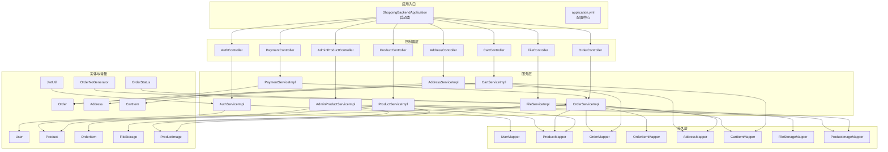

图表来源
- [ShoppingBackendApplication.java:1-17](file://src/main/java/com/qoder/mall/ShoppingBackendApplication.java#L1-L17)
- [application.yml:1-36](file://src/main/resources/application.yml#L1-L36)
- [AuthController.java:1-44](file://src/main/java/com/qoder/mall/controller/AuthController.java#L1-L44)
- [ProductController.java:1-54](file://src/main/java/com/qoder/mall/controller/ProductController.java#L1-L54)
- [CartController.java:1-78](file://src/main/java/com/qoder/mall/controller/CartController.java#L1-L78)
- [OrderController.java:1-70](file://src/main/java/com/qoder/mall/controller/OrderController.java#L1-L70)
- [AddressController.java:1-67](file://src/main/java/com/qoder/mall/controller/AddressController.java#L1-L67)
- [FileController.java:1-43](file://src/main/java/com/qoder/mall/controller/FileController.java#L1-L43)
- [AdminProductController.java:1-82](file://src/main/java/com/qoder/mall/controller/admin/AdminProductController.java#L1-L82)
- [PaymentController.java:1-28](file://src/main/java/com/qoder/mall/controller/PaymentController.java#L1-L28)

章节来源
- [ShoppingBackendApplication.java:1-17](file://src/main/java/com/qoder/mall/ShoppingBackendApplication.java#L1-L17)
- [application.yml:1-36](file://src/main/resources/application.yml#L1-L36)

## 核心组件
本节概述八大核心功能模块的职责与边界：
- 用户认证系统：负责注册、登录、用户信息查询；使用 JWT 生成令牌，结合 Spring Security 进行鉴权
- 商品浏览与搜索：提供热门/推荐商品、分页列表、关键词搜索、分类筛选与商品详情
- 购物车系统：支持添加、查询、修改数量、切换选中、单删与批量删除
- 订单处理系统：提交订单（扣减库存、生成订单与明细、清空购物车）、查询、取消、确认收货、后台发货
- 收货地址管理：地址增删改、设默认、列表展示
- 文件上传与存储：图片上传校验、存储与回显
- 后台商品管理：商品增删改查、上下架、库存与价格调整
- 支付流程模拟：异步模拟支付，完成后回调更新订单状态

章节来源
- [AuthController.java:1-44](file://src/main/java/com/qoder/mall/controller/AuthController.java#L1-L44)
- [AuthServiceImpl.java:1-92](file://src/main/java/com/qoder/mall/service/impl/AuthServiceImpl.java#L1-L92)
- [ProductController.java:1-54](file://src/main/java/com/qoder/mall/controller/ProductController.java#L1-L54)
- [ProductServiceImpl.java:1-131](file://src/main/java/com/qoder/mall/service/impl/ProductServiceImpl.java#L1-L131)
- [CartController.java:1-78](file://src/main/java/com/qoder/mall/controller/CartController.java#L1-L78)
- [CartServiceImpl.java:1-117](file://src/main/java/com/qoder/mall/service/impl/CartServiceImpl.java#L1-L117)
- [OrderController.java:1-70](file://src/main/java/com/qoder/mall/controller/OrderController.java#L1-L70)
- [OrderServiceImpl.java:1-286](file://src/main/java/com/qoder/mall/service/impl/OrderServiceImpl.java#L1-L286)
- [AddressController.java:1-67](file://src/main/java/com/qoder/mall/controller/AddressController.java#L1-L67)
- [AddressServiceImpl.java:1-98](file://src/main/java/com/qoder/mall/service/impl/AddressServiceImpl.java#L1-L98)
- [FileController.java:1-43](file://src/main/java/com/qoder/mall/controller/FileController.java#L1-L43)
- [FileServiceImpl.java:1-72](file://src/main/java/com/qoder/mall/service/impl/FileServiceImpl.java#L1-L72)
- [AdminProductController.java:1-82](file://src/main/java/com/qoder/mall/controller/admin/AdminProductController.java#L1-L82)
- [AdminProductServiceImpl.java:1-133](file://src/main/java/com/qoder/mall/service/impl/AdminProductServiceImpl.java#L1-L133)
- [PaymentController.java:1-28](file://src/main/java/com/qoder/mall/controller/PaymentController.java#L1-L28)
- [PaymentServiceImpl.java:1-34](file://src/main/java/com/qoder/mall/service/impl/PaymentServiceImpl.java#L1-L34)

## 架构总览
系统采用典型的 MVC 分层与领域驱动设计：
- 控制器层统一返回 Result 包装，便于前端消费
- 服务层承担业务编排与异常处理，部分方法声明事务
- 持久层通过 MyBatis-Plus Mapper 实现数据访问
- 公共模块提供常量、工具与全局异常处理
- 安全模块基于 JWT，控制器通过 Authentication 获取用户标识

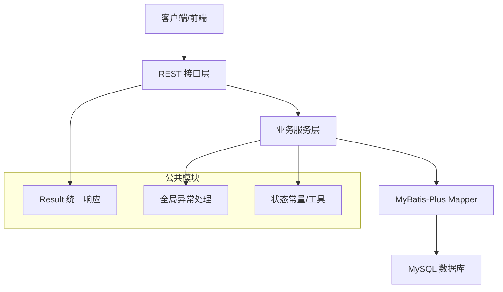

图表来源
- [Result.java](file://src/main/java/com/qoder/mall/common/result/Result.java)
- [GlobalExceptionHandler.java](file://src/main/java/com/qoder/mall/common/exception/GlobalExceptionHandler.java)
- [OrderStatus.java](file://src/main/java/com/qoder/mall/common/constant/OrderStatus.java)
- [OrderNoGenerator.java](file://src/main/java/com/qoder/mall/common/util/OrderNoGenerator.java)
- [JwtUtil.java](file://src/main/java/com/qoder/mall/common/util/JwtUtil.java)

## 详细组件分析

### 用户认证系统
- 功能点
  - 注册：校验用户名与手机号唯一性，加密保存用户信息
  - 登录：校验凭据与状态，签发 JWT
  - 查询用户信息：基于 Token 中的用户标识读取用户资料
- 关键流程
  - 登录成功后，服务层调用 JWT 工具生成令牌，返回包含用户角色与昵称的登录响应
  - 控制器通过 Spring Security 的 Authentication 获取当前用户 ID，避免重复查询
- 异常与边界
  - 用户名重复、手机号重复、账号禁用、用户不存在等均抛出业务异常

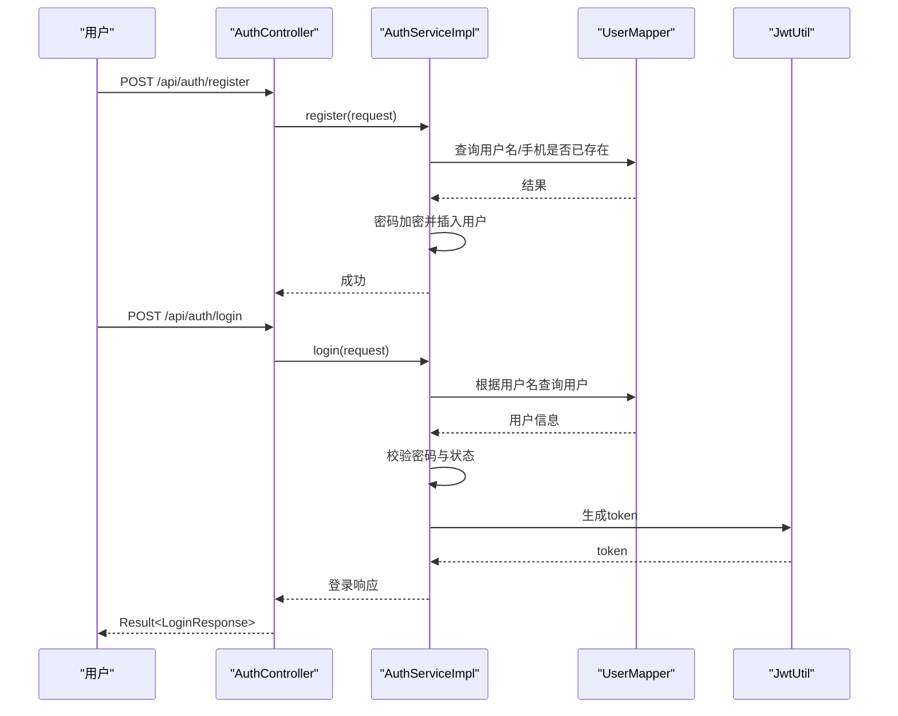

图表来源
- [AuthController.java:24-42](file://src/main/java/com/qoder/mall/controller/AuthController.java#L24-L42)
- [AuthServiceImpl.java:25-74](file://src/main/java/com/qoder/mall/service/impl/AuthServiceImpl.java#L25-L74)
- [JwtUtil.java](file://src/main/java/com/qoder/mall/common/util/JwtUtil.java)

章节来源
- [AuthController.java:1-44](file://src/main/java/com/qoder/mall/controller/AuthController.java#L1-L44)
- [AuthServiceImpl.java:1-92](file://src/main/java/com/qoder/mall/service/impl/AuthServiceImpl.java#L1-L92)

### 商品浏览与搜索
- 功能点
  - 热销/推荐商品：按状态与标记查询并排序
  - 列表分页：支持分类过滤与关键词模糊匹配
  - 商品详情：聚合封面图与轮播图 URL，组装详情响应
- 数据流
  - 控制器接收分页与筛选参数，服务层构建查询条件并分页查询
  - 详情页额外加载商品图片映射，拼接文件服务访问路径

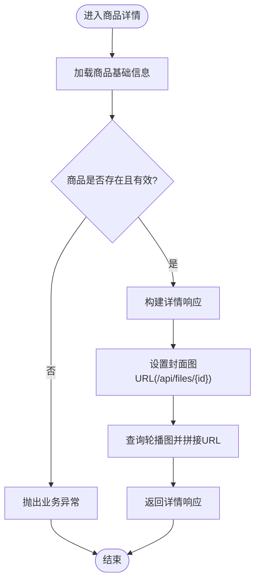

图表来源
- [ProductController.java:48-52](file://src/main/java/com/qoder/mall/controller/ProductController.java#L48-L52)
- [ProductServiceImpl.java:70-109](file://src/main/java/com/qoder/mall/service/impl/ProductServiceImpl.java#L70-L109)

章节来源
- [ProductController.java:1-54](file://src/main/java/com/qoder/mall/controller/ProductController.java#L1-L54)
- [ProductServiceImpl.java:1-131](file://src/main/java/com/qoder/mall/service/impl/ProductServiceImpl.java#L1-L131)

### 购物车系统
- 功能点
  - 添加商品：若同款已存在则累加数量，否则新建购物车项
  - 查询购物车：按时间倒序列出，计算小计金额
  - 修改数量/切换选中/删除/批量删除：均进行所有权校验
- 边界与异常
  - 商品不存在或已下架时禁止加入购物车
  - 删除/更新前校验归属，防止越权

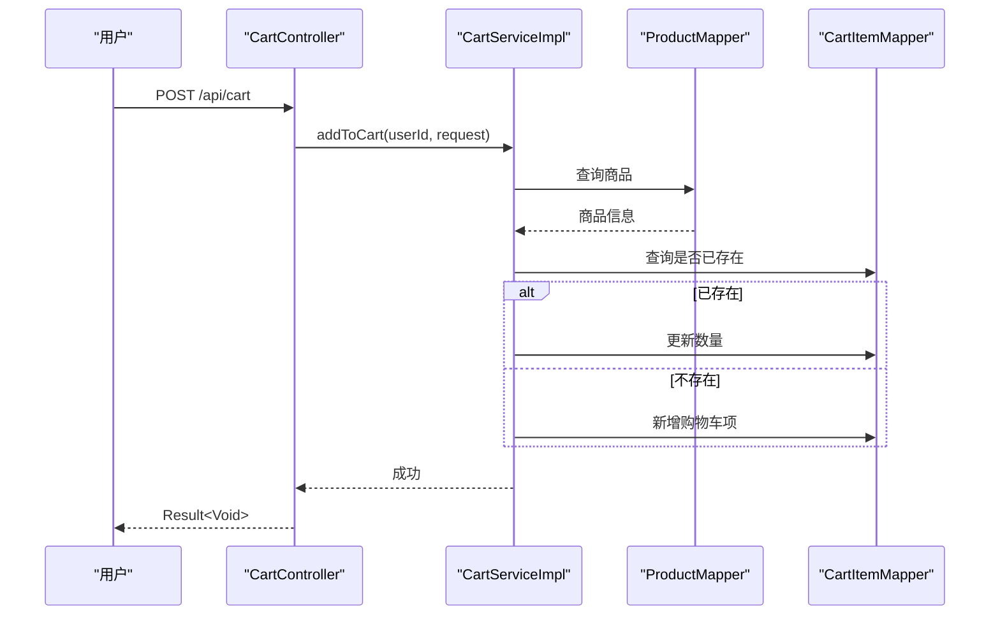

图表来源
- [CartController.java:31-38](file://src/main/java/com/qoder/mall/controller/CartController.java#L31-L38)
- [CartServiceImpl.java:27-50](file://src/main/java/com/qoder/mall/service/impl/CartServiceImpl.java#L27-L50)

章节来源
- [CartController.java:1-78](file://src/main/java/com/qoder/mall/controller/CartController.java#L1-L78)
- [CartServiceImpl.java:1-117](file://src/main/java/com/qoder/mall/service/impl/CartServiceImpl.java#L1-L117)

### 订单处理系统
- 功能点
  - 提交订单：校验购物车项与收货地址，扣减库存，生成订单与明细，清空购物车
  - 查询订单：支持按状态筛选与分页
  - 取消订单：仅待支付可取消，恢复库存
  - 确认收货：仅已发货可确认
  - 后台发货：仅已支付可发货
- 关键状态机
  - 使用枚举定义订单状态与描述，服务层在转换时进行严格校验

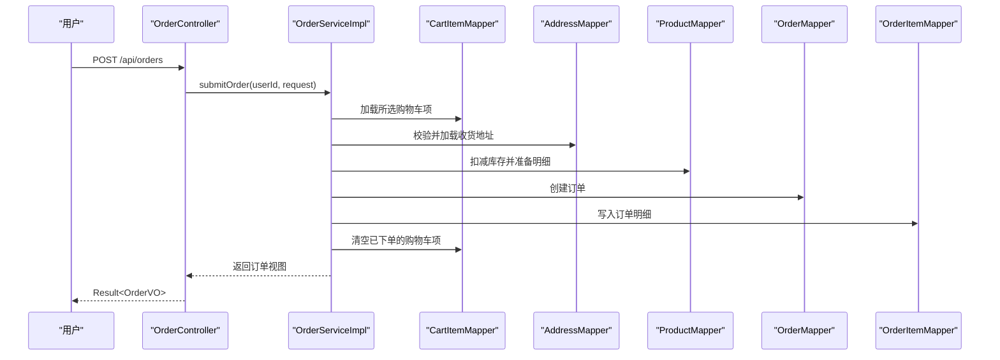

图表来源
- [OrderController.java:24-30](file://src/main/java/com/qoder/mall/controller/OrderController.java#L24-L30)
- [OrderServiceImpl.java:35-107](file://src/main/java/com/qoder/mall/service/impl/OrderServiceImpl.java#L35-L107)

章节来源
- [OrderController.java:1-70](file://src/main/java/com/qoder/mall/controller/OrderController.java#L1-L70)
- [OrderServiceImpl.java:1-286](file://src/main/java/com/qoder/mall/service/impl/OrderServiceImpl.java#L1-L286)
- [OrderStatus.java](file://src/main/java/com/qoder/mall/common/constant/OrderStatus.java)

### 收货地址管理
- 功能点
  - 地址列表：默认地址优先，再按创建时间倒序
  - 新增/更新/删除：均进行归属校验
  - 设默认：先清空旧默认，再设置新默认
- 边界
  - 单用户最多保留固定数量的地址

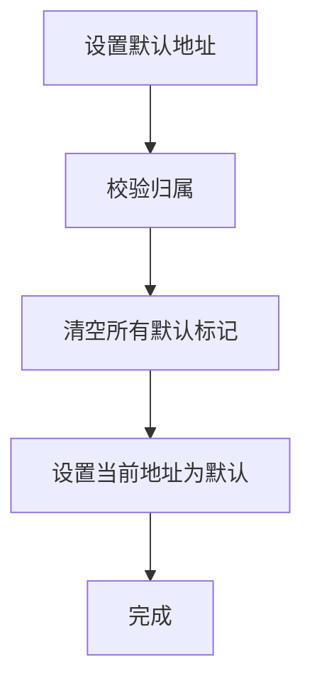

图表来源
- [AddressController.java:49-55](file://src/main/java/com/qoder/mall/controller/AddressController.java#L49-L55)
- [AddressServiceImpl.java:58-73](file://src/main/java/com/qoder/mall/service/impl/AddressServiceImpl.java#L58-L73)

章节来源
- [AddressController.java:1-67](file://src/main/java/com/qoder/mall/controller/AddressController.java#L1-L67)
- [AddressServiceImpl.java:1-98](file://src/main/java/com/qoder/mall/service/impl/AddressServiceImpl.java#L1-L98)

### 文件上传与存储
- 功能点
  - 上传：校验类型与大小，写入二进制数据，返回文件 ID 与访问 URL
  - 下载：根据文件 ID 读取并以正确 MIME 类型返回
- 安全与规范
  - 仅允许指定图片格式，限制最大体积
  - URL 规范化为 /api/files/{fileId}

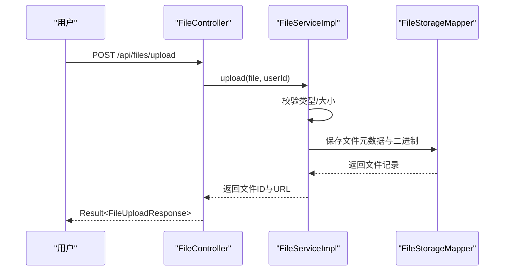

图表来源
- [FileController.java:25-31](file://src/main/java/com/qoder/mall/controller/FileController.java#L25-L31)
- [FileServiceImpl.java:26-61](file://src/main/java/com/qoder/mall/service/impl/FileServiceImpl.java#L26-L61)

章节来源
- [FileController.java:1-43](file://src/main/java/com/qoder/mall/controller/FileController.java#L1-L43)
- [FileServiceImpl.java:1-72](file://src/main/java/com/qoder/mall/service/impl/FileServiceImpl.java#L1-L72)

### 后台商品管理
- 功能点
  - 列表：支持关键词与分类筛选，分页排序
  - 新增/更新：复制请求字段到实体，必要时重建图片映射
  - 上下架/库存/价格调整/删除：直接更新商品状态与属性
- 事务与一致性
  - 新增与更新涉及多表写入，使用事务保证一致性

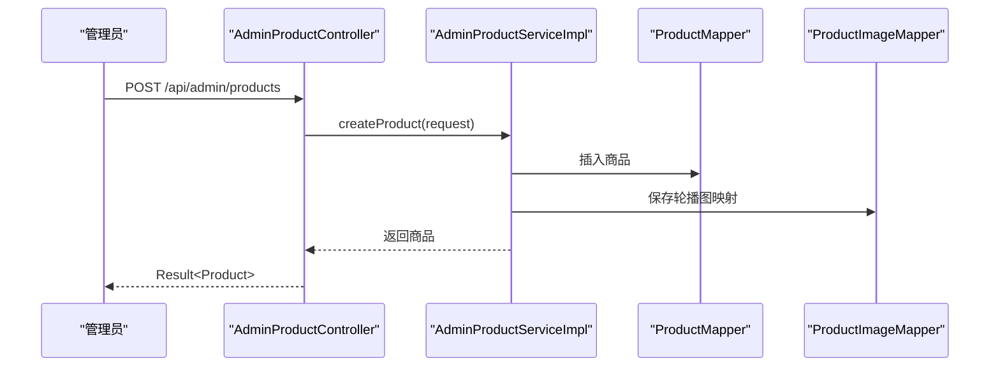

图表来源
- [AdminProductController.java:41-52](file://src/main/java/com/qoder/mall/controller/admin/AdminProductController.java#L41-L52)
- [AdminProductServiceImpl.java:50-80](file://src/main/java/com/qoder/mall/service/impl/AdminProductServiceImpl.java#L50-L80)

章节来源
- [AdminProductController.java:1-82](file://src/main/java/com/qoder/mall/controller/admin/AdminProductController.java#L1-L82)
- [AdminProductServiceImpl.java:1-133](file://src/main/java/com/qoder/mall/service/impl/AdminProductServiceImpl.java#L1-L133)

### 支付流程模拟
- 功能点
  - 发起支付：记录订单号与用户，异步执行模拟支付
  - 异步处理：3 秒延时后调用订单服务更新状态为“已支付”
- 与订单协作
  - 支付服务仅负责触发状态变更，不直接暴露订单细节

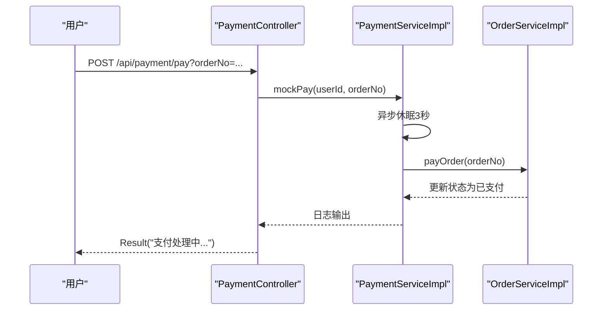

图表来源
- [PaymentController.java:19-26](file://src/main/java/com/qoder/mall/controller/PaymentController.java#L19-L26)
- [PaymentServiceImpl.java:17-32](file://src/main/java/com/qoder/mall/service/impl/PaymentServiceImpl.java#L17-L32)
- [OrderServiceImpl.java:180-189](file://src/main/java/com/qoder/mall/service/impl/OrderServiceImpl.java#L180-L189)

章节来源
- [PaymentController.java:1-28](file://src/main/java/com/qoder/mall/controller/PaymentController.java#L1-L28)
- [PaymentServiceImpl.java:1-34](file://src/main/java/com/qoder/mall/service/impl/PaymentServiceImpl.java#L1-L34)

## 依赖分析
- 控制器与服务
  - 控制器仅依赖服务接口，解耦具体实现
  - 服务实现依赖 Mapper 与工具类，保持单一职责
- 服务与实体
  - 服务通过实体与 VO 传递数据，避免直接暴露持久化模型
- 订单状态与编号
  - 订单状态由常量枚举统一管理，编号生成器集中处理
- 安全与配置
  - 应用配置集中于 application.yml，包含数据库、文件上传、MyBatis-Plus、JWT、Swagger 等

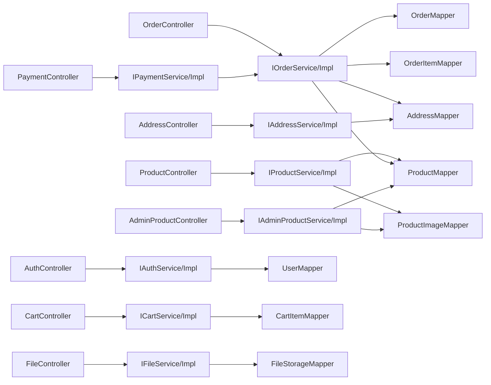

图表来源
- [AuthController.java:1-44](file://src/main/java/com/qoder/mall/controller/AuthController.java#L1-L44)
- [ProductController.java:1-54](file://src/main/java/com/qoder/mall/controller/ProductController.java#L1-L54)
- [CartController.java:1-78](file://src/main/java/com/qoder/mall/controller/CartController.java#L1-L78)
- [OrderController.java:1-70](file://src/main/java/com/qoder/mall/controller/OrderController.java#L1-L70)
- [AddressController.java:1-67](file://src/main/java/com/qoder/mall/controller/AddressController.java#L1-L67)
- [FileController.java:1-43](file://src/main/java/com/qoder/mall/controller/FileController.java#L1-L43)
- [AdminProductController.java:1-82](file://src/main/java/com/qoder/mall/controller/admin/AdminProductController.java#L1-L82)
- [PaymentController.java:1-28](file://src/main/java/com/qoder/mall/controller/PaymentController.java#L1-L28)

章节来源
- [application.yml:1-36](file://src/main/resources/application.yml#L1-L36)

## 性能考虑
- 分页与索引
  - 商品列表、订单列表、后台商品列表均使用分页查询，建议在相关字段建立索引（如 createTime、status、userId）
- 缓存策略
  - 热门/推荐商品可引入缓存，降低数据库压力
- 并发与锁
  - 库存扣减应使用乐观锁或悲观锁，避免超卖；当前实现通过更新影响行数判断，建议配合数据库层面约束
- 异步处理
  - 支付流程采用异步，减少请求阻塞，提升吞吐
- 文件存储
  - 建议将大文件迁移到对象存储（如 OSS），数据库仅存元数据与访问链接

## 故障排查指南
- 通用异常
  - 全局异常处理器捕获业务异常并返回统一格式，便于前端提示
- 常见问题定位
  - 用户相关：用户名/手机号重复、账号被禁用、用户不存在
  - 商品相关：商品不存在或已下架、库存不足
  - 订单相关：非本人订单、状态不允许变更、地址无效
  - 购物车相关：越权访问、购物车项不存在
  - 文件相关：格式不支持、大小超限、文件不存在
- 排查步骤
  - 查看控制器日志与服务层异常栈
  - 核对数据库状态字段与业务规则
  - 检查文件上传配置与对象存储连通性

章节来源
- [GlobalExceptionHandler.java](file://src/main/java/com/qoder/mall/common/exception/GlobalExceptionHandler.java)
- [AuthServiceImpl.java:30-41](file://src/main/java/com/qoder/mall/service/impl/AuthServiceImpl.java#L30-L41)
- [ProductServiceImpl.java:73-75](file://src/main/java/com/qoder/mall/service/impl/ProductServiceImpl.java#L73-L75)
- [OrderServiceImpl.java:66-69](file://src/main/java/com/qoder/mall/service/impl/OrderServiceImpl.java#L66-L69)
- [CartServiceImpl.java:111-114](file://src/main/java/com/qoder/mall/service/impl/CartServiceImpl.java#L111-L114)
- [FileServiceImpl.java:31-36](file://src/main/java/com/qoder/mall/service/impl/FileServiceImpl.java#L31-L36)

## 结论
本项目围绕电商核心业务构建了清晰的分层架构与模块边界，控制器统一响应、服务层承载业务与异常、持久层专注数据访问。八大功能模块协同工作，形成从用户认证、商品浏览、购物车、订单、地址、文件到后台管理与支付的完整闭环。建议后续在并发控制、缓存与对象存储方面进一步优化，以支撑更高并发与更大规模的数据访问。

## 附录
- 配置要点
  - 数据源与 MyBatis-Plus：驼峰映射、逻辑删除、表前缀
  - 文件上传：单文件与请求总大小限制
  - JWT：密钥与过期时间
  - Swagger：OpenAPI 文档开关
- 开发建议
  - 对外接口统一 Result 包装，异常统一处理
  - 重要业务（库存、订单状态）增加幂等与重试机制
  - 增加接口限流与安全防护（CSRF、XSS）

章节来源
- [application.yml:4-36](file://src/main/resources/application.yml#L4-L36)