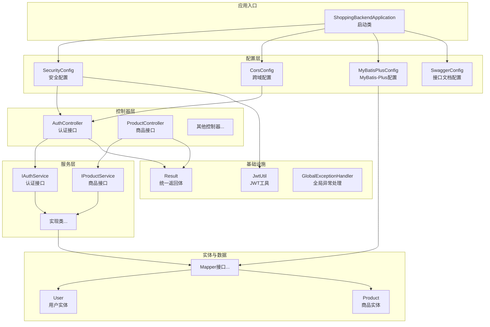
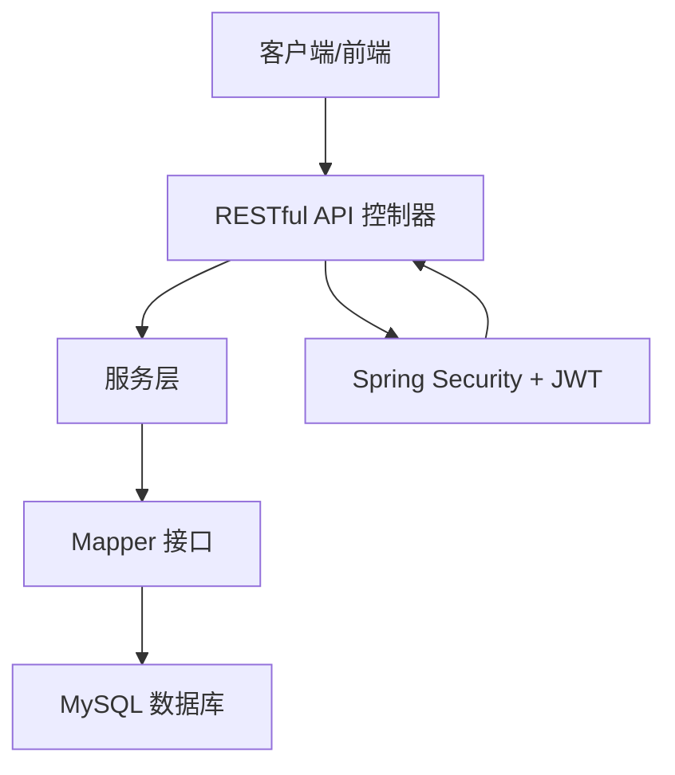
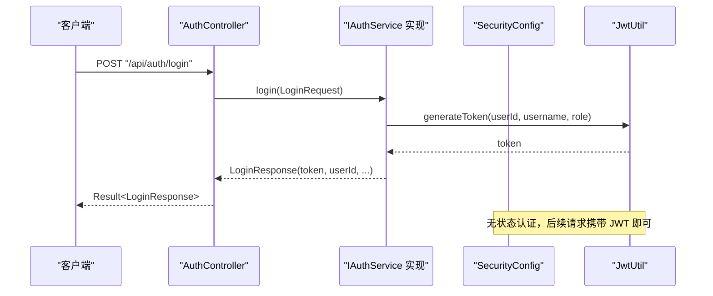
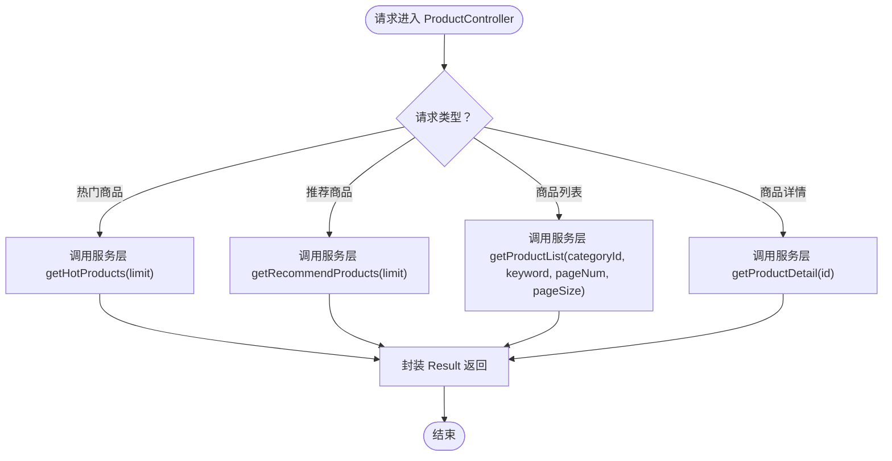
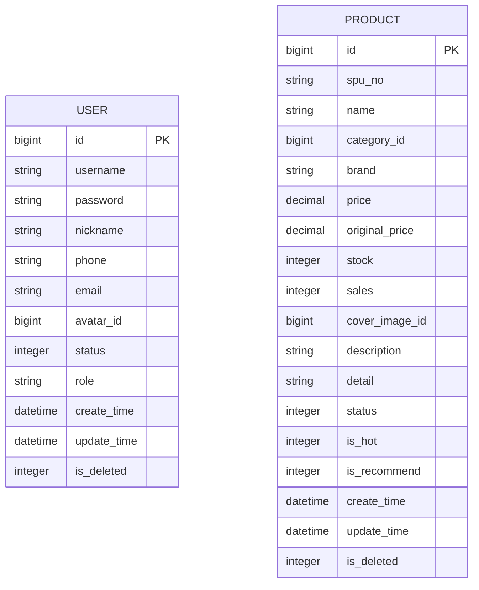
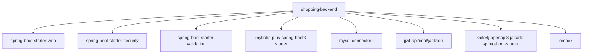

# 项目介绍

<cite>
**本文引用的文件**
- [ShoppingBackendApplication.java](file://src/main/java/com/qoder/mall/ShoppingBackendApplication.java)
- [pom.xml](file://pom.xml)
- [application.yml](file://src/main/resources/application.yml)
- [AuthController.java](file://src/main/java/com/qoder/mall/controller/AuthController.java)
- [ProductController.java](file://src/main/java/com/qoder/mall/controller/ProductController.java)
- [IAuthService.java](file://src/main/java/com/qoder/mall/service/IAuthService.java)
- [IProductService.java](file://src/main/java/com/qoder/mall/service/IProductService.java)
- [User.java](file://src/main/java/com/qoder/mall/entity/User.java)
- [Product.java](file://src/main/java/com/qoder/mall/entity/Product.java)
- [Result.java](file://src/main/java/com/qoder/mall/common/result/Result.java)
- [SecurityConfig.java](file://src/main/java/com/qoder/mall/config/SecurityConfig.java)
- [CorsConfig.java](file://src/main/java/com/qoder/mall/config/CorsConfig.java)
- [JwtUtil.java](file://src/main/java/com/qoder/mall/common/util/JwtUtil.java)
- [LoginRequest.java](file://src/main/java/com/qoder/mall/dto/request/LoginRequest.java)
- [LoginResponse.java](file://src/main/java/com/qoder/mall/dto/response/LoginResponse.java)
</cite>

## 目录
1. [引言](#引言)
2. [项目结构](#项目结构)
3. [核心组件](#核心组件)
4. [架构总览](#架构总览)
5. [详细组件分析](#详细组件分析)
6. [依赖分析](#依赖分析)
7. [性能考虑](#性能考虑)
8. [故障排查指南](#故障排查指南)
9. [结论](#结论)
10. [附录](#附录)

## 引言
本项目是一个基于 Spring Boot 的完整电商购物平台后端系统，面向在线购物商城、商品展示与交易、用户管理等典型业务场景。项目采用前后端分离架构，通过 RESTful API 提供统一的服务能力；在安全方面，使用 Spring Security 结合 JWT 实现无状态认证与授权；在数据访问层，集成 MyBatis-Plus 以提升开发效率与可维护性；在接口文档方面，集成 Knife4j（Swagger）以便于联调与测试。

本项目旨在帮助初学者快速理解一个电商后端系统的整体设计与实现思路，涵盖从应用启动、安全配置、控制器层、服务层、数据模型到通用返回体与工具类的关键要点，使读者能够把握系统在整个电商生态中的定位与价值。

## 项目结构
项目采用标准的 Maven 多模块风格（单模块工程），按领域与层次进行组织：
- 应用入口与扫描：应用启动类负责扫描 Mapper 接口与开启异步支持。
- 配置层：包含跨域、MyBatis-Plus、安全、接口文档等配置。
- 控制器层：对外暴露 RESTful 接口，如认证、商品浏览、订单、支付、地址等。
- DTO/VO 层：封装请求与响应参数及视图对象。
- 实体层：映射数据库表结构，包含逻辑删除与自动填充字段。
- 服务层：定义业务接口与实现类，承载核心业务逻辑。
- 基础设施：通用结果包装、异常处理、工具类（JWT、订单号生成等）。

图表来源
- [ShoppingBackendApplication.java:1-17](file://src/main/java/com/qoder/mall/ShoppingBackendApplication.java#L1-L17)
- [SecurityConfig.java:1-63](file://src/main/java/com/qoder/mall/config/SecurityConfig.java#L1-L63)
- [CorsConfig.java:1-25](file://src/main/java/com/qoder/mall/config/CorsConfig.java#L1-L25)
- [AuthController.java:1-44](file://src/main/java/com/qoder/mall/controller/AuthController.java#L1-L44)
- [ProductController.java:1-54](file://src/main/java/com/qoder/mall/controller/ProductController.java#L1-L54)
- [IAuthService.java:1-16](file://src/main/java/com/qoder/mall/service/IAuthService.java#L1-L16)
- [IProductService.java:1-19](file://src/main/java/com/qoder/mall/service/IProductService.java#L1-L19)
- [User.java:1-40](file://src/main/java/com/qoder/mall/entity/User.java#L1-L40)
- [Product.java:1-53](file://src/main/java/com/qoder/mall/entity/Product.java#L1-L53)
- [Result.java:1-39](file://src/main/java/com/qoder/mall/common/result/Result.java#L1-L39)
- [JwtUtil.java:1-80](file://src/main/java/com/qoder/mall/common/util/JwtUtil.java#L1-L80)

章节来源
- [ShoppingBackendApplication.java:1-17](file://src/main/java/com/qoder/mall/ShoppingBackendApplication.java#L1-L17)
- [pom.xml:1-134](file://pom.xml#L1-L134)
- [application.yml:1-36](file://src/main/resources/application.yml#L1-L36)

## 核心组件
- 统一返回体 Result：封装通用的响应结构（状态码、消息、数据），简化控制器层返回逻辑。
- 安全与认证：基于 Spring Security 的无状态过滤链，结合 JWT 进行登录认证与权限控制。
- 数据访问：MyBatis-Plus 简化 CRUD 与分页查询，配合逻辑删除与自动填充字段。
- 接口文档：Knife4j（Swagger）提供在线接口文档与调试界面。
- 跨域支持：全局 CORS 配置，便于前端联调。

章节来源
- [Result.java:1-39](file://src/main/java/com/qoder/mall/common/result/Result.java#L1-L39)
- [SecurityConfig.java:1-63](file://src/main/java/com/qoder/mall/config/SecurityConfig.java#L1-L63)
- [JwtUtil.java:1-80](file://src/main/java/com/qoder/mall/common/util/JwtUtil.java#L1-L80)
- [application.yml:1-36](file://src/main/resources/application.yml#L1-L36)

## 架构总览
系统采用典型的分层架构：
- 表现层：RESTful 控制器接收请求，校验参数，调用服务层处理业务。
- 业务层：服务接口与实现类承载核心业务规则，协调数据访问与第三方集成。
- 数据访问层：Mapper 接口与 MyBatis-Plus 配置，提供高效的数据操作能力。
- 基础设施层：安全过滤、跨域、统一返回体、工具类等支撑能力。

图表来源
- [AuthController.java:1-44](file://src/main/java/com/qoder/mall/controller/AuthController.java#L1-L44)
- [ProductController.java:1-54](file://src/main/java/com/qoder/mall/controller/ProductController.java#L1-L54)
- [SecurityConfig.java:1-63](file://src/main/java/com/qoder/mall/config/SecurityConfig.java#L1-L63)
- [application.yml:1-36](file://src/main/resources/application.yml#L1-L36)

## 详细组件分析

### 认证与用户管理
- 控制器层：提供注册、登录、获取当前用户信息等接口，使用 Swagger 注解标注接口语义。
- 服务层：定义认证相关接口，实现注册、登录、用户信息查询等业务逻辑。
- 安全配置：开放部分公开接口（如登录、注册、商品与分类浏览），其余接口需认证；管理员端点需要 ADMIN 角色。
- JWT 工具：生成与解析 JWT，提取用户身份与角色信息，校验令牌有效性。

图表来源
- [AuthController.java:1-44](file://src/main/java/com/qoder/mall/controller/AuthController.java#L1-L44)
- [IAuthService.java:1-16](file://src/main/java/com/qoder/mall/service/IAuthService.java#L1-L16)
- [SecurityConfig.java:1-63](file://src/main/java/com/qoder/mall/config/SecurityConfig.java#L1-L63)
- [JwtUtil.java:1-80](file://src/main/java/com/qoder/mall/common/util/JwtUtil.java#L1-L80)
- [LoginRequest.java:1-21](file://src/main/java/com/qoder/mall/dto/request/LoginRequest.java#L1-L21)
- [LoginResponse.java:1-31](file://src/main/java/com/qoder/mall/dto/response/LoginResponse.java#L1-L31)

章节来源
- [AuthController.java:1-44](file://src/main/java/com/qoder/mall/controller/AuthController.java#L1-L44)
- [IAuthService.java:1-16](file://src/main/java/com/qoder/mall/service/IAuthService.java#L1-L16)
- [SecurityConfig.java:1-63](file://src/main/java/com/qoder/mall/config/SecurityConfig.java#L1-L63)
- [JwtUtil.java:1-80](file://src/main/java/com/qoder/mall/common/util/JwtUtil.java#L1-L80)
- [LoginRequest.java:1-21](file://src/main/java/com/qoder/mall/dto/request/LoginRequest.java#L1-L21)
- [LoginResponse.java:1-31](file://src/main/java/com/qoder/mall/dto/response/LoginResponse.java#L1-L31)

### 商品浏览与详情
- 控制器层：提供热门商品、推荐商品、分页列表、商品详情等接口。
- 服务层：定义商品相关接口，实现热门/推荐商品查询、分页检索、详情加载等。
- 数据模型：商品实体包含基础信息、价格、库存、销量、状态、是否热门/推荐等字段。

图表来源
- [ProductController.java:1-54](file://src/main/java/com/qoder/mall/controller/ProductController.java#L1-L54)
- [IProductService.java:1-19](file://src/main/java/com/qoder/mall/service/IProductService.java#L1-L19)
- [Product.java:1-53](file://src/main/java/com/qoder/mall/entity/Product.java#L1-L53)

章节来源
- [ProductController.java:1-54](file://src/main/java/com/qoder/mall/controller/ProductController.java#L1-L54)
- [IProductService.java:1-19](file://src/main/java/com/qoder/mall/service/IProductService.java#L1-L19)
- [Product.java:1-53](file://src/main/java/com/qoder/mall/entity/Product.java#L1-L53)

### 数据模型与持久化
- 用户实体：包含基础字段、角色、状态、时间戳与逻辑删除字段。
- 商品实体：包含 SPU 编号、名称、分类、品牌、价格、库存、销量、封面图、描述、状态与推荐标志等。
- Mapper 接口：由 MyBatis-Plus 扫描并生成 CRUD 能力，结合全局配置实现驼峰映射、逻辑删除与表前缀。

图表来源
- [User.java:1-40](file://src/main/java/com/qoder/mall/entity/User.java#L1-L40)
- [Product.java:1-53](file://src/main/java/com/qoder/mall/entity/Product.java#L1-L53)

章节来源
- [User.java:1-40](file://src/main/java/com/qoder/mall/entity/User.java#L1-L40)
- [Product.java:1-53](file://src/main/java/com/qoder/mall/entity/Product.java#L1-L53)

### 统一返回体与异常处理
- 统一返回体：Result 封装 code、message、data 字段，提供 success 与 error 工厂方法，减少重复代码。
- 全局异常处理：可结合全局异常处理器对业务异常与运行时异常进行统一处理与返回。

章节来源
- [Result.java:1-39](file://src/main/java/com/qoder/mall/common/result/Result.java#L1-L39)

## 依赖分析
项目基于 Spring Boot 3.x 与 Java 17，核心依赖包括：
- Web 与安全：spring-boot-starter-web、spring-boot-starter-security、spring-boot-starter-validation
- 持久化：mybatis-plus-spring-boot3-starter、mysql-connector-j
- 安全与认证：jjwt（API、实现、Jackson）
- 文档：knife4j-openapi3-jakarta-spring-boot-starter
- 开发辅助：lombok

图表来源
- [pom.xml:1-134](file://pom.xml#L1-L134)

章节来源
- [pom.xml:1-134](file://pom.xml#L1-L134)

## 性能考虑
- 无状态认证：JWT 无状态设计降低会话存储压力，适合水平扩展。
- 分页查询：商品列表采用分页接口，避免一次性加载大量数据。
- 逻辑删除：通过逻辑删除字段减少物理删除带来的性能与数据风险。
- 跨域与静态资源：合理配置跨域与文件上传大小，避免不必要的网络开销。
- 日志与监控：MyBatis-Plus 可开启日志输出，便于开发阶段定位 SQL 性能问题。

## 故障排查指南
- 登录失败或令牌无效：检查 JWT 密钥与过期时间配置，确认请求头中携带正确的 Authorization。
- 权限不足：确认请求路径是否属于受保护资源，管理员端点需具备 ADMIN 角色。
- 文件上传失败：检查 application.yml 中的文件大小限制与数据库连接配置。
- 接口文档不可见：确认 Knife4j/Swagger 开关已启用，且路径正确。

章节来源
- [SecurityConfig.java:1-63](file://src/main/java/com/qoder/mall/config/SecurityConfig.java#L1-L63)
- [application.yml:1-36](file://src/main/resources/application.yml#L1-L36)

## 结论
本项目以 Spring Boot 为基础，围绕电商购物场景构建了完整的后端能力：认证与授权、商品浏览、统一返回体与安全配置等。通过 RESTful API、JWT 无状态认证与 MyBatis-Plus 的组合，既保证了开发效率，也满足了线上系统的可维护性与扩展性。对于初学者而言，该项目提供了清晰的分层结构与关键组件示例，有助于快速理解电商后端系统的设计与实现。

## 附录
- 启动方式：使用 Maven 插件或 IDE 启动应用入口类。
- 环境要求：Java 17、MySQL 5.7+/8.0、Maven 3.6+。
- 默认端口：8080；数据库连接与 JWT 配置可在 application.yml 中调整。