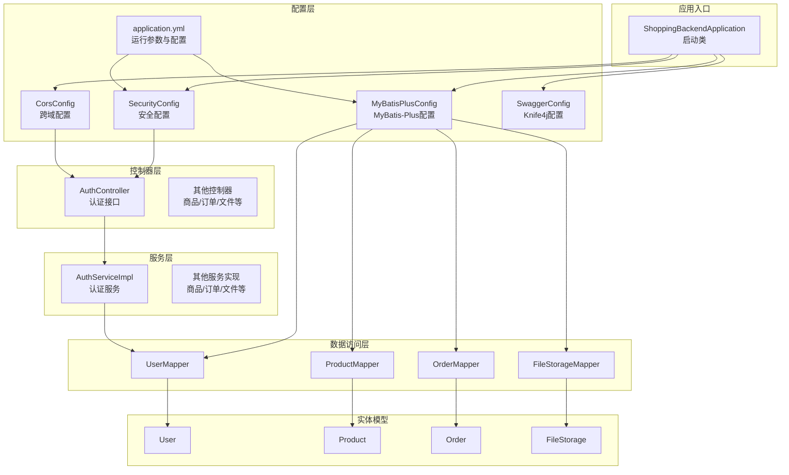
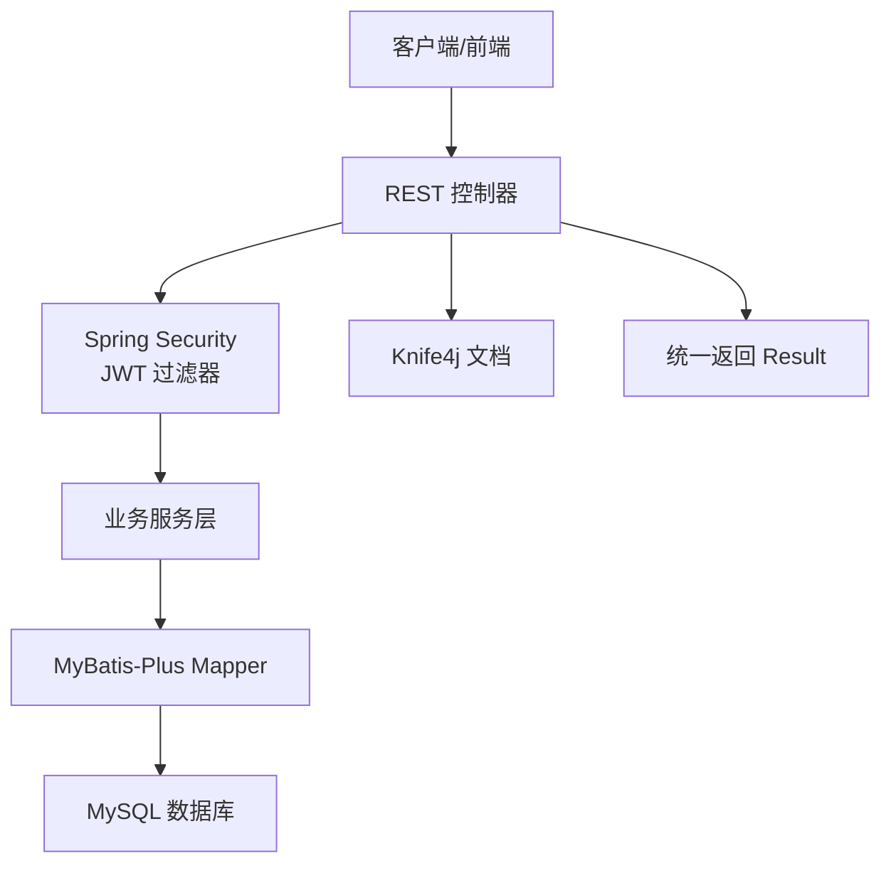
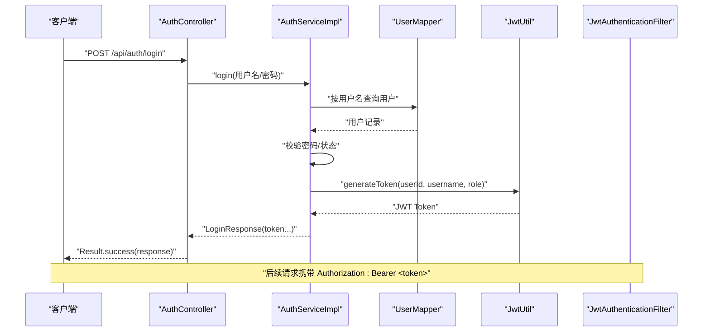
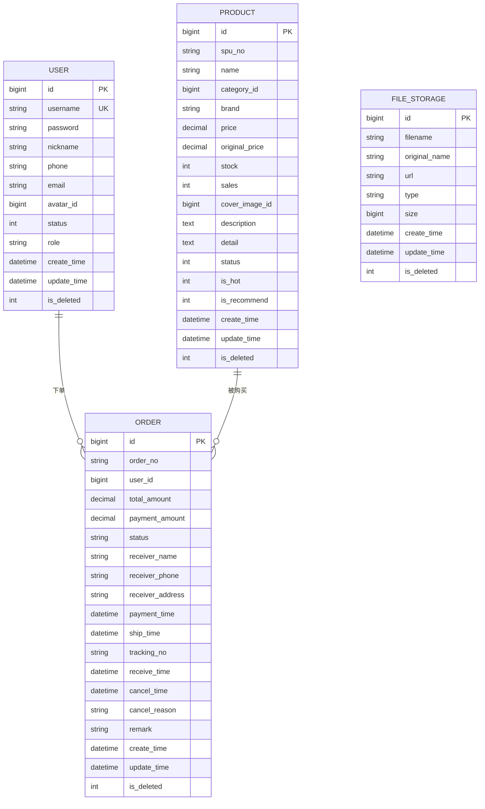
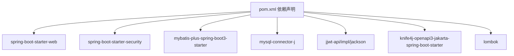

# 项目概述

<cite>
**本文引用的文件**
- [ShoppingBackendApplication.java](file://src/main/java/com/qoder/mall/ShoppingBackendApplication.java)
- [pom.xml](file://pom.xml)
- [application.yml](file://src/main/resources/application.yml)
- [SecurityConfig.java](file://src/main/java/com/qoder/mall/config/SecurityConfig.java)
- [JwtAuthenticationFilter.java](file://src/main/java/com/qoder/mall/security/filter/JwtAuthenticationFilter.java)
- [JwtUtil.java](file://src/main/java/com/qoder/mall/common/util/JwtUtil.java)
- [MyBatisPlusConfig.java](file://src/main/java/com/qoder/mall/config/MyBatisPlusConfig.java)
- [CorsConfig.java](file://src/main/java/com/qoder/mall/config/CorsConfig.java)
- [SwaggerConfig.java](file://src/main/java/com/qoder/mall/config/SwaggerConfig.java)
- [Result.java](file://src/main/java/com/qoder/mall/common/result/Result.java)
- [AuthController.java](file://src/main/java/com/qoder/mall/controller/AuthController.java)
- [AuthServiceImpl.java](file://src/main/java/com/qoder/mall/service/impl/AuthServiceImpl.java)
- [User.java](file://src/main/java/com/qoder/mall/entity/User.java)
- [Product.java](file://src/main/java/com/qoder/mall/entity/Product.java)
- [Order.java](file://src/main/java/com/qoder/mall/entity/Order.java)
</cite>

## 目录
1. [引言](#引言)
2. [项目结构](#项目结构)
3. [核心组件](#核心组件)
4. [架构总览](#架构总览)
5. [详细组件分析](#详细组件分析)
6. [依赖分析](#依赖分析)
7. [性能考虑](#性能考虑)
8. [故障排查指南](#故障排查指南)
9. [结论](#结论)
10. [附录](#附录)

## 引言
本项目是一个基于 Spring Boot + MyBatis-Plus + Spring Security 的购物商城后端系统，采用前后端分离设计，提供统一的 RESTful 接口与完善的权限控制。项目通过 JWT 实现无状态认证，结合 Spring Security 的拦截策略，对公开接口、Swagger 文档、管理员接口进行细粒度授权；使用 MyBatis-Plus 提供高效的数据访问能力，支持逻辑删除、自动填充时间戳、分页插件等特性；通过 Knife4j（Swagger）提供在线接口文档与调试能力。

项目目标是构建一个可扩展、易维护、安全可靠的电商后端服务，覆盖用户认证、商品管理、购物车、订单处理、文件上传与管理等核心业务模块，满足从入门到进阶开发者的不同需求。

## 项目结构
项目采用标准的 Spring Boot 多模块分层组织方式，主要目录与职责如下：
- config：安全、跨域、MyBatis-Plus、Knife4j 等全局配置
- controller：对外暴露的 REST 控制器，按业务域划分（如认证、商品、订单、文件）
- service：业务服务层，包含接口与实现类
- mapper：数据访问层，基于 MyBatis-Plus 的 Mapper 接口
- entity：数据库实体映射类
- dto：请求/响应数据传输对象
- vo：视图对象
- common：通用工具、异常处理、返回封装
- resources：配置文件、数据库初始化脚本与资源

图表来源
- [ShoppingBackendApplication.java:1-17](file://src/main/java/com/qoder/mall/ShoppingBackendApplication.java#L1-L17)
- [SecurityConfig.java:1-63](file://src/main/java/com/qoder/mall/config/SecurityConfig.java#L1-L63)
- [CorsConfig.java:1-25](file://src/main/java/com/qoder/mall/config/CorsConfig.java#L1-L25)
- [MyBatisPlusConfig.java:1-34](file://src/main/java/com/qoder/mall/config/MyBatisPlusConfig.java#L1-L34)
- [SwaggerConfig.java:1-30](file://src/main/java/com/qoder/mall/config/SwaggerConfig.java#L1-L30)
- [application.yml:1-36](file://src/main/resources/application.yml#L1-L36)
- [AuthController.java:1-44](file://src/main/java/com/qoder/mall/controller/AuthController.java#L1-L44)
- [AuthServiceImpl.java:1-92](file://src/main/java/com/qoder/mall/service/impl/AuthServiceImpl.java#L1-L92)
- [User.java:1-40](file://src/main/java/com/qoder/mall/entity/User.java#L1-L40)
- [Product.java:1-53](file://src/main/java/com/qoder/mall/entity/Product.java#L1-L53)
- [Order.java:1-55](file://src/main/java/com/qoder/mall/entity/Order.java#L1-L55)

章节来源
- [ShoppingBackendApplication.java:1-17](file://src/main/java/com/qoder/mall/ShoppingBackendApplication.java#L1-L17)
- [pom.xml:1-134](file://pom.xml#L1-L134)
- [application.yml:1-36](file://src/main/resources/application.yml#L1-L36)

## 核心组件
- 应用启动类：启用 MyBatis-Plus Mapper 扫描与异步任务能力，作为整个应用的入口。
- 安全框架：Spring Security + JWT，无状态认证，基于角色的访问控制。
- 数据持久化：MyBatis-Plus 提供分页、逻辑删除、自动填充时间戳等增强能力。
- 接口文档：Knife4j（OpenAPI 3）集成，支持在开发阶段可视化调试。
- 统一返回：Result 封装统一的响应结构，便于前端消费。
- 跨域支持：全局 CORS 配置，便于前端联调。

章节来源
- [ShoppingBackendApplication.java:1-17](file://src/main/java/com/qoder/mall/ShoppingBackendApplication.java#L1-L17)
- [SecurityConfig.java:1-63](file://src/main/java/com/qoder/mall/config/SecurityConfig.java#L1-L63)
- [JwtUtil.java:1-80](file://src/main/java/com/qoder/mall/common/util/JwtUtil.java#L1-L80)
- [JwtAuthenticationFilter.java:1-56](file://src/main/java/com/qoder/mall/security/filter/JwtAuthenticationFilter.java#L1-L56)
- [MyBatisPlusConfig.java:1-34](file://src/main/java/com/qoder/mall/config/MyBatisPlusConfig.java#L1-L34)
- [SwaggerConfig.java:1-30](file://src/main/java/com/qoder/mall/config/SwaggerConfig.java#L1-L30)
- [Result.java:1-39](file://src/main/java/com/qoder/mall/common/result/Result.java#L1-L39)
- [CorsConfig.java:1-25](file://src/main/java/com/qoder/mall/config/CorsConfig.java#L1-L25)

## 架构总览
系统采用经典的分层架构：
- 表现层：REST 控制器接收请求，校验参数，调用服务层处理业务。
- 业务层：服务实现类编排领域逻辑，协调数据访问与外部依赖。
- 数据访问层：Mapper 基于 MyBatis-Plus，提供 CRUD 与条件查询能力。
- 基础设施层：Spring Security + JWT 负责认证鉴权；Knife4j 提供接口文档；MyBatis-Plus 提供 ORM 能力；CORS 支持跨域。

图表来源
- [AuthController.java:1-44](file://src/main/java/com/qoder/mall/controller/AuthController.java#L1-L44)
- [SecurityConfig.java:1-63](file://src/main/java/com/qoder/mall/config/SecurityConfig.java#L1-L63)
- [JwtAuthenticationFilter.java:1-56](file://src/main/java/com/qoder/mall/security/filter/JwtAuthenticationFilter.java#L1-L56)
- [AuthServiceImpl.java:1-92](file://src/main/java/com/qoder/mall/service/impl/AuthServiceImpl.java#L1-L92)
- [MyBatisPlusConfig.java:1-34](file://src/main/java/com/qoder/mall/config/MyBatisPlusConfig.java#L1-L34)
- [SwaggerConfig.java:1-30](file://src/main/java/com/qoder/mall/config/SwaggerConfig.java#L1-L30)
- [Result.java:1-39](file://src/main/java/com/qoder/mall/common/result/Result.java#L1-L39)

## 详细组件分析

### 认证与授权流程
系统通过 JWT 实现无状态认证，流程如下：
- 用户注册/登录时，服务层对密码进行加密存储，并签发包含用户标识与角色的 JWT。
- 请求到达时，过滤器从 Authorization 头中提取 Bearer Token，解析并校验有效性，注入认证上下文。
- 安全配置定义了公开接口、Swagger 文档、管理员接口的放行规则与受控范围。

图表来源
- [AuthController.java:1-44](file://src/main/java/com/qoder/mall/controller/AuthController.java#L1-L44)
- [AuthServiceImpl.java:1-92](file://src/main/java/com/qoder/mall/service/impl/AuthServiceImpl.java#L1-L92)
- [JwtUtil.java:1-80](file://src/main/java/com/qoder/mall/common/util/JwtUtil.java#L1-L80)
- [JwtAuthenticationFilter.java:1-56](file://src/main/java/com/qoder/mall/security/filter/JwtAuthenticationFilter.java#L1-L56)

章节来源
- [AuthController.java:1-44](file://src/main/java/com/qoder/mall/controller/AuthController.java#L1-L44)
- [AuthServiceImpl.java:1-92](file://src/main/java/com/qoder/mall/service/impl/AuthServiceImpl.java#L1-L92)
- [JwtUtil.java:1-80](file://src/main/java/com/qoder/mall/common/util/JwtUtil.java#L1-L80)
- [JwtAuthenticationFilter.java:1-56](file://src/main/java/com/qoder/mall/security/filter/JwtAuthenticationFilter.java#L1-L56)
- [SecurityConfig.java:1-63](file://src/main/java/com/qoder/mall/config/SecurityConfig.java#L1-L63)

### 数据模型与实体关系
系统核心实体包括用户、商品、订单与文件存储，采用 MyBatis-Plus 注解映射表结构，支持逻辑删除与自动时间戳填充。

图表来源
- [User.java:1-40](file://src/main/java/com/qoder/mall/entity/User.java#L1-L40)
- [Product.java:1-53](file://src/main/java/com/qoder/mall/entity/Product.java#L1-L53)
- [Order.java:1-55](file://src/main/java/com/qoder/mall/entity/Order.java#L1-L55)

章节来源
- [User.java:1-40](file://src/main/java/com/qoder/mall/entity/User.java#L1-L40)
- [Product.java:1-53](file://src/main/java/com/qoder/mall/entity/Product.java#L1-L53)
- [Order.java:1-55](file://src/main/java/com/qoder/mall/entity/Order.java#L1-L55)

### 统一返回与异常处理
- 统一响应结构 Result，包含 code、message、data 字段，便于前端统一处理。
- 全局异常处理器用于捕获业务异常并返回标准化错误码与消息。
- 结合 Spring Security 的认证与授权异常处理器，确保鉴权失败场景的一致性反馈。

章节来源
- [Result.java:1-39](file://src/main/java/com/qoder/mall/common/result/Result.java#L1-L39)

### 文件上传与管理
- 文件上传大小限制在配置中定义，支持多文件请求。
- 文件存储实体包含文件名、原始名、URL、类型、大小等字段，便于前端展示与下载。
- 文件访问接口允许匿名访问指定路径下的静态资源。

章节来源
- [application.yml:10-14](file://src/main/resources/application.yml#L10-L14)
- [FileController.java](file://src/main/java/com/qoder/mall/controller/FileController.java)

### 商品与分类管理
- 商品实体包含 SPU 编号、名称、品牌、价格、库存、销量、封面图、详情、状态、热门/推荐标记等字段。
- 分类实体用于组织商品类别，支持树形结构与层级查询。
- 商品与分类、文件存储之间通过外键关联，保证数据一致性。

章节来源
- [Product.java:1-53](file://src/main/java/com/qoder/mall/entity/Product.java#L1-L53)
- [Category.java](file://src/main/java/com/qoder/mall/entity/Category.java)

### 订单与支付处理
- 订单实体包含订单号、用户 ID、应付金额、实付金额、收货人信息、物流时间、状态、备注等字段。
- 支付流程通过独立的支付控制器与服务实现，结合订单状态机推进业务流转。
- 支持订单取消、发货、收货、取消原因等完整生命周期管理。

章节来源
- [Order.java:1-55](file://src/main/java/com/qoder/mall/entity/Order.java#L1-L55)
- [OrderController.java](file://src/main/java/com/qoder/mall/controller/OrderController.java)
- [PaymentController.java](file://src/main/java/com/qoder/mall/controller/PaymentController.java)

## 依赖分析
项目采用 Maven 管理依赖，核心依赖包括：
- Spring Boot Web：提供 Web 开发基础能力
- Spring Security：提供认证与授权能力
- MyBatis-Plus：提供 ORM 能力与增强插件
- MySQL Connector：数据库驱动
- JWT（jjwt）：提供 JWT 签发与解析能力
- Knife4j（Swagger）：提供接口文档与调试能力
- Lombok：简化实体类与配置类代码

图表来源
- [pom.xml:27-98](file://pom.xml#L27-L98)

章节来源
- [pom.xml:1-134](file://pom.xml#L1-L134)

## 性能考虑
- 启用 MyBatis-Plus 分页插件，避免一次性加载大量数据，提升查询性能。
- 使用逻辑删除减少物理删除带来的锁竞争与数据不一致风险。
- 合理设置 JWT 过期时间，平衡安全性与用户体验。
- 对热点接口进行缓存优化（如商品详情、分类列表），降低数据库压力。
- 使用连接池与慢查询日志，监控数据库性能瓶颈。

## 故障排查指南
- 认证失败：检查 Authorization 头是否以 Bearer 开头，确认 Token 是否过期或签名无效。
- 权限不足：确认用户角色是否具备访问对应接口的权限，检查安全配置中的放行规则。
- 数据库连接问题：核对 application.yml 中的数据库连接参数与驱动版本。
- 文件上传失败：检查文件大小限制与路径权限，确认文件类型与存储路径有效。
- 接口文档不可用：确认 Knife4j 的开关与路径配置正确，浏览器可访问 /doc.html 或 /v3/api-docs。

章节来源
- [SecurityConfig.java:44-58](file://src/main/java/com/qoder/mall/config/SecurityConfig.java#L44-L58)
- [JwtAuthenticationFilter.java:25-46](file://src/main/java/com/qoder/mall/security/filter/JwtAuthenticationFilter.java#L25-L46)
- [application.yml:4-28](file://src/main/resources/application.yml#L4-L28)
- [SwaggerConfig.java:14-28](file://src/main/java/com/qoder/mall/config/SwaggerConfig.java#L14-L28)

## 结论
本项目以 Spring Boot 为基础，整合 MyBatis-Plus 与 Spring Security，构建了清晰的分层架构与完善的认证授权体系。通过 JWT 无状态认证与 Knife4j 在线文档，提升了开发效率与系统可观测性。核心业务模块覆盖用户、商品、订单、文件等关键场景，具备良好的扩展性与可维护性。建议在生产环境中进一步完善缓存策略、监控告警与安全加固，持续提升系统稳定性与性能表现。

## 附录
- 快速启动：确保 JDK 17+、Maven 已安装，执行 Maven 构建并启动应用。
- 数据库初始化：根据 resources/db 下的 SQL 脚本初始化表结构与示例数据。
- 接口调试：访问 /doc.html 查看接口文档，使用 Bearer Token 进行认证测试。